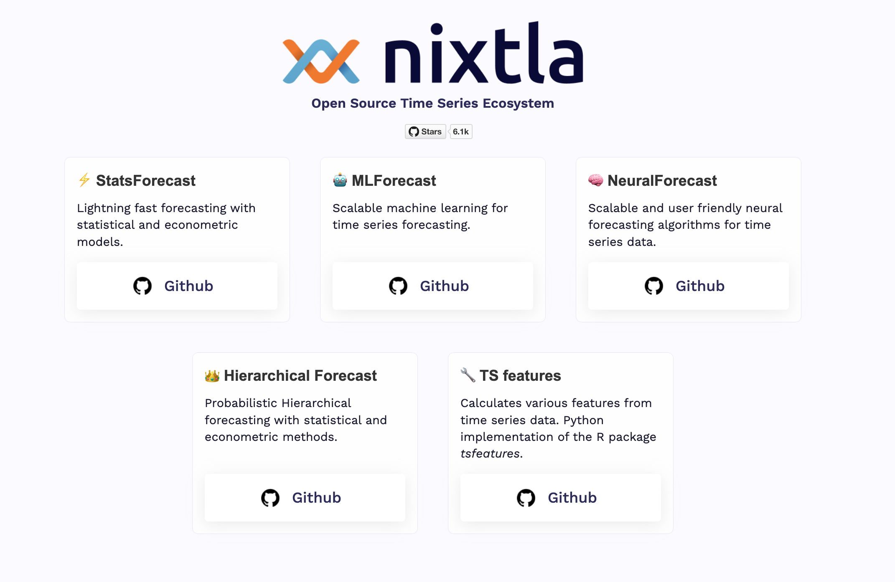

The Nixtlaverse is composed by our open-source libraries, designed to provide a comprehensive, cutting-edge toolkit for time series forecasting. The Nixtla ecosystem is primarily built around five main libraries, each specializing in different aspects of time series forecasting:

## StatsForecast
Designed for high-speed forecasting, StatsForecast leverages statistical and econometric models. This library provides a set of robust algorithms and techniques that allow for quick, yet accurate predictions, making it an excellent choice for applications requiring rapid forecasting.

## MLForecast
MLForecast makes machine learning scalable for time series forecasting. This library is tailored for applications that require the processing of vast amounts of time-series data, implementing machine learning techniques to optimize accuracy, efficiency, and scalability.

## NeuralForecast
NeuralForecast offers scalable and user-friendly neural forecasting algorithms for time series data. By combining the power of deep learning with the complexity of time series forecasting, this library makes advanced neural forecasting techniques accessible and easy to implement, even for non-experts.

## HierarchicalForecast
Hierarchical Forecast focuses on probabilistic hierarchical forecasting using statistical and econometric methods. It provides tools to model and forecast hierarchical or grouped time series data, capturing the underlying correlations and shared information between different levels of hierarchy.

## TS Features
TS Features is a Python implementation of the R package *tsfeatures*. It calculates various features from time series data, helping users to understand and extract meaningful information from their datasets. By identifying key characteristics and patterns, this library supports more informed and effective forecasting.
