`balanced_pool()` returns 42 pre-configured generator instances, built
from 15 of SynForecast’s 31 generator classes with one class per
behavioral niche. The niches span ARMA and exponential smoothing,
long-range memory, volatility clustering, intermittent demand,
deterministic chaos, counts, and bounded and heavy-tailed processes.

It is the default corpus behind
[`generate_series`](../getting-started/quickstart), and a bias-free
starting point for benchmarking or pretraining: generators are allocated
proportionally to each niche’s behavioral range, so no single domain
dominates the pool. The list is ordered round-robin across the niches,
so any prefix spans as many distinct behaviors as possible: a
`generate_series` panel smaller than the pool still gets one niche per
series.

> **What’s in, and what’s deliberately out**
>
> The pool draws from *interpretable, single-mechanism* generators —
> each slot is one named data-generating process. The meta-generators
> (`TSIGenerator`, `TCMGenerator`, `KernelSynthGenerator`) are excluded
> on purpose: they already randomize across many behaviors internally,
> so folding them in would blur the one-niche-one-mechanism design. Use
> the [`pretraining_pool()`](#pretraining-pool) preset for maximal
> breadth in foundation-model pretraining; it bundles those
> meta-generators, with `balanced_pool` included by default.

```python
import matplotlib.pyplot as plt
import polars as pl

from synforecast import SynSet, balanced_pool, pretraining_pool
```

## Generate a balanced dataset

Create 42 generators and generate one series per generator.

```python
generators = balanced_pool(
    min_length=200, max_length=200, freq="D", seed=42, engine="polars"
)
dataset = SynSet(generators)
df = dataset.generate(n_series_per_generator=1)

print(f"Generators: {len(generators)}")
print(f"Series: {df['unique_id'].n_unique()}")
print(f"Total observations: {len(df)}")
```

``` text
Generators: 42
Series: 42
Total observations: 8400
```

## Generator names

Each generator has a descriptive name indicating its type and
configuration.

```python
for i, gen in enumerate(generators):
    print(f"  {i}: {gen.alias}")
```

``` text
  0: SARIMAGenerator
  1: ETSGenerator
  2: FractionalBrownianMotionGenerator
  3: RegimeSwitchingGenerator
  4: GARCHGenerator
  5: CyclicGenerator
  6: IntermittentDemandGenerator
  7: EnergyLoadGenerator
  8: IoTSensorGenerator
  9: VitalSignsGenerator
  10: GaussianProcessGenerator
  11: ChaoticSystemGenerator
  12: INARGenerator
  13: BoundedProcessGenerator
  14: LevyProcessGenerator
  15: SARIMAGenerator
  16: ETSGenerator
  17: FractionalBrownianMotionGenerator
  18: RegimeSwitchingGenerator
  19: GARCHGenerator
  20: CyclicGenerator
  21: IntermittentDemandGenerator
  22: EnergyLoadGenerator
  23: IoTSensorGenerator
  24: VitalSignsGenerator
  25: GaussianProcessGenerator
  26: ChaoticSystemGenerator
  27: INARGenerator
  28: BoundedProcessGenerator
  29: LevyProcessGenerator
  30: SARIMAGenerator
  31: ETSGenerator
  32: FractionalBrownianMotionGenerator
  33: IntermittentDemandGenerator
  34: IoTSensorGenerator
  35: VitalSignsGenerator
  36: GaussianProcessGenerator
  37: ChaoticSystemGenerator
  38: SARIMAGenerator
  39: ETSGenerator
  40: GaussianProcessGenerator
  41: SARIMAGenerator
```

## Overview: all 42 series

A compact grid showing every series in the balanced pool.

```python
fig, axes = plt.subplots(7, 6, figsize=(18, 16))
axes = axes.flatten()

for i, gen in enumerate(generators):
    uid = str(i)
    series = df.filter(pl.col("unique_id") == uid)
    values = series["y"].to_list()
    axes[i].plot(values, linewidth=0.8)
    axes[i].set_title(gen.alias, fontsize=7)
    axes[i].tick_params(labelsize=5)

fig.suptitle("Balanced pool: 42 generators across 15 behavioral niches", fontsize=14)
plt.tight_layout()
plt.show()
```

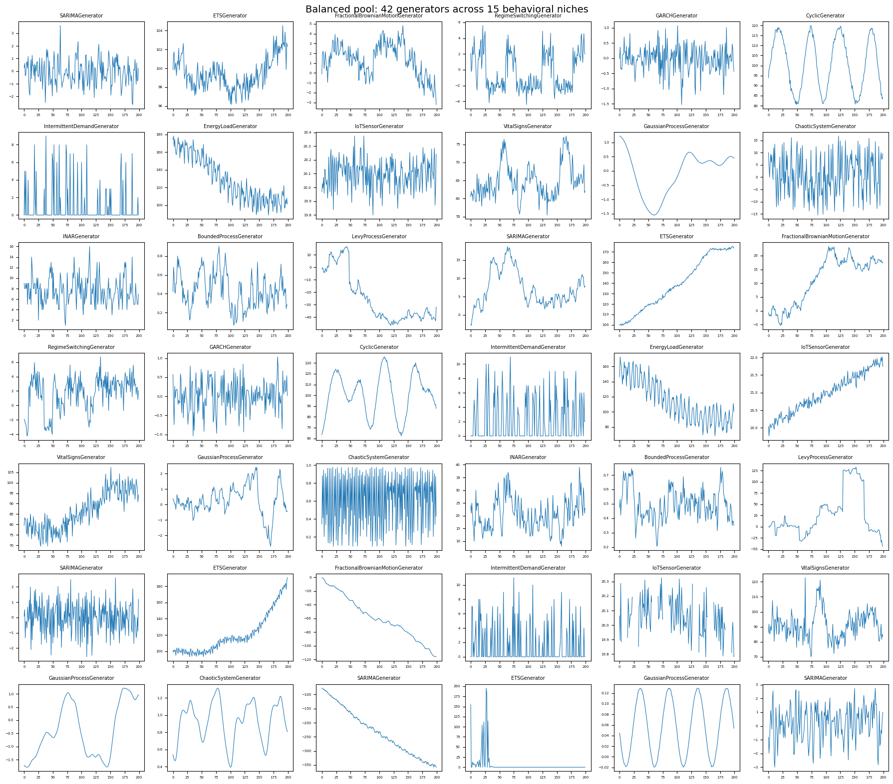

## Niche deep-dives

Each behavioral niche contributes a different number of generators.
Below we group them by niche and plot the variants side by side.

```python
niche_labels = [
    ("ARMA + Seasonality (SARIMA)", "SARIMAGenerator"),
    ("Exponential Smoothing (ETS)", "ETSGenerator"),
    ("Long-Range Memory (FBM)", "FractionalBrownianMotionGenerator"),
    ("Structural Breaks (Regime Switching)", "RegimeSwitchingGenerator"),
    ("Volatility Clustering (GARCH)", "GARCHGenerator"),
    ("Irregular Cycles (Cyclic)", "CyclicGenerator"),
    ("Sparse/Intermittent (Intermittent Demand)", "IntermittentDemandGenerator"),
    ("Multi-Seasonal (Energy Load)", "EnergyLoadGenerator"),
    ("Sensor Artifacts (IoT Sensor)", "IoTSensorGenerator"),
    ("Physiological (Vital Signs)", "VitalSignsGenerator"),
    ("Smooth/Rough Functions (Gaussian Process)", "GaussianProcessGenerator"),
    ("Deterministic Chaos (Chaotic System)", "ChaoticSystemGenerator"),
    ("Count Time Series (INAR)", "INARGenerator"),
    ("Bounded/Proportion Data (Bounded Process)", "BoundedProcessGenerator"),
    ("Heavy-Tailed Processes (Levy Process)", "LevyProcessGenerator"),
]

# The pool is interleaved across niches, so look indices up by class
# rather than assuming contiguous blocks.
niches = [
    (label, [i for i, g in enumerate(generators) if type(g).__name__ == cls])
    for label, cls in niche_labels
]
```


```python
for niche_name, indices in niches:
    n = len(indices)
    fig, axes = plt.subplots(1, n, figsize=(4 * n, 3), squeeze=False)
    fig.suptitle(niche_name, fontsize=12, fontweight="bold")

    for j, idx in enumerate(indices):
        uid = str(idx)
        series = df.filter(pl.col("unique_id") == uid)
        axes[0][j].plot(series["y"].to_list(), linewidth=0.9)
        axes[0][j].set_title(generators[idx].alias, fontsize=8)
        axes[0][j].tick_params(labelsize=7)

    plt.tight_layout()
    plt.show()
```


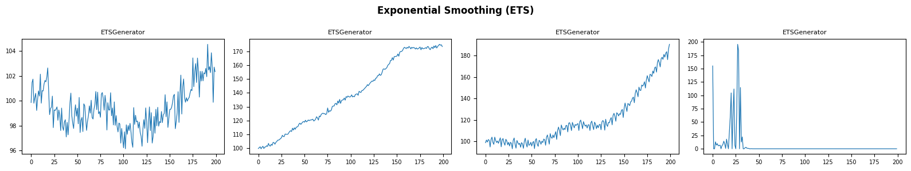


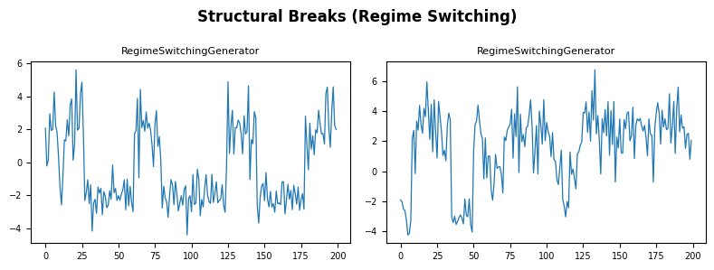


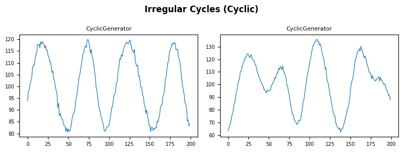

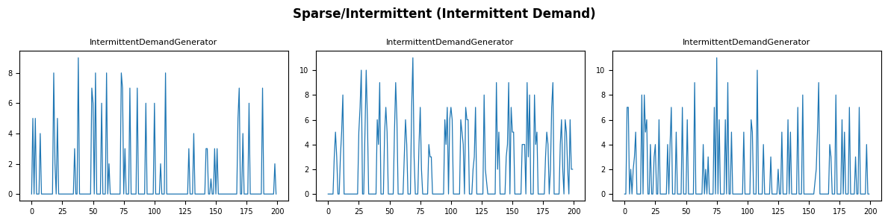

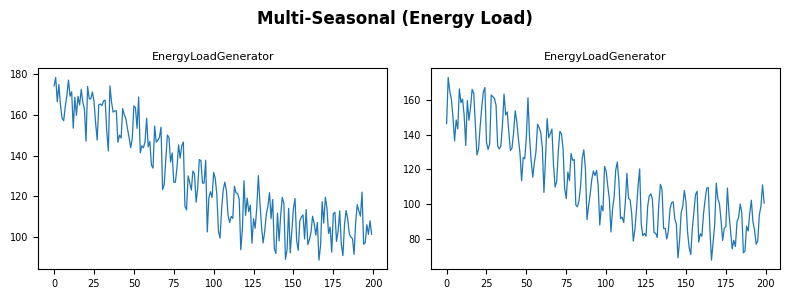

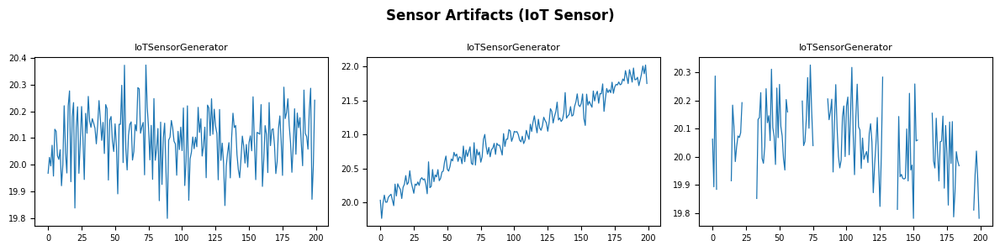


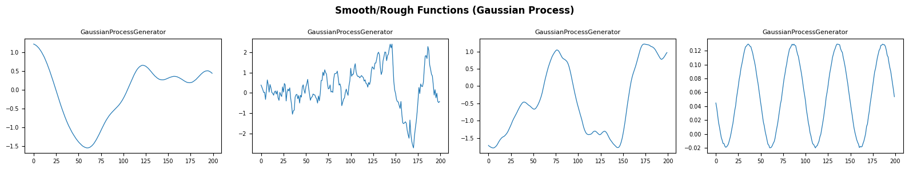

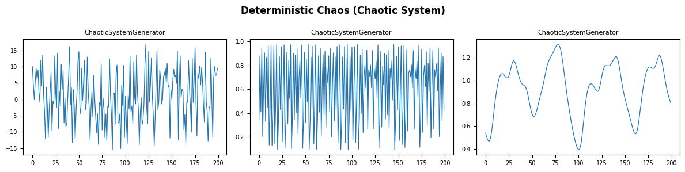


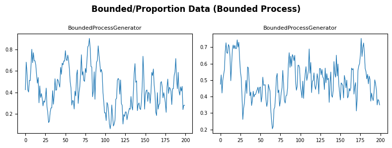

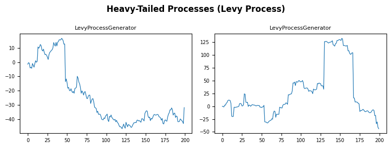

## Summary statistics

Compare key statistics across all 42 series to see how the balanced pool
spans different value ranges and variabilities.

```python
stats = (
    df.group_by("unique_id")
    .agg(
        [
            pl.col("y").count().alias("count"),
            pl.col("y").min().alias("min"),
            pl.col("y").max().alias("max"),
            pl.col("y").mean().alias("mean"),
            pl.col("y").std().alias("std"),
        ]
    )
    .sort("unique_id")
)
stats
```

| unique_id | count | min       | max        | mean       | std       |
|-----------|-------|-----------|------------|------------|-----------|
| cat       | u32   | f64       | f64        | f64        | f64       |
| "0"       | 200   | -2.652759 | 3.609343   | -0.068571  | 0.99059   |
| "1"       | 200   | 96.138073 | 104.540914 | 99.457374  | 1.680738  |
| "10"      | 200   | -1.549691 | 1.22711    | -0.083459  | 0.761829  |
| "11"      | 200   | -15.4612  | 16.7784    | 0.983599   | 7.871835  |
| "12"      | 200   | 1.0       | 16.0       | 7.64       | 2.544163  |
| …         | …     | …         | …          | …          | …         |
| "5"       | 200   | 80.533159 | 119.965854 | 101.125541 | 12.976649 |
| "6"       | 200   | 0.0       | 9.0        | 0.915      | 2.168244  |
| "7"       | 200   | 88.836529 | 178.20318  | 129.009721 | 25.104989 |
| "8"       | 200   | 19.799144 | 20.373597  | 20.096759  | 0.105014  |
| "9"       | 200   | 55.425593 | 77.339503  | 64.864145  | 4.815145  |

## Scaling up

Generate multiple series per generator for a larger dataset.

```python
df_large = dataset.generate(n_series_per_generator=5)
print(f"Series: {df_large['unique_id'].n_unique()}")
print(f"Total observations: {len(df_large)}")
```

``` text
Series: 210
Total observations: 42000
```

Plot five series from a single generator to see intra-generator
variation.

```python
fig, ax = plt.subplots(figsize=(10, 4))

# SynSet assigns ids per generator in pool order, so series 0-4 come
# from generators[0]: the SARIMAGenerator configured as a stationary AR(1)
for sid in range(5):
    uid = str(sid)
    series = df_large.filter(pl.col("unique_id") == uid)
    ax.plot(series["y"].to_list(), alpha=0.7, label=uid)

ax.set_title(f"Intra-Generator Variation: {generators[0].alias}")
ax.legend(fontsize=8)
plt.tight_layout()
plt.show()
```


## Pretraining pool

`pretraining_pool()` is the breadth-maximizing counterpart to
`balanced_pool()`. It keeps the 42 single-mechanism instances above and
adds independently-seeded copies of the three meta-generators
`balanced_pool` deliberately leaves out — `TSIGenerator`,
`TCMGenerator`, and `KernelSynthGenerator`. Each of those resamples a
fresh trend/seasonal, causal-graph, or GP-kernel configuration per
series, so a handful of instances already spans a very wide distribution
— the goal when pretraining a foundation model rather than benchmarking
one named process. The default length range is wider too (256-1024
steps), matching typical pretraining contexts.

Two knobs control the mix: `n_meta_variants` sets how many
independently-seeded copies of each meta-generator to add (default 3),
and `include_balanced=False` drops the single-mechanism generators for a
purely procedural corpus.

```python
pretrain = pretraining_pool(
    min_length=256, max_length=256, freq="D", seed=42, engine="polars"
)
meta_only = pretraining_pool(include_balanced=False, engine="polars")

from collections import Counter

print(f"pretraining_pool: {len(pretrain)} generators")
print(f"  {len(pretrain) - len(meta_only)} single-mechanism (from balanced_pool)")
print(f"  {len(meta_only)} meta-generator instances")
print("  meta-generators:", dict(Counter(type(g).__name__ for g in meta_only)))
```

``` text
pretraining_pool: 51 generators
  42 single-mechanism (from balanced_pool)
  9 meta-generator instances
  meta-generators: {'TSIGenerator': 3, 'TCMGenerator': 3, 'KernelSynthGenerator': 3}
```

```python
# Each meta-generator instance draws its own structure, so even nine series
# span trends, seasonality, causal dynamics, and kernel-sampled shapes.
meta_df = SynSet(meta_only).generate(n_series_per_generator=1)

fig, axes = plt.subplots(3, 3, figsize=(15, 7))
for ax, (uid, gen) in zip(axes.ravel(), enumerate(meta_only)):
    series = meta_df.filter(pl.col("unique_id") == str(uid))
    ax.plot(series["y"].to_list(), linewidth=0.8)
    ax.set_title(type(gen).__name__, fontsize=9)
    ax.tick_params(labelsize=7)

fig.suptitle("Meta-generators: each instance resamples its own structure")
plt.tight_layout()
plt.show()
```

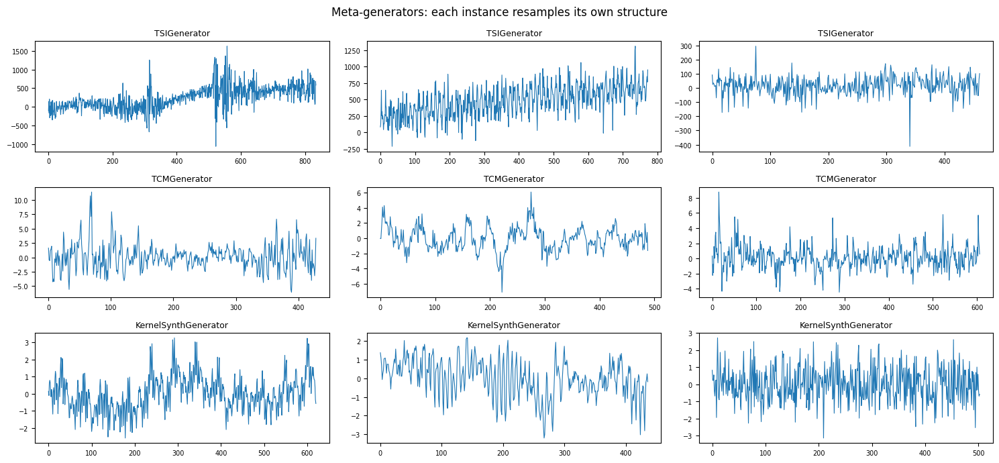

Whether pretraining on a synthetic corpus like this actually helps
depends on the target data and the amount of real history available. See
[when synthetic data helps](when_synthetic_helps) for a paired,
multi-seed benchmark that reports where it wins, where it is neutral,
and where the edge reverses.

