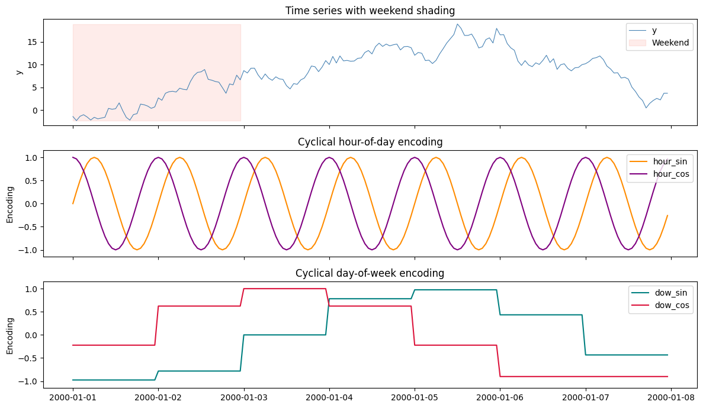
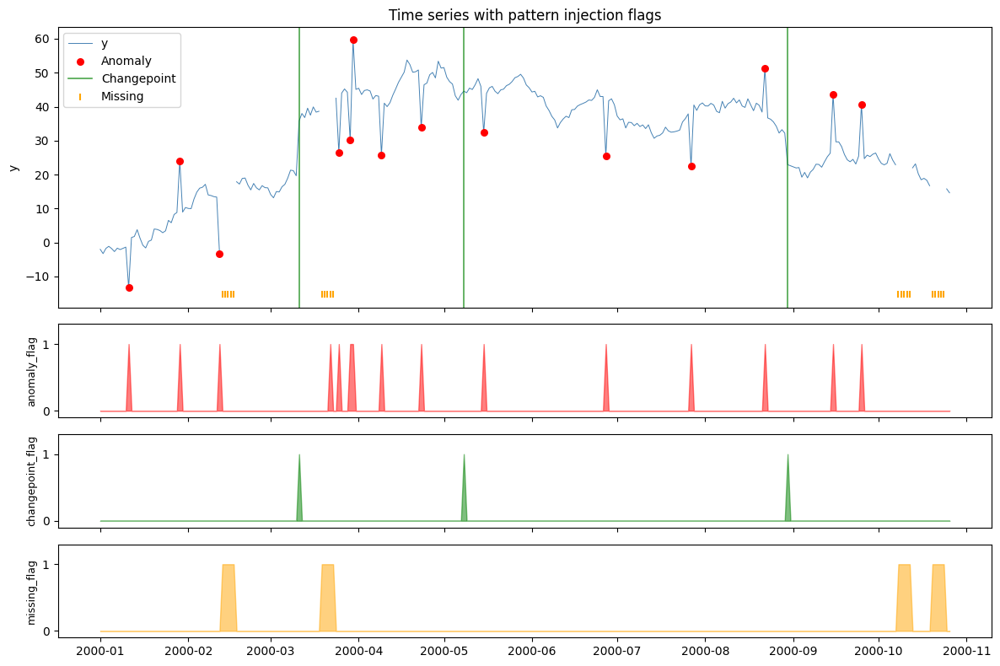
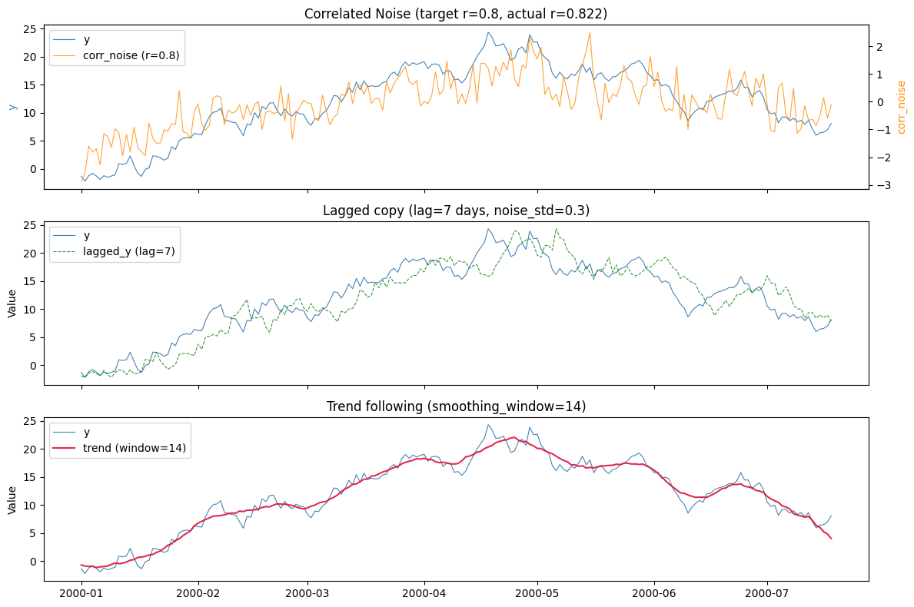
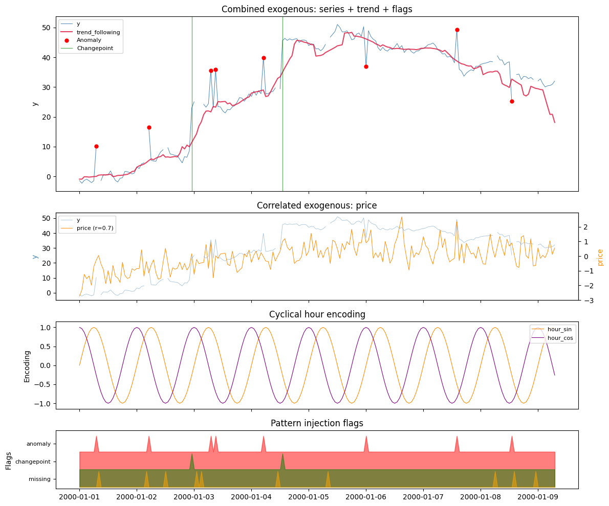

Forecasts often improve when the model sees more than the target’s own
past — calendar effects, known interventions, related drivers. Every
SynForecast generator can attach these as extra columns via the
`exogenous` parameter, so you can build test panels that exercise a
model’s covariate handling end to end, all reproducible from the seed.

> **Three kinds of covariate**
>
> 1.  **Datetime features** — calendar and cyclical (sin/cos) time
>     encodings, added frequency-aware.
> 2.  **Pattern-injection flags** — binary `anomaly_flag` /
>     `changepoint_flag` / `missing_flag` columns marking exactly where
>     each injected pattern landed (ground-truth labels for detectors).
> 3.  **Correlated exogenous** — numeric columns statistically tied to
>     the target series.

```python
import matplotlib.pyplot as plt
import numpy as np
import polars as pl

from synforecast.exogenous import CorrelatedExogConfig, ExogenousConfig
from synforecast.generators import RandomWalkGenerator
```

## Datetime features

Enable `datetime_features` for calendar columns (year, month,
day_of_week, hour, etc.) and `datetime_cyclical` for sin/cos encodings.
Features are frequency-aware: hourly data includes `hour`,
`hour_sin/cos`; daily data omits them since they would be constant.

```python
gen = RandomWalkGenerator(engine="polars", **{
    "min_length": 168,  # 7 days of hourly data
    "max_length": 168,
    "freq": "h",
    "seed": 42,
    "exogenous": ExogenousConfig(
        datetime_features=True,
        datetime_cyclical=True,
    ),
})
df = gen.generate(n_series=1)

print(f"Columns: {df.columns}")
df.head(10)
```

``` text
Columns: ['unique_id', 'ds', 'y', 'year', 'quarter', 'month', 'day_of_year', 'day_of_week', 'day_of_month', 'is_weekend', 'hour', 'hour_sin', 'hour_cos', 'dow_sin', 'dow_cos', 'month_sin', 'month_cos', 'doy_sin', 'doy_cos']
```

| unique_id | ds                  | y         | year | quarter | month | day_of_year | day_of_week | day_of_month | is_weekend | hour | hour_sin | hour_cos   | dow_sin   | dow_cos   | month_sin | month_cos | doy_sin | doy_cos |
|-----------|---------------------|-----------|------|---------|-------|-------------|-------------|--------------|------------|------|----------|------------|-----------|-----------|-----------|-----------|---------|---------|
| cat       | datetime\[ns\]      | f64       | i32  | i8      | i8    | i16         | i8          | i8           | i8         | i8   | f32      | f32        | f32       | f32       | f32       | f32       | f32     | f32     |
| "0"       | 2000-01-01 00:00:00 | -1.401594 | 2000 | 1       | 1     | 1           | 5           | 1            | 1          | 0    | 0.0      | 1.0        | -0.974928 | -0.222521 | 0.0       | 1.0       | 0.0     | 1.0     |
| "0"       | 2000-01-01 01:00:00 | -2.307539 | 2000 | 1       | 1     | 1           | 5           | 1            | 1          | 1    | 0.258819 | 0.965926   | -0.974928 | -0.222521 | 0.0       | 1.0       | 0.0     | 1.0     |
| "0"       | 2000-01-01 02:00:00 | -1.352484 | 2000 | 1       | 1     | 1           | 5           | 1            | 1          | 2    | 0.5      | 0.866025   | -0.974928 | -0.222521 | 0.0       | 1.0       | 0.0     | 1.0     |
| "0"       | 2000-01-01 03:00:00 | -1.011828 | 2000 | 1       | 1     | 1           | 5           | 1            | 1          | 3    | 0.707107 | 0.707107   | -0.974928 | -0.222521 | 0.0       | 1.0       | 0.0     | 1.0     |
| "0"       | 2000-01-01 04:00:00 | -1.511372 | 2000 | 1       | 1     | 1           | 5           | 1            | 1          | 4    | 0.866025 | 0.5        | -0.974928 | -0.222521 | 0.0       | 1.0       | 0.0     | 1.0     |
| "0"       | 2000-01-01 05:00:00 | -2.176202 | 2000 | 1       | 1     | 1           | 5           | 1            | 1          | 5    | 0.965926 | 0.258819   | -0.974928 | -0.222521 | 0.0       | 1.0       | 0.0     | 1.0     |
| "0"       | 2000-01-01 06:00:00 | -1.574639 | 2000 | 1       | 1     | 1           | 5           | 1            | 1          | 6    | 1.0      | 6.1232e-17 | -0.974928 | -0.222521 | 0.0       | 1.0       | 0.0     | 1.0     |
| "0"       | 2000-01-01 07:00:00 | -1.915517 | 2000 | 1       | 1     | 1           | 5           | 1            | 1          | 7    | 0.965926 | -0.258819  | -0.974928 | -0.222521 | 0.0       | 1.0       | 0.0     | 1.0     |
| "0"       | 2000-01-01 08:00:00 | -1.746987 | 2000 | 1       | 1     | 1           | 5           | 1            | 1          | 8    | 0.866025 | -0.5       | -0.974928 | -0.222521 | 0.0       | 1.0       | 0.0     | 1.0     |
| "0"       | 2000-01-01 09:00:00 | -1.566314 | 2000 | 1       | 1     | 1           | 5           | 1            | 1          | 9    | 0.707107 | -0.707107  | -0.974928 | -0.222521 | 0.0       | 1.0       | 0.0     | 1.0     |

```python
ts = df["ds"].to_list()
y = df["y"].to_numpy()
is_weekend = df["is_weekend"].to_numpy().astype(bool)

fig, axes = plt.subplots(3, 1, figsize=(12, 7), sharex=True)

# Panel 1: time series with weekend shading
axes[0].plot(ts, y, linewidth=0.8, color="steelblue", label="y")
axes[0].fill_between(ts, y.min(), y.max(), where=is_weekend,
                      alpha=0.15, color="salmon", label="Weekend")
axes[0].set_ylabel("y")
axes[0].set_title("Time series with weekend shading")
axes[0].legend(loc="upper right")

# Panel 2: hour-of-day cyclical encoding
axes[1].plot(ts, df["hour_sin"].to_numpy(), label="hour_sin", color="darkorange")
axes[1].plot(ts, df["hour_cos"].to_numpy(), label="hour_cos", color="purple")
axes[1].set_ylabel("Encoding")
axes[1].set_title("Cyclical hour-of-day encoding")
axes[1].legend(loc="upper right")
axes[1].set_ylim(-1.15, 1.15)

# Panel 3: day-of-week cyclical encoding
axes[2].plot(ts, df["dow_sin"].to_numpy(), label="dow_sin", color="teal")
axes[2].plot(ts, df["dow_cos"].to_numpy(), label="dow_cos", color="crimson")
axes[2].set_ylabel("Encoding")
axes[2].set_title("Cyclical day-of-week encoding")
axes[2].legend(loc="upper right")
axes[2].set_ylim(-1.15, 1.15)

plt.tight_layout()
plt.show()
```



## Pattern injection flags

When pattern injection is enabled (anomalies, changepoints, missing
data), you can get binary flag columns indicating exactly where each
pattern was injected. This is useful for training anomaly detectors or
evaluating changepoint detection algorithms.

```python
gen = RandomWalkGenerator(engine="polars", **{
    "min_length": 300,
    "max_length": 300,
    "freq": "D",
    "seed": 42,
    "drift": 0.1,
    "volatility": 1.5,
    "anomalies": True,
    "anomaly_fraction": 0.05,
    "anomaly_types": ["spike", "dip"],
    "spike_magnitude": 15.0,
    "dip_magnitude": -15.0,
    "changepoints": True,
    "num_changepoints": 3,
    "changepoint_type": "level",
    "missing_data": True,
    "missing_rate": 0.08,
    "missing_pattern": "block",
    "missing_block_size": 5,
    "exogenous": ExogenousConfig(
        anomaly_flags=True,
        changepoint_flags=True,
        missing_flags=True,
    ),
})
df = gen.generate(n_series=1)

print(f"Columns: {df.columns}")
print(f"Anomalies: {df['anomaly_flag'].sum()}, "
      f"Changepoints: {df['changepoint_flag'].sum()}, "
      f"Missing: {df['missing_flag'].sum()}")
df.head(10)
```

``` text
Columns: ['unique_id', 'ds', 'y', 'anomaly_flag', 'changepoint_flag', 'missing_flag']
Anomalies: 15, Changepoints: 3, Missing: 20
```

| unique_id | ds                  | y         | anomaly_flag | changepoint_flag | missing_flag |
|-----------|---------------------|-----------|--------------|------------------|--------------|
| cat       | datetime\[ns\]      | f64       | i8           | i8               | i8           |
| "0"       | 2000-01-01 00:00:00 | -2.002391 | 0            | 0                | 0            |
| "0"       | 2000-01-02 00:00:00 | -3.261309 | 0            | 0                | 0            |
| "0"       | 2000-01-03 00:00:00 | -1.728725 | 0            | 0                | 0            |
| "0"       | 2000-01-04 00:00:00 | -1.117742 | 0            | 0                | 0            |
| "0"       | 2000-01-05 00:00:00 | -1.767059 | 0            | 0                | 0            |
| "0"       | 2000-01-06 00:00:00 | -2.664304 | 0            | 0                | 0            |
| "0"       | 2000-01-07 00:00:00 | -1.661958 | 0            | 0                | 0            |
| "0"       | 2000-01-08 00:00:00 | -2.073275 | 0            | 0                | 0            |
| "0"       | 2000-01-09 00:00:00 | -1.72048  | 0            | 0                | 0            |
| "0"       | 2000-01-10 00:00:00 | -1.34947  | 0            | 0                | 0            |

```python
ts = df["ds"].to_list()
y = df["y"].to_numpy()
anom = df["anomaly_flag"].to_numpy().astype(bool)
cp = df["changepoint_flag"].to_numpy().astype(bool)
miss = df["missing_flag"].to_numpy().astype(bool)

fig, axes = plt.subplots(4, 1, figsize=(12, 8), sharex=True,
                          gridspec_kw={"height_ratios": [3, 1, 1, 1]})

# Panel 1: time series with flagged points
axes[0].plot(ts, y, linewidth=0.7, color="steelblue", label="y", zorder=1)
if anom.any():
    axes[0].scatter([ts[i] for i in range(len(ts)) if anom[i]],
                    y[anom], color="red", s=30, zorder=3, label="Anomaly")
if cp.any():
    for i, t_cp in enumerate([ts[i] for i in range(len(ts)) if cp[i]]):
        axes[0].axvline(t_cp, color="green", linewidth=1.2, alpha=0.7,
                        label="Changepoint" if i == 0 else None)
if miss.any():
    axes[0].scatter([ts[i] for i in range(len(ts)) if miss[i]],
                    np.full(miss.sum(), np.nanmin(y) - 2),
                    marker="|", color="orange", s=40, zorder=2, label="Missing")
axes[0].set_ylabel("y")
axes[0].set_title("Time series with pattern injection flags")
axes[0].legend(loc="upper left")

# Panels 2-4: binary flag traces
for ax, (name, flag, color) in zip(
    axes[1:],
    [("anomaly_flag", anom, "red"),
     ("changepoint_flag", cp, "green"),
     ("missing_flag", miss, "orange")],
):
    ax.fill_between(ts, 0, flag.astype(int), color=color, alpha=0.5)
    ax.set_ylabel(name, fontsize=9)
    ax.set_ylim(-0.1, 1.3)
    ax.set_yticks([0, 1])

plt.tight_layout()
plt.show()
```



## Correlated exogenous variables

Generate additional numeric columns that are statistically related to
the target series. Three methods are available:

| Method             | Description                                            |
|----------------------------|--------------------------------------------|
| `correlated_noise` | Cholesky-based noise with a target Pearson correlation |
| `lagged_copy`      | Shifted copy of the target series with additive noise  |
| `trend_following`  | Moving-average smoothing of the target                 |

> **These are derived from the target**
>
> Each correlated column is computed *from* `y` — a correlated draw, a
> lagged copy, or a smoothed trend — so it carries information about the
> target by construction. That is exactly what you want when testing
> whether a model can exploit covariates. But treat them accordingly: a
> `lagged_copy` with `lag=7` is only a leak-free feature for a real
> forecast if the lag exceeds the forecast horizon.

```python
gen = RandomWalkGenerator(engine="polars", **{
    "min_length": 200,
    "max_length": 200,
    "freq": "D",
    "seed": 42,
    "drift": 0.05,
    "volatility": 1.0,
    "exogenous": ExogenousConfig(
        correlated=[
            CorrelatedExogConfig(
                name="corr_noise",
                method="correlated_noise",
                correlation=0.8,
            ),
            CorrelatedExogConfig(
                name="lagged_y",
                method="lagged_copy",
                lag=7,
                noise_std=0.3,
            ),
            CorrelatedExogConfig(
                name="trend",
                method="trend_following",
                smoothing_window=14,
                trend_noise_std=0.1,
            ),
        ]
    ),
})
df = gen.generate(n_series=1)

print(f"Columns: {df.columns}")
y = df["y"].to_numpy()
corr = np.corrcoef(y, df["corr_noise"].to_numpy())[0, 1]
print(f"Target correlation: 0.8, actual: {corr:.3f}")
df.head(10)
```

``` text
Columns: ['unique_id', 'ds', 'y', 'corr_noise', 'lagged_y', 'trend']
Target correlation: 0.8, actual: 0.822
```

| unique_id | ds                  | y         | corr_noise | lagged_y  | trend     |
|-----------|---------------------|-----------|------------|-----------|-----------|
| cat       | datetime\[ns\]      | f64       | f64        | f64       | f64       |
| "0"       | 2000-01-01 00:00:00 | -1.351594 | -2.863126  | -1.966645 | -0.657573 |
| "0"       | 2000-01-02 00:00:00 | -2.207539 | -2.581491  | -2.222155 | -0.844525 |
| "0"       | 2000-01-03 00:00:00 | -1.202484 | -1.597043  | -1.455453 | -0.922337 |
| "0"       | 2000-01-04 00:00:00 | -0.811828 | -1.814348  | -1.177472 | -0.903796 |
| "0"       | 2000-01-05 00:00:00 | -1.261372 | -1.691236  | -1.524818 | -1.119365 |
| "0"       | 2000-01-06 00:00:00 | -1.876202 | -2.270328  | -1.976439 | -0.993435 |
| "0"       | 2000-01-07 00:00:00 | -1.224639 | -1.148895  | -0.949868 | -0.943064 |
| "0"       | 2000-01-08 00:00:00 | -1.515517 | -1.246452  | -1.749512 | -0.86473  |
| "0"       | 2000-01-09 00:00:00 | -1.296987 | -1.646017  | -2.19835  | -0.558921 |
| "0"       | 2000-01-10 00:00:00 | -1.066314 | -0.980272  | -1.347734 | -0.315824 |

```python
ts = df["ds"].to_list()
y = df["y"].to_numpy()

fig, axes = plt.subplots(3, 1, figsize=(12, 8), sharex=True)

# Panel 1: correlated noise
ax = axes[0]
ax.plot(ts, y, linewidth=0.8, color="steelblue", label="y")
ax2 = ax.twinx()
ax2.plot(ts, df["corr_noise"].to_numpy(), linewidth=0.8,
         color="darkorange", alpha=0.8, label="corr_noise (r=0.8)")
ax.set_ylabel("y", color="steelblue")
ax2.set_ylabel("corr_noise", color="darkorange")
corr = np.corrcoef(y, df["corr_noise"].to_numpy())[0, 1]
ax.set_title(f"Correlated Noise (target r=0.8, actual r={corr:.3f})")
lines1, labels1 = ax.get_legend_handles_labels()
lines2, labels2 = ax2.get_legend_handles_labels()
ax.legend(lines1 + lines2, labels1 + labels2, loc="upper left")

# Panel 2: lagged copy
ax = axes[1]
ax.plot(ts, y, linewidth=0.8, color="steelblue", label="y")
ax.plot(ts, df["lagged_y"].to_numpy(), linewidth=0.8,
        color="green", alpha=0.8, linestyle="--", label="lagged_y (lag=7)")
ax.set_ylabel("Value")
ax.set_title("Lagged copy (lag=7 days, noise_std=0.3)")
ax.legend(loc="upper left")

# Panel 3: trend following
ax = axes[2]
ax.plot(ts, y, linewidth=0.8, color="steelblue", label="y")
ax.plot(ts, df["trend"].to_numpy(), linewidth=1.5,
        color="crimson", alpha=0.9, label="trend (window=14)")
ax.set_ylabel("Value")
ax.set_title("Trend following (smoothing_window=14)")
ax.legend(loc="upper left")

plt.tight_layout()
plt.show()
```



## Combined: all exogenous types

All exogenous types can be combined freely in a single generator call.

```python
gen = RandomWalkGenerator(engine="polars", **{
    "min_length": 200,
    "max_length": 200,
    "freq": "h",
    "seed": 42,
    "drift": 0.02,
    "volatility": 1.0,
    "anomalies": True,
    "anomaly_fraction": 0.04,
    "spike_magnitude": 12.0,
    "dip_magnitude": -12.0,
    "changepoints": True,
    "num_changepoints": 2,
    "missing_data": True,
    "missing_rate": 0.05,
    "exogenous": ExogenousConfig(
        datetime_features=True,
        datetime_cyclical=True,
        anomaly_flags=True,
        changepoint_flags=True,
        missing_flags=True,
        correlated=[
            CorrelatedExogConfig(name="price", correlation=0.7),
            CorrelatedExogConfig(
                name="trend",
                method="trend_following",
                smoothing_window=12,
                trend_noise_std=0.05,
            ),
        ],
    ),
})
df = gen.generate(n_series=1)

print(f"Generated DataFrame: {df.shape[0]} rows x {df.shape[1]} columns")
print(f"Columns: {df.columns}")
df.head(10)
```

``` text
Generated DataFrame: 200 rows x 24 columns
Columns: ['unique_id', 'ds', 'y', 'anomaly_flag', 'changepoint_flag', 'missing_flag', 'year', 'quarter', 'month', 'day_of_year', 'day_of_week', 'day_of_month', 'is_weekend', 'hour', 'hour_sin', 'hour_cos', 'dow_sin', 'dow_cos', 'month_sin', 'month_cos', 'doy_sin', 'doy_cos', 'price', 'trend']
```

| unique_id | ds                  | y         | anomaly_flag | changepoint_flag | missing_flag | year | quarter | month | day_of_year | day_of_week | day_of_month | is_weekend | hour | hour_sin | hour_cos   | dow_sin   | dow_cos   | month_sin | month_cos | doy_sin | doy_cos | price     | trend     |
|-----------|---------------------|-----------|--------------|------------------|--------------|------|---------|-------|-------------|-------------|--------------|------------|------|----------|------------|-----------|-----------|-----------|-----------|---------|---------|-----------|-----------|
| cat       | datetime\[ns\]      | f64       | i8           | i8               | i8           | i32  | i8      | i8    | i16         | i8          | i8           | i8         | i8   | f32      | f32        | f32       | f32       | f32       | f32       | f32     | f32     | f64       | f64       |
| "0"       | 2000-01-01 00:00:00 | -1.381594 | 0            | 0                | 0            | 2000 | 1       | 1     | 1           | 5           | 1            | 1          | 0    | 0.0      | 1.0        | -0.974928 | -0.222521 | 0.0       | 1.0       | 0.0     | 1.0     | -2.731882 | -0.880927 |
| "0"       | 2000-01-01 01:00:00 | -2.267539 | 0            | 0                | 0            | 2000 | 1       | 1     | 1           | 5           | 1            | 1          | 1    | 0.258819 | 0.965926   | -0.974928 | -0.222521 | 0.0       | 1.0       | 0.0     | 1.0     | -2.306626 | -0.900407 |
| "0"       | 2000-01-01 02:00:00 | -1.292484 | 0            | 0                | 0            | 2000 | 1       | 1     | 1           | 5           | 1            | 1          | 2    | 0.5      | 0.866025   | -0.974928 | -0.222521 | 0.0       | 1.0       | 0.0     | 1.0     | -1.243434 | -0.086426 |
| "0"       | 2000-01-01 03:00:00 | -0.931828 | 0            | 0                | 0            | 2000 | 1       | 1     | 1           | 5           | 1            | 1          | 3    | 0.707107 | 0.707107   | -0.974928 | -0.222521 | 0.0       | 1.0       | 0.0     | 1.0     | -1.545055 | -0.105205 |
| "0"       | 2000-01-01 04:00:00 | -1.411372 | 0            | 0                | 0            | 2000 | 1       | 1     | 1           | 5           | 1            | 1          | 4    | 0.866025 | 0.5        | -0.974928 | -0.222521 | 0.0       | 1.0       | 0.0     | 1.0     | -1.351844 | -0.202032 |
| "0"       | 2000-01-01 05:00:00 | -2.056202 | 0            | 0                | 0            | 2000 | 1       | 1     | 1           | 5           | 1            | 1          | 5    | 0.965926 | 0.258819   | -0.974928 | -0.222521 | 0.0       | 1.0       | 0.0     | 1.0     | -1.976786 | -0.124526 |
| "0"       | 2000-01-01 06:00:00 | -1.434639 | 0            | 0                | 0            | 2000 | 1       | 1     | 1           | 5           | 1            | 1          | 6    | 1.0      | 6.1232e-17 | -0.974928 | -0.222521 | 0.0       | 1.0       | 0.0     | 1.0     | -0.712831 | -0.026375 |
| "0"       | 2000-01-01 07:00:00 | 10.244483 | 1            | 0                | 0            | 2000 | 1       | 1     | 1           | 5           | 1            | 1          | 7    | 0.965926 | -0.258819  | -0.974928 | -0.222521 | 0.0       | 1.0       | 0.0     | 1.0     | -0.282877 | 0.024575  |
| "0"       | 2000-01-01 08:00:00 | NaN       | 0            | 0                | 1            | 2000 | 1       | 1     | 1           | 5           | 1            | 1          | 8    | 0.866025 | -0.5       | -0.974928 | -0.222521 | 0.0       | 1.0       | 0.0     | 1.0     | 0.047155  | 0.437111  |
| "0"       | 2000-01-01 09:00:00 | -1.366314 | 0            | 0                | 0            | 2000 | 1       | 1     | 1           | 5           | 1            | 1          | 9    | 0.707107 | -0.707107  | -0.974928 | -0.222521 | 0.0       | 1.0       | 0.0     | 1.0     | -0.532896 | 0.532599  |

```python
ts = df["ds"].to_list()
y = df["y"].to_numpy()
anom = df["anomaly_flag"].to_numpy().astype(bool)
cp = df["changepoint_flag"].to_numpy().astype(bool)
miss = df["missing_flag"].to_numpy().astype(bool)

fig, axes = plt.subplots(4, 1, figsize=(12, 10), sharex=True,
                          gridspec_kw={"height_ratios": [3, 1.5, 1.5, 1]})

# Panel 1: main series + trend + anomaly/changepoint markers
ax = axes[0]
ax.plot(ts, y, linewidth=0.7, color="steelblue", label="y")
ax.plot(ts, df["trend"].to_numpy(), linewidth=1.5, color="crimson",
        alpha=0.8, label="trend_following")
if anom.any():
    ax.scatter([ts[i] for i in range(len(ts)) if anom[i]],
              y[anom], color="red", s=25, zorder=3, label="Anomaly")
if cp.any():
    for i, t_cp in enumerate([ts[i] for i in range(len(ts)) if cp[i]]):
        ax.axvline(t_cp, color="green", linewidth=1, alpha=0.6,
                   label="Changepoint" if i == 0 else None)
ax.set_ylabel("y")
ax.set_title("Combined exogenous: series + trend + flags")
ax.legend(loc="upper left", fontsize=8)

# Panel 2: correlated price
ax = axes[1]
ax.plot(ts, y, linewidth=0.6, color="steelblue", alpha=0.5, label="y")
ax2 = ax.twinx()
ax2.plot(ts, df["price"].to_numpy(), linewidth=0.7,
         color="darkorange", label="price (r=0.7)")
ax.set_ylabel("y", color="steelblue")
ax2.set_ylabel("price", color="darkorange")
lines1, labels1 = ax.get_legend_handles_labels()
lines2, labels2 = ax2.get_legend_handles_labels()
ax.legend(lines1 + lines2, labels1 + labels2, loc="upper left", fontsize=8)
ax.set_title("Correlated exogenous: price")

# Panel 3: cyclical hour encoding
ax = axes[2]
ax.plot(ts, df["hour_sin"].to_numpy(), linewidth=0.8,
        color="darkorange", label="hour_sin")
ax.plot(ts, df["hour_cos"].to_numpy(), linewidth=0.8,
        color="purple", label="hour_cos")
ax.set_ylabel("Encoding")
ax.set_ylim(-1.15, 1.15)
ax.set_title("Cyclical hour encoding")
ax.legend(loc="upper right", fontsize=8)

# Panel 4: combined binary flags
ax = axes[3]
ax.fill_between(ts, 0, anom.astype(int) * 0.9 + 2.0,
                color="red", alpha=0.5, label="anomaly")
ax.fill_between(ts, 0, cp.astype(int) * 0.9 + 1.0,
                color="green", alpha=0.5, label="changepoint")
ax.fill_between(ts, 0, miss.astype(int) * 0.9,
                color="orange", alpha=0.5, label="missing")
ax.set_ylabel("Flags")
ax.set_yticks([0.45, 1.45, 2.45])
ax.set_yticklabels(["missing", "changepoint", "anomaly"], fontsize=8)
ax.set_ylim(-0.1, 3.2)
ax.set_title("Pattern injection flags")

plt.tight_layout()
plt.show()
```



