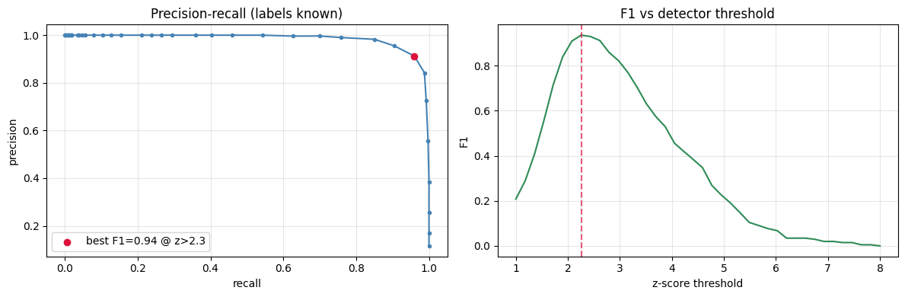
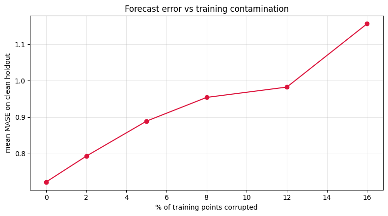

When SynForecast injects an anomaly, changepoint, or gap, it also keeps
the label and the uncorrupted series. That lets you measure two things
you normally can’t: how well a detector finds the corruptions, and how
much they cost a forecaster. Both need answers that real data doesn’t
hand you.

> **Why synthetic data**
>
> A detector’s precision and recall are only defined if you know which
> points are anomalies. Measuring the cost of contamination needs a
> clean copy of the same series. On real data you have neither; the
> generator supplies both.

```python
import matplotlib.pyplot as plt
import numpy as np
import polars as pl

from utilsforecast.losses import mase

from synforecast.exogenous import ExogenousConfig
from synforecast.generators import SeasonalGenerator


def robust_zscores(y: np.ndarray, window: int = 25) -> np.ndarray:
    """Rolling robust z-score: |y - median| / (1.4826 * MAD) in a window."""
    n = len(y)
    z = np.zeros(n)
    half = window // 2
    for i in range(n):
        lo, hi = max(0, i - half), min(n, i + half + 1)
        w = y[lo:hi]
        med = np.median(w)
        mad = np.median(np.abs(w - med))
        scale = 1.4826 * mad if mad > 1e-9 else (np.std(w) + 1e-9)
        z[i] = abs(y[i] - med) / scale
    return z
```

## Detecting anomalies

We make weekly-seasonal series with 4% of points hit by spikes and dips,
and record their positions with `ExogenousConfig(anomaly_flags=True)`. A
rolling robust z-score scores each point; varying the threshold moves
along the precision/recall trade-off.

```python
FLAGS = ExogenousConfig(anomaly_flags=True)

panel = SeasonalGenerator(
    engine='polars', min_length=400, max_length=400, freq='D',
    seasonality_period=7, seasonality_amplitude=8.0, base_level=100.0,
    noise_level=2.0,
    anomalies=True, anomaly_fraction=0.04, anomaly_types=['spike', 'dip'],
    spike_magnitude=30.0, dip_magnitude=-30.0,
    exogenous=FLAGS, seed=7,
).generate(n_series=25)

# Pool robust z-scores and ground-truth labels across every series.
scores, labels = [], []
for uid in panel['unique_id'].unique(maintain_order=True):
    s = panel.filter(pl.col('unique_id') == uid)
    scores.append(robust_zscores(s['y'].to_numpy()))
    labels.append(s['anomaly_flag'].to_numpy())
scores = np.concatenate(scores)
labels = np.concatenate(labels).astype(bool)
print(f'{labels.sum()} injected anomalies across {len(labels)} points '
      f'({labels.mean():.1%})')
```

``` text
400 injected anomalies across 10000 points (4.0%)
```

```python
thresholds = np.linspace(1.0, 8.0, 40)
precision, recall, f1 = [], [], []
for t in thresholds:
    pred = scores > t
    tp = int((pred & labels).sum())
    fp = int((pred & ~labels).sum())
    fn = int((~pred & labels).sum())
    p = tp / (tp + fp) if tp + fp else 1.0
    r = tp / (tp + fn) if tp + fn else 0.0
    precision.append(p)
    recall.append(r)
    f1.append(2 * p * r / (p + r) if p + r else 0.0)

best = int(np.argmax(f1))
fig, (ax1, ax2) = plt.subplots(1, 2, figsize=(12, 4))
ax1.plot(recall, precision, marker='.', color='steelblue')
ax1.scatter([recall[best]], [precision[best]], color='crimson', zorder=5,
            label=f'best F1={f1[best]:.2f} @ z>{thresholds[best]:.1f}')
ax1.set(xlabel='recall', ylabel='precision', title='Precision-recall (labels known)')
ax1.legend(); ax1.grid(alpha=0.3)
ax2.plot(thresholds, f1, color='seagreen')
ax2.axvline(thresholds[best], color='crimson', ls='--', alpha=0.7)
ax2.set(xlabel='z-score threshold', ylabel='F1', title='F1 vs detector threshold')
ax2.grid(alpha=0.3)
plt.tight_layout(); plt.show()
```



The labels make the operating point measurable rather than assumed: the
marked threshold is the one with the best F1. Higher thresholds buy
precision at the cost of recall. Substitute another detector to see
where it sits on the same axes.

## The cost of contamination

We generate clean seasonal series, hold out the last 14 days, then
corrupt a growing fraction of the *training* history and refit a
trend-plus-seasonal-means model. That model reads its slope and seasonal
profile off every training point, so outliers shift the fit — a
seasonal-naive rule, which only repeats recent values, would barely
register them.

> **Scale against the clean series**
>
> Each forecast is scaled by an in-sample seasonal error taken from the
> **clean** training series and held fixed across contamination levels.
> Scale by the contaminated series instead and the spikes inflate the
> denominator, so error appears to drop as contamination rises.

```python
H, SEASON = 14, 7
clean = SeasonalGenerator(
    engine='polars', min_length=200, max_length=200, freq='D',
    seasonality_period=SEASON, seasonality_amplitude=8.0, base_level=100.0,
    noise_level=2.0, seed=11,
).generate(n_series=40)

rng = np.random.default_rng(0)
ids = clean['unique_id'].unique(maintain_order=True).to_list()
series = [clean.filter(pl.col('unique_id') == u)['y'].to_numpy() for u in ids]
dates = clean.filter(pl.col('unique_id') == ids[0])['ds'].to_list()


def trend_seasonal_forecast(train, h, season):
    """Least-squares trend + per-position seasonal means (outlier-sensitive)."""
    n = len(train)
    t = np.arange(n)
    slope, intercept = np.polyfit(t, train, 1)
    resid = train - (slope * t + intercept)
    seasonal = np.array([resid[k::season].mean() for k in range(season)])
    fut = np.arange(n, n + h)
    return slope * fut + intercept + seasonal[fut % season]


# `mase` takes its scale from train_df. Passing the CLEAN training frame, the
# same one at every contamination level, is what keeps the denominator honest:
# scaling by the contaminated series would inflate it and make error appear to
# fall as noise is added.
clean_train_df = pl.DataFrame(
    {
        'unique_id': [uid for uid in ids for _ in dates[:-H]],
        'ds': [d for _ in ids for d in dates[:-H]],
        'y': np.concatenate([y[:-H] for y in series]),
    }
)

levels = [0.0, 0.02, 0.05, 0.08, 0.12, 0.16]
curve = []
for contamination in levels:
    forecasts = []
    for y in series:
        train, test = y[:-H].copy(), y[-H:]
        k = int(round(contamination * len(train)))
        if k:
            idx = rng.choice(len(train), size=k, replace=False)
            train[idx] += rng.choice([-1, 1], size=k) * rng.uniform(15, 35, size=k)
        forecasts.append(trend_seasonal_forecast(train, H, SEASON))
    scored = mase(
        pl.DataFrame(
            {
                'unique_id': [uid for uid in ids for _ in range(H)],
                'ds': [d for _ in ids for d in dates[-H:]],
                'y': np.concatenate([y[-H:] for y in series]),
                'forecast': np.concatenate(forecasts),
            }
        ),
        models=['forecast'],
        seasonality=SEASON,
        train_df=clean_train_df,
    )
    curve.append(float(scored['forecast'].mean()))

fig, ax = plt.subplots(figsize=(8, 4.5))
ax.plot([c * 100 for c in levels], curve, marker='o', color='crimson')
ax.set(xlabel='% of training points corrupted', ylabel='mean MASE on clean holdout',
       title='Forecast error vs training contamination')
ax.grid(alpha=0.3)
plt.tight_layout(); plt.show()
print('MASE at 0% / 16% contamination: '
      f'{curve[0]:.3f} / {curve[-1]:.3f}')

```



``` text
MASE at 0% / 16% contamination: 0.722 / 1.157
```

Error rises with contamination, measured on a holdout we know is clean
and against a scale the noise can’t move. The same setup works for any
pipeline: perturb the input by a known amount and watch a trustworthy
metric respond.

> **Related capabilities**
>
> -   [Anomalies](anomalies), [changepoints](changepoints), and
>     [missingness](missingness) — the injection knobs used here, each
>     with a ground-truth flag column.
> -   [When does synthetic data help?](when_synthetic_helps) — the
>     accuracy picture, and the uses that sit outside it.

