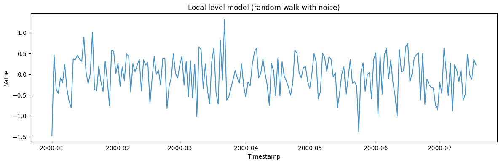
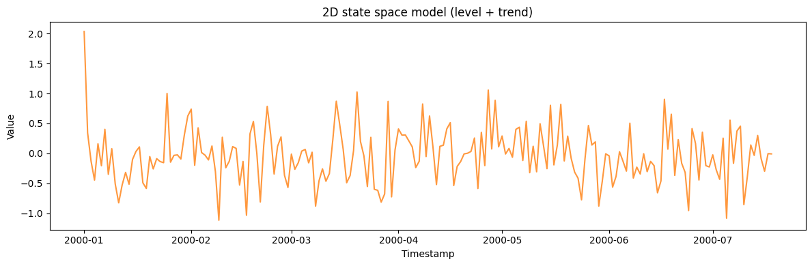
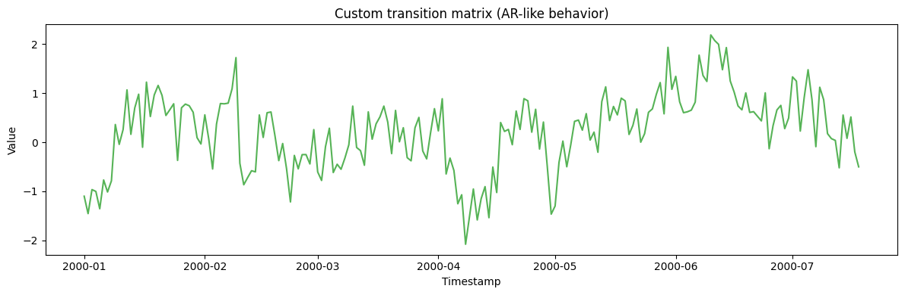
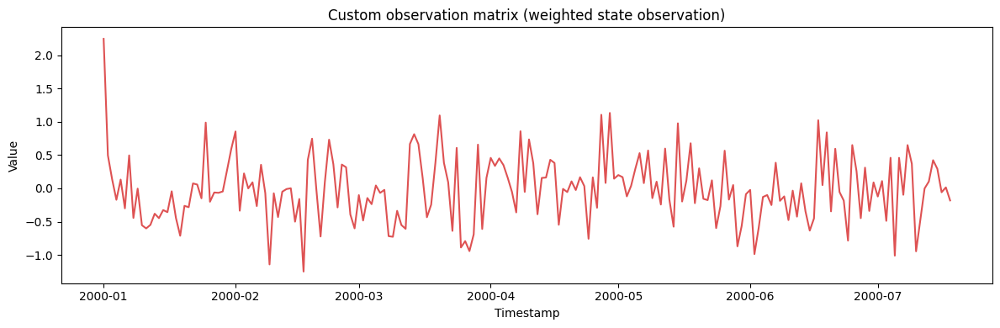
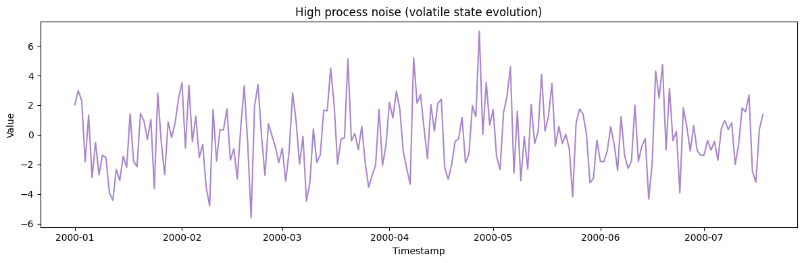
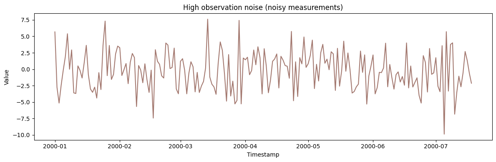
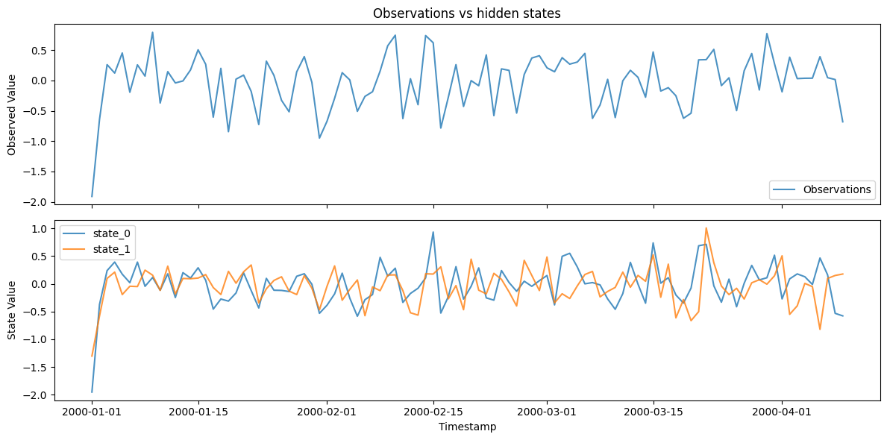
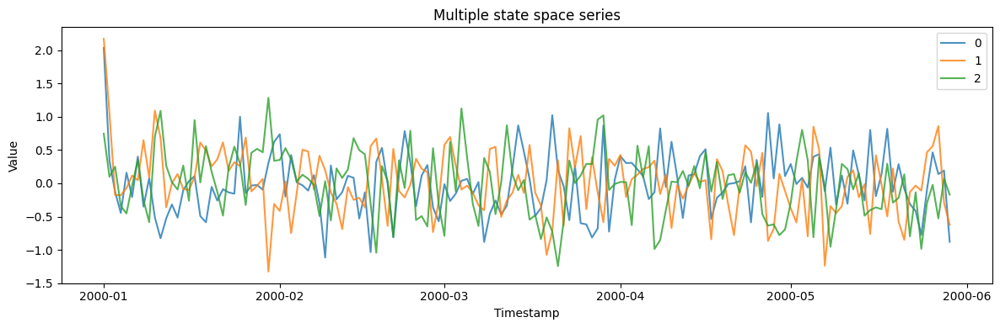

A state-space model separates a hidden *state* that evolves over time
from the *observations* it emits. It is the general framework underlying
ARIMA, ETS, and Kalman filtering; `StateSpaceGenerator` lets you specify
the transition and observation dynamics directly to build custom linear
systems.

> **The model**
>
> $$x_t = F x_{t-1} + w_t, \quad w_t \sim (0, Q), \qquad y_t = H x_t + v_t, \quad v_t \sim \mathcal{N}(0, R)$$
>
> A latent state evolves by a linear transition with process noise, and
> is mapped to the observed series by an observation equation with
> measurement noise. Choosing these dynamics reproduces local-level,
> local-trend, and other structural time-series models.

```python
import numpy as np
import polars as pl
import matplotlib.pyplot as plt

from synforecast.generators import StateSpaceGenerator
```

## 1. Basic local level model (random walk with noise)

The simplest state space model: a hidden random walk observed with
measurement noise.

```python
local_level_params = {
    "min_length": 200,
    "max_length": 200,
    "freq": "D",
    "state_dim": 1,
    "obs_dim": 1,
    "seed": 42,
}
local_level_gen = StateSpaceGenerator(engine="polars", **local_level_params)
local_level_df = local_level_gen.generate(n_series=1)
print(f"Generated {len(local_level_df)} observations from local level model")
print(
    f"Statistics: Mean={local_level_df['y'].mean():.4f}, "
    f"Std={local_level_df['y'].std():.4f}"
)
local_level_df.head(10)
```

``` text
Generated 200 observations from local level model
Statistics: Mean=-0.0235, Std=0.4556
```

| unique_id | ds                  | y         |
|-----------|---------------------|-----------|
| cat       | datetime\[ns\]      | f64       |
| "0"       | 2000-01-01 00:00:00 | -1.477252 |
| "0"       | 2000-01-02 00:00:00 | 0.466308  |
| "0"       | 2000-01-03 00:00:00 | -0.351479 |
| "0"       | 2000-01-04 00:00:00 | -0.460238 |
| "0"       | 2000-01-05 00:00:00 | -0.088038 |
| "0"       | 2000-01-06 00:00:00 | -0.199117 |
| "0"       | 2000-01-07 00:00:00 | 0.23307   |
| "0"       | 2000-01-08 00:00:00 | -0.331227 |
| "0"       | 2000-01-09 00:00:00 | -0.634035 |
| "0"       | 2000-01-10 00:00:00 | -0.79934  |

```python
fig, ax = plt.subplots(figsize=(12, 4))
ax.plot(local_level_df["ds"].to_list(), local_level_df["y"].to_list(), alpha=0.8)
ax.set_xlabel("Timestamp")
ax.set_ylabel("Value")
ax.set_title("Local level model (random walk with noise)")
plt.tight_layout()
plt.show()
```



## 2. 2D state space model (level + trend)

A two-dimensional state captures both the level and its trend (rate of
change).

```python
two_dim_params = {
    "min_length": 200,
    "max_length": 200,
    "freq": "D",
    "state_dim": 2,
    "obs_dim": 1,
    "seed": 42,
}
two_dim_gen = StateSpaceGenerator(engine="polars", **two_dim_params)
two_dim_df = two_dim_gen.generate(n_series=1)
print(f"Generated {len(two_dim_df)} observations from 2D state space model")
print(
    f"Statistics: Mean={two_dim_df['y'].mean():.4f}, "
    f"Std={two_dim_df['y'].std():.4f}"
)
two_dim_df.head(10)
```

``` text
Generated 200 observations from 2D state space model
Statistics: Mean=-0.0315, Std=0.4513
```

| unique_id | ds                  | y         |
|-----------|---------------------|-----------|
| cat       | datetime\[ns\]      | f64       |
| "0"       | 2000-01-01 00:00:00 | 2.035213  |
| "0"       | 2000-01-02 00:00:00 | 0.342724  |
| "0"       | 2000-01-03 00:00:00 | -0.130302 |
| "0"       | 2000-01-04 00:00:00 | -0.445831 |
| "0"       | 2000-01-05 00:00:00 | 0.159239  |
| "0"       | 2000-01-06 00:00:00 | -0.206335 |
| "0"       | 2000-01-07 00:00:00 | 0.401635  |
| "0"       | 2000-01-08 00:00:00 | -0.350341 |
| "0"       | 2000-01-09 00:00:00 | 0.077724  |
| "0"       | 2000-01-10 00:00:00 | -0.512018 |

```python
fig, ax = plt.subplots(figsize=(12, 4))
ax.plot(two_dim_df["ds"].to_list(), two_dim_df["y"].to_list(), alpha=0.8, color="C1")
ax.set_xlabel("Timestamp")
ax.set_ylabel("Value")
ax.set_title("2D state space model (level + trend)")
plt.tight_layout()
plt.show()
```



## 3. Custom transition matrix (AR-like behavior)

Specify a custom state transition matrix to create AR-like dynamics in
the hidden state.

```python
transition_matrix = np.array([[0.9, 0.1], [0.0, 0.8]])
custom_transition_params = {
    "min_length": 200,
    "max_length": 200,
    "freq": "D",
    "state_dim": 2,
    "obs_dim": 1,
    "transition_matrix": transition_matrix.tolist(),
    "seed": 42,
}
custom_transition_gen = StateSpaceGenerator(engine="polars", **custom_transition_params)
custom_transition_df = custom_transition_gen.generate(n_series=1)
print(f"Generated {len(custom_transition_df)} observations with custom transition matrix")
print(
    f"Statistics: Mean={custom_transition_df['y'].mean():.4f}, "
    f"Std={custom_transition_df['y'].std():.4f}"
)
custom_transition_df.head(10)
```

``` text
Generated 200 observations with custom transition matrix
Statistics: Mean=0.2258, Std=0.7764
```

| unique_id | ds                  | y         |
|-----------|---------------------|-----------|
| cat       | datetime\[ns\]      | f64       |
| "0"       | 2000-01-01 00:00:00 | -1.099579 |
| "0"       | 2000-01-02 00:00:00 | -1.454542 |
| "0"       | 2000-01-03 00:00:00 | -0.964621 |
| "0"       | 2000-01-04 00:00:00 | -1.002322 |
| "0"       | 2000-01-05 00:00:00 | -1.355461 |
| "0"       | 2000-01-06 00:00:00 | -0.768567 |
| "0"       | 2000-01-07 00:00:00 | -1.013438 |
| "0"       | 2000-01-08 00:00:00 | -0.786117 |
| "0"       | 2000-01-09 00:00:00 | 0.361217  |
| "0"       | 2000-01-10 00:00:00 | -0.043312 |

```python
fig, ax = plt.subplots(figsize=(12, 4))
ax.plot(custom_transition_df["ds"].to_list(), custom_transition_df["y"].to_list(), alpha=0.8, color="C2")
ax.set_xlabel("Timestamp")
ax.set_ylabel("Value")
ax.set_title("Custom transition matrix (AR-like behavior)")
plt.tight_layout()
plt.show()
```



## 4. Custom observation matrix (weighted state observation)

Observe a weighted combination of the hidden states.

```python
observation_matrix = np.array([[1.0, 0.5]])
custom_obs_params = {
    "min_length": 200,
    "max_length": 200,
    "freq": "D",
    "state_dim": 2,
    "obs_dim": 1,
    "observation_matrix": observation_matrix.tolist(),
    "seed": 42,
}
custom_obs_gen = StateSpaceGenerator(engine="polars", **custom_obs_params)
custom_obs_df = custom_obs_gen.generate(n_series=1)
print(f"Generated {len(custom_obs_df)} observations with custom observation matrix")
print(
    f"Statistics: Mean={custom_obs_df['y'].mean():.4f}, "
    f"Std={custom_obs_df['y'].std():.4f}"
)
custom_obs_df.head(10)
```

``` text
Generated 200 observations with custom observation matrix
Statistics: Mean=-0.0163, Std=0.4940
```

| unique_id | ds                  | y         |
|-----------|---------------------|-----------|
| cat       | datetime\[ns\]      | f64       |
| "0"       | 2000-01-01 00:00:00 | 2.24795   |
| "0"       | 2000-01-02 00:00:00 | 0.496252  |
| "0"       | 2000-01-03 00:00:00 | 0.135206  |
| "0"       | 2000-01-04 00:00:00 | -0.172047 |
| "0"       | 2000-01-05 00:00:00 | 0.132115  |
| "0"       | 2000-01-06 00:00:00 | -0.300323 |
| "0"       | 2000-01-07 00:00:00 | 0.495517  |
| "0"       | 2000-01-08 00:00:00 | -0.444273 |
| "0"       | 2000-01-09 00:00:00 | -0.004085 |
| "0"       | 2000-01-10 00:00:00 | -0.554032 |

```python
fig, ax = plt.subplots(figsize=(12, 4))
ax.plot(custom_obs_df["ds"].to_list(), custom_obs_df["y"].to_list(), alpha=0.8, color="C3")
ax.set_xlabel("Timestamp")
ax.set_ylabel("Value")
ax.set_title("Custom observation matrix (weighted state observation)")
plt.tight_layout()
plt.show()
```



## 5. High process noise (volatile state evolution)

Increase the process noise covariance to create more volatile hidden
state dynamics.

```python
high_process_noise = np.array([[5.0, 0.0], [0.0, 5.0]])
high_noise_params = {
    "min_length": 200,
    "max_length": 200,
    "freq": "D",
    "state_dim": 2,
    "obs_dim": 1,
    "state_covariance": high_process_noise.tolist(),
    "seed": 42,
}
high_noise_gen = StateSpaceGenerator(engine="polars", **high_noise_params)
high_noise_df = high_noise_gen.generate(n_series=1)
print(f"Generated {len(high_noise_df)} observations with high process noise")
print(
    f"Statistics: Mean={high_noise_df['y'].mean():.4f}, "
    f"Std={high_noise_df['y'].std():.4f}"
)
high_noise_df.head(10)
```

``` text
Generated 200 observations with high process noise
Statistics: Mean=-0.1518, Std=2.2105
```

| unique_id | ds                  | y         |
|-----------|---------------------|-----------|
| cat       | datetime\[ns\]      | f64       |
| "0"       | 2000-01-01 00:00:00 | 2.035213  |
| "0"       | 2000-01-02 00:00:00 | 2.980453  |
| "0"       | 2000-01-03 00:00:00 | 2.307622  |
| "0"       | 2000-01-04 00:00:00 | -1.815772 |
| "0"       | 2000-01-05 00:00:00 | 1.32836   |
| "0"       | 2000-01-06 00:00:00 | -2.890637 |
| "0"       | 2000-01-07 00:00:00 | -0.526938 |
| "0"       | 2000-01-08 00:00:00 | -2.710086 |
| "0"       | 2000-01-09 00:00:00 | -1.37662  |
| "0"       | 2000-01-10 00:00:00 | -1.535066 |

```python
fig, ax = plt.subplots(figsize=(12, 4))
ax.plot(high_noise_df["ds"].to_list(), high_noise_df["y"].to_list(), alpha=0.8, color="C4")
ax.set_xlabel("Timestamp")
ax.set_ylabel("Value")
ax.set_title("High process noise (volatile state evolution)")
plt.tight_layout()
plt.show()
```



## 6. High observation noise (noisy measurements)

Increase the observation noise to simulate noisy measurement conditions.

```python
high_obs_noise = np.array([[10.0]])
noisy_obs_params = {
    "min_length": 200,
    "max_length": 200,
    "freq": "D",
    "state_dim": 2,
    "obs_dim": 1,
    "obs_covariance": high_obs_noise.tolist(),
    "seed": 42,
}
noisy_obs_gen = StateSpaceGenerator(engine="polars", **noisy_obs_params)
noisy_obs_df = noisy_obs_gen.generate(n_series=1)
print(f"Generated {len(noisy_obs_df)} observations with high observation noise")
print(
    f"Statistics: Mean={noisy_obs_df['y'].mean():.4f}, "
    f"Std={noisy_obs_df['y'].std():.4f}"
)
noisy_obs_df.head(10)
```

``` text
Generated 200 observations with high observation noise
Statistics: Mean=-0.2227, Std=2.9604
```

| unique_id | ds                  | y         |
|-----------|---------------------|-----------|
| cat       | datetime\[ns\]      | f64       |
| "0"       | 2000-01-01 00:00:00 | 5.679936  |
| "0"       | 2000-01-02 00:00:00 | -2.754326 |
| "0"       | 2000-01-03 00:00:00 | -5.158032 |
| "0"       | 2000-01-04 00:00:00 | -2.433461 |
| "0"       | 2000-01-05 00:00:00 | -0.135867 |
| "0"       | 2000-01-06 00:00:00 | 1.917522  |
| "0"       | 2000-01-07 00:00:00 | 5.393208  |
| "0"       | 2000-01-08 00:00:00 | -0.005179 |
| "0"       | 2000-01-09 00:00:00 | 2.933222  |
| "0"       | 2000-01-10 00:00:00 | -3.603567 |

```python
fig, ax = plt.subplots(figsize=(12, 4))
ax.plot(noisy_obs_df["ds"].to_list(), noisy_obs_df["y"].to_list(), alpha=0.8, color="C5")
ax.set_xlabel("Timestamp")
ax.set_ylabel("Value")
ax.set_title("High observation noise (noisy measurements)")
plt.tight_layout()
plt.show()
```



## 7. Generate with hidden states

Return both observations and hidden states to inspect the latent
dynamics.

```python
with_states_params = {
    "min_length": 100,
    "max_length": 100,
    "freq": "D",
    "state_dim": 2,
    "obs_dim": 1,
    "seed": 42,
}
with_states_gen = StateSpaceGenerator(engine="polars", **with_states_params)
obs_df, states_df = with_states_gen.generate_with_states(n_series=1)
print(f"Generated observations and hidden states")
print(
    f"Observation Statistics: Mean={obs_df['y'].mean():.4f}, "
    f"Std={obs_df['y'].std():.4f}"
)
print("\nObservations:")
print(obs_df.head(10))
print("\nHidden States:")
print(states_df.head(10))
```

``` text
Generated observations and hidden states
Observation Statistics: Mean=-0.0286, Std=0.4412

Observations:
shape: (10, 3)
┌───────────┬─────────────────────┬───────────┐
│ unique_id ┆ ds                  ┆ y         │
│ ---       ┆ ---                 ┆ ---       │
│ cat       ┆ datetime[ns]        ┆ f64       │
╞═══════════╪═════════════════════╪═══════════╡
│ 0         ┆ 2000-01-01 00:00:00 ┆ -1.910609 │
│ 0         ┆ 2000-01-02 00:00:00 ┆ -0.642705 │
│ 0         ┆ 2000-01-03 00:00:00 ┆ 0.258913  │
│ 0         ┆ 2000-01-04 00:00:00 ┆ 0.120297  │
│ 0         ┆ 2000-01-05 00:00:00 ┆ 0.451117  │
│ 0         ┆ 2000-01-06 00:00:00 ┆ -0.195514 │
│ 0         ┆ 2000-01-07 00:00:00 ┆ 0.256028  │
│ 0         ┆ 2000-01-08 00:00:00 ┆ 0.070385  │
│ 0         ┆ 2000-01-09 00:00:00 ┆ 0.791294  │
│ 0         ┆ 2000-01-10 00:00:00 ┆ -0.372822 │
└───────────┴─────────────────────┴───────────┘

Hidden States:
shape: (10, 4)
┌───────────┬─────────────────────┬───────────┬───────────┐
│ unique_id ┆ ds                  ┆ state_0   ┆ state_1   │
│ ---       ┆ ---                 ┆ ---       ┆ ---       │
│ cat       ┆ datetime[ns]        ┆ f64       ┆ f64       │
╞═══════════╪═════════════════════╪═══════════╪═══════════╡
│ 0         ┆ 2000-01-01 00:00:00 ┆ -1.951035 ┆ -1.30218  │
│ 0         ┆ 2000-01-02 00:00:00 ┆ -0.372949 ┆ -0.5793   │
│ 0         ┆ 2000-01-03 00:00:00 ┆ 0.238032  ┆ 0.097115  │
│ 0         ┆ 2000-01-04 00:00:00 ┆ 0.39203   ┆ 0.210554  │
│ 0         ┆ 2000-01-05 00:00:00 ┆ 0.173327  ┆ -0.193943 │
│ 0         ┆ 2000-01-06 00:00:00 ┆ 0.019815  ┆ -0.044133 │
│ 0         ┆ 2000-01-07 00:00:00 ┆ 0.391477  ┆ -0.049829 │
│ 0         ┆ 2000-01-08 00:00:00 ┆ -0.045179 ┆ 0.24666   │
│ 0         ┆ 2000-01-09 00:00:00 ┆ 0.114046  ┆ 0.155727  │
│ 0         ┆ 2000-01-10 00:00:00 ┆ -0.115485 ┆ -0.119006 │
└───────────┴─────────────────────┴───────────┴───────────┘
```

```python
fig, axes = plt.subplots(2, 1, figsize=(12, 6), sharex=True)
axes[0].plot(obs_df["ds"].to_list(), obs_df["y"].to_list(), alpha=0.8, label="Observations")
axes[0].set_ylabel("Observed Value")
axes[0].set_title("Observations vs hidden states")
axes[0].legend()

state_cols = [c for c in states_df.columns if c.startswith("state_")]
for col in state_cols:
    axes[1].plot(states_df["ds"].to_list(), states_df[col].to_list(), alpha=0.8, label=col)
axes[1].set_xlabel("Timestamp")
axes[1].set_ylabel("State Value")
axes[1].legend()
plt.tight_layout()
plt.show()
```



## 8. Multiple state space series

Generate multiple independent state space series.

```python
multi_params = {
    "min_length": 150,
    "max_length": 150,
    "freq": "D",
    "state_dim": 2,
    "obs_dim": 1,
    "seed": 42,
}
multi_gen = StateSpaceGenerator(engine="polars", **multi_params)
multi_df = multi_gen.generate(n_series=3)
print(f"Generated 3 series with {len(multi_df)} total observations")
print(
    f"Overall Statistics: Mean={multi_df['y'].mean():.4f}, "
    f"Std={multi_df['y'].std():.4f}"
)

multi_df.filter(pl.col("unique_id") == "0").head(10)
```

``` text
Generated 3 series with 450 total observations
Overall Statistics: Mean=-0.0026, Std=0.4818
```

| unique_id | ds                  | y         |
|-----------|---------------------|-----------|
| cat       | datetime\[ns\]      | f64       |
| "0"       | 2000-01-01 00:00:00 | 2.035213  |
| "0"       | 2000-01-02 00:00:00 | 0.342724  |
| "0"       | 2000-01-03 00:00:00 | -0.130302 |
| "0"       | 2000-01-04 00:00:00 | -0.445831 |
| "0"       | 2000-01-05 00:00:00 | 0.159239  |
| "0"       | 2000-01-06 00:00:00 | -0.206335 |
| "0"       | 2000-01-07 00:00:00 | 0.401635  |
| "0"       | 2000-01-08 00:00:00 | -0.350341 |
| "0"       | 2000-01-09 00:00:00 | 0.077724  |
| "0"       | 2000-01-10 00:00:00 | -0.512018 |

```python
fig, ax = plt.subplots(figsize=(12, 4))
for uid in multi_df["unique_id"].unique().to_list():
    series = multi_df.filter(pl.col("unique_id") == uid)
    ax.plot(series["ds"].to_list(), series["y"].to_list(), label=uid, alpha=0.8)
ax.set_xlabel("Timestamp")
ax.set_ylabel("Value")
ax.set_title("Multiple state space series")
ax.legend()
plt.tight_layout()
plt.show()
```



> **Related generators**
>
> -   [SARIMA](../statistical/sarima) and [ETS](../statistical/ets) —
>     specific state-space families.
> -   [Chaotic system](../stochastic/chaotic_system) — deterministic
>     nonlinear dynamics.
>
> Full parameters are in the [generator
> reference](https://github.com/Nixtla/synforecast/blob/main/GENERATORS.md).

