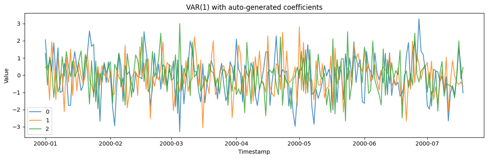
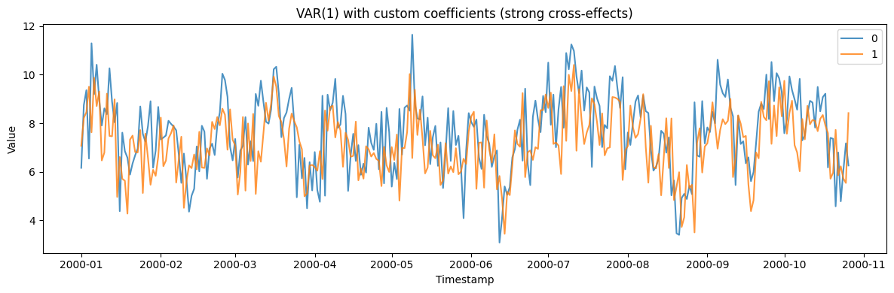
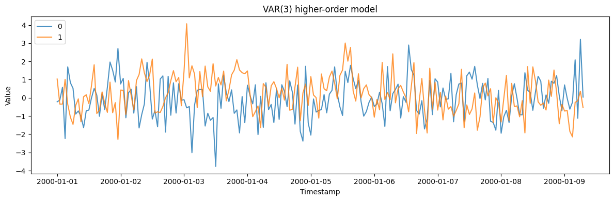
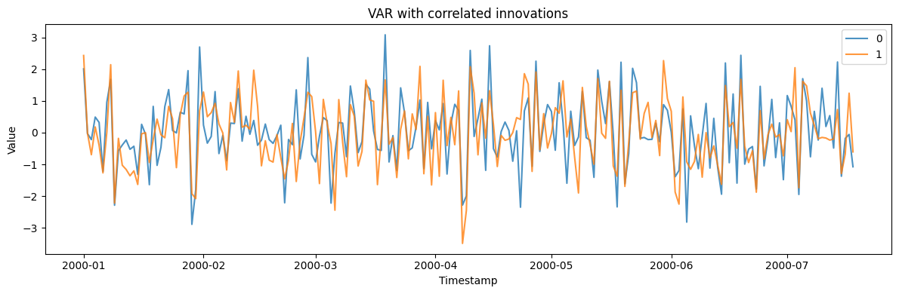
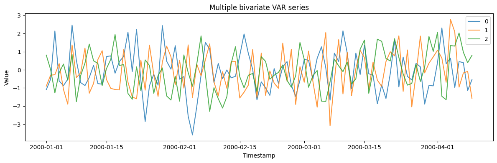

A vector autoregression models several series that influence *each other
over time*: every channel is a linear function of the recent past of all
channels. It is the standard multivariate linear model for coupled
economic and sensor series, capturing the lead-lag feedback that a set
of independent univariate models cannot.

> **The model**
>
> $$y_t = c + A_1 y_{t-1} + \dots + A_p y_{t-p} + e_t, \qquad e_t \sim (0, \Sigma)$$
>
> At each step every series is a linear combination of the last
> `lag_order` values of all series, plus correlated innovations.
> `generate(n_series)` returns the coupled channels of one system, so
> the cross-series dynamics are shared rather than independent.

```python
import numpy as np
import polars as pl
import matplotlib.pyplot as plt

from synforecast.generators import VARGenerator
```

## 1. VAR(1) with auto-generated stable coefficients

Generate a 3-variable VAR(1) model with automatically generated stable
coefficient matrices.

```python
params_auto = {
    "min_length": 200,
    "max_length": 200,
    "freq": "D",
    "lag_order": 1,
    "seed": 42,
}

gen_auto = VARGenerator(engine="polars", **params_auto)
df_auto = gen_auto.generate(n_series=3)

print(f"Generated {len(df_auto)} observations for 3 variables")
df_auto.head(10)
```

``` text
Generated 600 observations for 3 variables
```

| unique_id | ds                  | y         |
|-----------|---------------------|-----------|
| cat       | datetime\[ns\]      | f64       |
| "0"       | 2000-01-01 00:00:00 | 2.057667  |
| "0"       | 2000-01-02 00:00:00 | 0.295293  |
| "0"       | 2000-01-03 00:00:00 | 0.893053  |
| "0"       | 2000-01-04 00:00:00 | 0.235888  |
| "0"       | 2000-01-05 00:00:00 | 1.876363  |
| "0"       | 2000-01-06 00:00:00 | -0.051986 |
| "0"       | 2000-01-07 00:00:00 | 1.583556  |
| "0"       | 2000-01-08 00:00:00 | -1.001584 |
| "0"       | 2000-01-09 00:00:00 | -0.94835  |
| "0"       | 2000-01-10 00:00:00 | 0.680186  |

```python
fig, ax = plt.subplots(figsize=(12, 4))
for uid in df_auto["unique_id"].unique().to_list():
    series = df_auto.filter(pl.col("unique_id") == uid)
    ax.plot(series["ds"].to_list(), series["y"].to_list(), label=uid, alpha=0.8)
ax.set_xlabel("Timestamp")
ax.set_ylabel("Value")
ax.set_title("VAR(1) with auto-generated coefficients")
ax.legend()
plt.tight_layout()
plt.show()
```



### Summary statistics and correlations

```python
stats = df_auto.group_by("unique_id").agg(
    pl.col("y").mean().alias("mean"),
    pl.col("y").std().alias("std"),
)
print("Summary statistics:")
print(stats)

df_wide = df_auto.pivot(on="unique_id", index="ds", values="y")
series_cols = [col for col in df_wide.columns if col != "ds"]
if len(series_cols) >= 2:
    corr_01 = np.corrcoef(
        df_wide[series_cols[0]].to_numpy(), df_wide[series_cols[1]].to_numpy()
    )[0, 1]
    print(f"\nVariable correlations:")
    print(f"  0 vs 1: {corr_01:.3f}")
```

``` text
Summary statistics:
shape: (3, 3)
┌───────────┬───────────┬──────────┐
│ unique_id ┆ mean      ┆ std      │
│ ---       ┆ ---       ┆ ---      │
│ cat       ┆ f64       ┆ f64      │
╞═══════════╪═══════════╪══════════╡
│ 0         ┆ -0.060332 ┆ 1.168862 │
│ 2         ┆ -0.037405 ┆ 1.077848 │
│ 1         ┆ -0.081108 ┆ 1.0294   │
└───────────┴───────────┴──────────┘

Variable correlations:
  0 vs 1: 0.218
```

## 2. VAR(1) with custom coefficients (strong cross-effects)

Design a coefficient matrix where each variable depends strongly on the
other’s lagged values.

```python
coef_matrix = np.array(
    [
        [0.3, 0.6],
        [0.5, 0.2],
    ]
)

params_custom = {
    "min_length": 300,
    "max_length": 300,
    "freq": "D",
    "lag_order": 1,
    "coef_matrices": [coef_matrix],
    "intercept": np.array([1.0, 2.0]),
    "seed": 123,
}

gen_custom = VARGenerator(engine="polars", **params_custom)
df_custom = gen_custom.generate(n_series=2)

print(f"Generated {len(df_custom)} observations")
print(f"Coefficient matrix:\n{coef_matrix}")
df_custom.head(10)
```

``` text
Generated 600 observations
Coefficient matrix:
[[0.3 0.6]
 [0.5 0.2]]
```

| unique_id | ds                  | y         |
|-----------|---------------------|-----------|
| cat       | datetime\[ns\]      | f64       |
| "0"       | 2000-01-01 00:00:00 | 6.160864  |
| "0"       | 2000-01-02 00:00:00 | 8.747224  |
| "0"       | 2000-01-03 00:00:00 | 9.36052   |
| "0"       | 2000-01-04 00:00:00 | 6.545609  |
| "0"       | 2000-01-05 00:00:00 | 11.293658 |
| "0"       | 2000-01-06 00:00:00 | 9.197751  |
| "0"       | 2000-01-07 00:00:00 | 10.410391 |
| "0"       | 2000-01-08 00:00:00 | 8.974064  |
| "0"       | 2000-01-09 00:00:00 | 7.905556  |
| "0"       | 2000-01-10 00:00:00 | 8.612394  |

```python
fig, ax = plt.subplots(figsize=(12, 4))
for uid in df_custom["unique_id"].unique().to_list():
    series = df_custom.filter(pl.col("unique_id") == uid)
    ax.plot(series["ds"].to_list(), series["y"].to_list(), label=uid, alpha=0.8)
ax.set_xlabel("Timestamp")
ax.set_ylabel("Value")
ax.set_title("VAR(1) with custom coefficients (strong cross-effects)")
ax.legend()
plt.tight_layout()
plt.show()
```



```python
df_custom_wide = df_custom.pivot(on="unique_id", index="ds", values="y")
custom_cols = [col for col in df_custom_wide.columns if col != "ds"]
if len(custom_cols) >= 2:
    corr_stocks = np.corrcoef(
        df_custom_wide[custom_cols[0]].to_numpy(),
        df_custom_wide[custom_cols[1]].to_numpy(),
    )[0, 1]
    print(f"Series correlation: {corr_stocks:.3f}")
    print(f"Note: Strong cross-dependencies create correlation between variables")
```

``` text
Series correlation: 0.414
Note: Strong cross-dependencies create correlation between variables
```

## 3. Higher-order VAR(3) model

A VAR(3) model uses three lags of each variable, capturing longer-range
dependencies.

```python
params_var3 = {
    "min_length": 200,
    "max_length": 200,
    "freq": "h",
    "lag_order": 3,
    "seed": 456,
}

gen_var3 = VARGenerator(engine="polars", **params_var3)
df_var3 = gen_var3.generate(n_series=2)

print(f"Generated {len(df_var3)} hourly observations")
print(f"Model: VAR(3) - uses 3 lags of each variable")
df_var3.head(10)
```

``` text
Generated 400 hourly observations
Model: VAR(3) - uses 3 lags of each variable
```

| unique_id | ds                  | y         |
|-----------|---------------------|-----------|
| cat       | datetime\[ns\]      | f64       |
| "0"       | 2000-01-01 00:00:00 | -0.221184 |
| "0"       | 2000-01-01 01:00:00 | -0.122691 |
| "0"       | 2000-01-01 02:00:00 | 0.572251  |
| "0"       | 2000-01-01 03:00:00 | -2.239382 |
| "0"       | 2000-01-01 04:00:00 | 1.699675  |
| "0"       | 2000-01-01 05:00:00 | 0.831221  |
| "0"       | 2000-01-01 06:00:00 | 0.521463  |
| "0"       | 2000-01-01 07:00:00 | -0.893806 |
| "0"       | 2000-01-01 08:00:00 | -0.722153 |
| "0"       | 2000-01-01 09:00:00 | -1.019791 |

```python
fig, ax = plt.subplots(figsize=(12, 4))
for uid in df_var3["unique_id"].unique().to_list():
    series = df_var3.filter(pl.col("unique_id") == uid)
    ax.plot(series["ds"].to_list(), series["y"].to_list(), label=uid, alpha=0.8)
ax.set_xlabel("Timestamp")
ax.set_ylabel("Value")
ax.set_title("VAR(3) higher-order model")
ax.legend()
plt.tight_layout()
plt.show()
```



## 4. VAR with correlated innovations

Specify a custom innovation covariance matrix to add contemporaneous
correlation between variables.

```python
innov_cov = np.array([[1.0, 0.7], [0.7, 1.0]])

params_corr_innov = {
    "min_length": 200,
    "max_length": 200,
    "freq": "D",
    "lag_order": 1,
    "innovation_covariance": innov_cov,
    "seed": 789,
}

gen_corr_innov = VARGenerator(engine="polars", **params_corr_innov)
df_corr_innov = gen_corr_innov.generate(n_series=2)

print(f"Generated {len(df_corr_innov)} observations")
print(f"Innovation covariance matrix:\n{innov_cov}")

df_corr_wide = df_corr_innov.pivot(on="unique_id", index="ds", values="y")
corr_cols = [col for col in df_corr_wide.columns if col != "ds"]
if len(corr_cols) >= 2:
    corr_markets = np.corrcoef(
        df_corr_wide[corr_cols[0]].to_numpy(), df_corr_wide[corr_cols[1]].to_numpy()
    )[0, 1]
    print(f"\nSeries correlation: {corr_markets:.3f}")
    print(f"Note: Correlated innovations create additional correlation")
```

``` text
Generated 400 observations
Innovation covariance matrix:
[[1.  0.7]
 [0.7 1. ]]

Series correlation: 0.705
Note: Correlated innovations create additional correlation
```

```python
fig, ax = plt.subplots(figsize=(12, 4))
for uid in df_corr_innov["unique_id"].unique().to_list():
    series = df_corr_innov.filter(pl.col("unique_id") == uid)
    ax.plot(series["ds"].to_list(), series["y"].to_list(), label=uid, alpha=0.8)
ax.set_xlabel("Timestamp")
ax.set_ylabel("Value")
ax.set_title("VAR with correlated innovations")
ax.legend()
plt.tight_layout()
plt.show()
```



## 5. Generating multiple VAR series

Generate multiple independent draws of bivariate VAR series.

```python
params_multi = {
    "min_length": 100,
    "max_length": 100,
    "freq": "D",
    "lag_order": 1,
    "seed": 999,
}

gen_multi = VARGenerator(engine="polars", **params_multi)
df_multi = gen_multi.generate(n_series=3)

print(f"Generated 3 bivariate VAR series")
print(f"Total rows: {len(df_multi)}")
print(f"Unique series IDs: {df_multi['unique_id'].unique().to_list()}")

df_multi.filter(pl.col("unique_id") == "0").head(5)
```

``` text
Generated 3 bivariate VAR series
Total rows: 300
Unique series IDs: ['0', '1', '2']
```

| unique_id | ds                  | y         |
|-----------|---------------------|-----------|
| cat       | datetime\[ns\]      | f64       |
| "0"       | 2000-01-01 00:00:00 | -1.098665 |
| "0"       | 2000-01-02 00:00:00 | -0.519748 |
| "0"       | 2000-01-03 00:00:00 | 2.138136  |
| "0"       | 2000-01-04 00:00:00 | -0.6182   |
| "0"       | 2000-01-05 00:00:00 | -0.871331 |

```python
fig, ax = plt.subplots(figsize=(12, 4))
for uid in df_multi["unique_id"].unique().to_list():
    series = df_multi.filter(pl.col("unique_id") == uid)
    ax.plot(series["ds"].to_list(), series["y"].to_list(), label=uid, alpha=0.8)
ax.set_xlabel("Timestamp")
ax.set_ylabel("Value")
ax.set_title("Multiple bivariate VAR series")
ax.legend()
plt.tight_layout()
plt.show()
```



> **Related generators**
>
> -   [Copula](copula) — contemporaneous dependence without temporal
>     dynamics.
> -   [Multivariatize](../../capabilities/multivariatize) — add coupling
>     to any univariate generator.
>
> Full parameters are in the [generator
> reference](https://github.com/Nixtla/synforecast/blob/main/GENERATORS.md).

