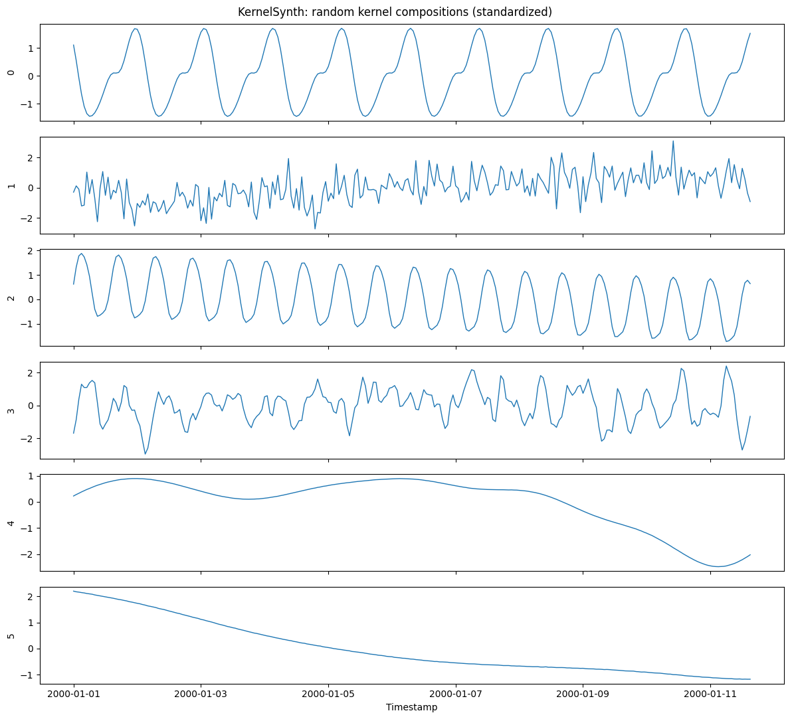
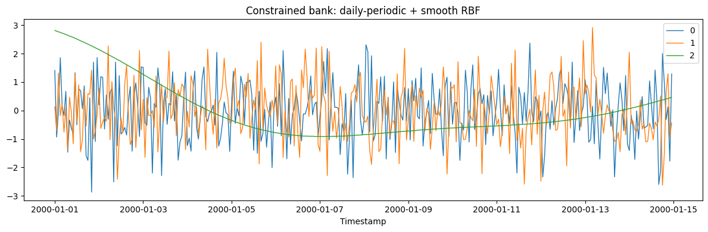

`KernelSynthGenerator` samples each series from a Gaussian-process prior
whose covariance is a *random composition* of simple base kernels. For
every series it draws `1..max_kernels` kernels from a fixed bank, folds
them together with randomly chosen `+` and `*` operators, and draws one
path from the resulting prior. Addition mixes behaviors (trend +
seasonality); multiplication modulates them (locally periodic,
amplitude-varying seasonality).

$$k = k_1 \star k_2 \star \dots \star k_n, \quad \star \in \{+, \times\}, \qquad f \sim \mathcal{GP}(0, k)$$

This adapts the KernelSynth recipe introduced for pretraining the
Chronos forecasting models (Ansari et al. 2024, [*Chronos: Learning the
Language of Time Series*](https://arxiv.org/abs/2403.07815)) and its
Apache-2.0-licensed [reference
implementation](https://github.com/amazon-science/chronos-forecasting/blob/main/scripts/kernel-synth.py).
SynForecast makes the bank configurable, expresses seasonal periods in
time steps on a normalized grid, and adds bounded retries, divergence
guards, and optional standardization.

```python
import matplotlib.pyplot as plt
import polars as pl

from synforecast.generators import KernelSynthGenerator
```

## Generate a diverse pool

With the default bank, each series is a different kernel composition, so
one call yields a varied pool. Lengths are fixed here to make the paths
easy to compare; the composition is what varies.

```python
generator = KernelSynthGenerator(
    engine="polars",
    min_length=256,
    max_length=256,
    freq="h",
    seed=42,
)
ks_df = generator.generate(n_series=6)

ks_df.group_by("unique_id").agg(
    pl.len().alias("length"),
    pl.col("y").mean().round(3).alias("mean"),
    pl.col("y").std().round(3).alias("std"),
).sort("unique_id")
```

| unique_id | length | mean | std   |
|-----------|--------|------|-------|
| cat       | u32    | f64  | f64   |
| "0"       | 256    | 0.0  | 1.002 |
| "1"       | 256    | 0.0  | 1.002 |
| "2"       | 256    | -0.0 | 1.002 |
| "3"       | 256    | 0.0  | 1.002 |
| "4"       | 256    | -0.0 | 1.002 |
| "5"       | 256    | 0.0  | 1.002 |

```python
fig, axes = plt.subplots(6, 1, figsize=(12, 11), sharex=True)
for ax, uid in zip(axes, ks_df["unique_id"].unique(maintain_order=True), strict=True):
    series = ks_df.filter(pl.col("unique_id") == uid)
    ax.plot(series["ds"], series["y"], linewidth=1)
    ax.set_ylabel(str(uid))
axes[-1].set_xlabel("Timestamp")
fig.suptitle("KernelSynth: random kernel compositions (standardized)")
plt.tight_layout()
plt.show()
```



## Constrain the kernel bank

Every kernel family is a list you can narrow or extend. To bias the pool
toward a specific inductive structure, restrict the bank — here to a
single daily period plus a smooth RBF trend, composed one or two at a
time — so the draws concentrate on smooth, near-daily-periodic shapes.

```python
periodic = KernelSynthGenerator(
    engine="polars",
    min_length=336,
    max_length=336,
    freq="h",
    max_kernels=2,
    seasonal_periods=[24.0],
    rbf_length_scales=[0.3],
    rational_quadratic_alphas=[],
    linear_sigmas=[],
    white_noise_levels=[0.05],
    include_constant=False,
    seed=7,
)
periodic_df = periodic.generate(n_series=3)

fig, ax = plt.subplots(figsize=(12, 4))
for uid in periodic_df["unique_id"].unique(maintain_order=True):
    s = periodic_df.filter(pl.col("unique_id") == uid)
    ax.plot(s["ds"], s["y"], linewidth=1, label=str(uid))
ax.set_title("Constrained bank: daily-periodic + smooth RBF")
ax.set_xlabel("Timestamp")
ax.legend()
plt.tight_layout()
plt.show()
```



## Use in a pretraining corpus

`standardize=True` (the default) rescales each series to zero mean and
unit variance, so compositions that span very different natural scales
stay comparable — the usual setting for a pretraining pool. Set
`standardize=False` to keep the raw GP draws. Because
`KernelSynthGenerator` is an ordinary generator, it composes with
`SynSet`, `generate_series`, and the pattern-injection options like any
other.

```python
raw = KernelSynthGenerator(
    engine="polars",
    min_length=128,
    max_length=128,
    freq="h",
    standardize=False,
    seed=0,
)
raw.generate(n_series=3).group_by("unique_id").agg(
    pl.col("y").std().round(3).alias("raw_std")
).sort("unique_id")
```

| unique_id | raw_std |
|-----------|---------|
| cat       | f64     |
| "0"       | 0.612   |
| "1"       | 1.887   |
| "2"       | 0.312   |

> **Related generators**
>
> -   [TSI](tsi) and [TCM](tcm) — the other pretraining generators
>     (component composition and random causal graphs).
> -   [Gaussian process](../multivariate/gaussian_process) — a single
>     fixed kernel rather than random compositions.
>
> Full parameters are in the [generator
> reference](https://github.com/Nixtla/synforecast/blob/main/GENERATORS.md).

