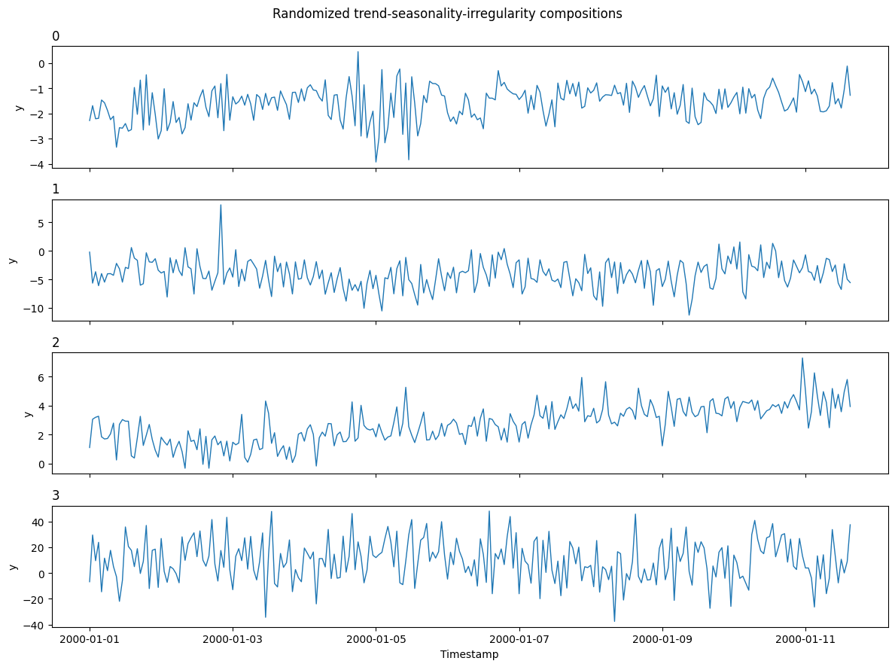

`TSIGenerator` creates diverse series by combining randomized trend,
seasonality, and irregular components. Each generated series samples a
fresh configuration, so one call can produce a varied synthetic pool.

$$y_t = T(t) + \sum_{h} S_h(t) + I_t \quad \text{(additive)}, \qquad y_t = T(t)\prod_{h} S_h(t) + I_t \quad \text{(multiplicative)}$$

The component-based construction is informed by Bahrpeyma et al. (2021),
[A Methodology for Validating Diversity in Synthetic Time Series
Generation](https://doi.org/10.1016/j.mex.2021.101459). SynForecast’s
component families, sampling distributions, and stability guards are its
own design choices rather than a reproduction of the paper’s generator.

```python
import matplotlib.pyplot as plt
import polars as pl

from synforecast.generators import TSIGenerator
```

## Generate a diverse pool

Lengths are fixed here to make the series easy to compare. The remaining
defaults randomize the trend shape, seasonal harmonics, irregular
process, magnitude, and additive or multiplicative composition.

```python
generator = TSIGenerator(
    engine="polars",
    min_length=256,
    max_length=256,
    freq="h",
    seed=42,
)
tsi_df = generator.generate(n_series=4)

summary = tsi_df.group_by("unique_id").agg(
    pl.len().alias("length"),
    pl.col("y").mean().alias("mean"),
    pl.col("y").std().alias("std"),
)
summary
```

| unique_id | length | mean      | std      |
|-----------|--------|-----------|----------|
| cat       | u32    | f64       | f64      |
| "3"       | 256    | 9.960003  | 16.37748 |
| "0"       | 256    | -1.564618 | 0.675566 |
| "1"       | 256    | -4.0516   | 2.524986 |
| "2"       | 256    | 2.734903  | 1.325484 |

```python
fig, axes = plt.subplots(4, 1, figsize=(12, 9), sharex=True)
for ax, uid in zip(axes, tsi_df["unique_id"].unique(maintain_order=True), strict=True):
    series = tsi_df.filter(pl.col("unique_id") == uid)
    ax.plot(series["ds"], series["y"], linewidth=1)
    ax.set_title(str(uid), loc="left")
    ax.set_ylabel("y")
axes[-1].set_xlabel("Timestamp")
fig.suptitle("Randomized trend-seasonality-irregularity compositions")
plt.tight_layout()
plt.show()
```



## Constrain the component pool

Every component family can be narrowed when a dataset needs a more
specific inductive bias. This example limits the pool to linear or
damped trends, one or two seasonal components, and Gaussian or AR(1)
irregularity.

```python
controlled = TSIGenerator(
    engine="polars",
    min_length=168,
    max_length=168,
    freq="h",
    trend_types=["linear", "damped"],
    n_seasonal_range=(1, 2),
    seasonal_periods=[12.0, 24.0, 168.0],
    irregular_types=["gaussian", "ar1"],
    seed=7,
)
controlled.generate(n_series=2).head()
```

| unique_id | ds                  | y         |
|-----------|---------------------|-----------|
| cat       | datetime\[ns\]      | f64       |
| "0"       | 2000-01-01 00:00:00 | 11.837247 |
| "0"       | 2000-01-01 01:00:00 | 17.178323 |
| "0"       | 2000-01-01 02:00:00 | 12.562518 |
| "0"       | 2000-01-01 03:00:00 | 17.547732 |
| "0"       | 2000-01-01 04:00:00 | 15.332925 |

> **Related generators**
>
> -   [TCM](tcm) — random causal-graph dynamics;
>     [KernelSynth](kernel_synth) — Gaussian-process kernel
>     compositions.
> -   [Balanced pool](../../capabilities/balanced_pool) — interpretable
>     single-mechanism generators for benchmarking.
>
> Full parameters are in the [generator
> reference](https://github.com/Nixtla/synforecast/blob/main/GENERATORS.md).

