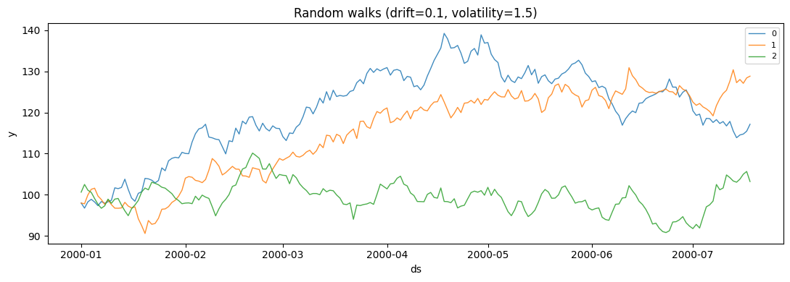
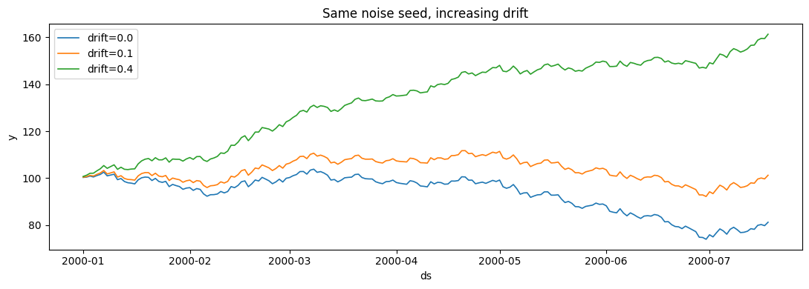

A random walk is the canonical non-stationary series: each value is the
previous one plus a random step, optionally nudged by a constant drift.
It is the process behind the *naive* forecast (tomorrow ≈ today), a
first model of efficient-market prices, and a useful stress test for
whether a pipeline handles trends and growing variance rather than
assuming a stable mean.

> **The model**
>
> $$y_t = y_{t-1} + \mu + \sigma\,\varepsilon_t, \qquad \varepsilon_t \sim \mathcal{N}(0, 1)$$
>
> -   `drift` ($\mu$) — the constant step added each period; a
>     deterministic trend.
> -   `volatility` ($\sigma$) — the standard deviation of the random
>     step.
> -   `start_value` ($y_0$) — where every series begins.
>
> Because steps accumulate, the variance grows with time — the series
> has no fixed mean to revert to.

## Generate

Instantiate the generator and draw a few series. All outputs are
long-format (`unique_id`, `ds`, `y`).

```python
import matplotlib.pyplot as plt
import polars as pl

from synforecast.generators import RandomWalkGenerator


def plot_panel(df, title):
    """Plot each series in a long-format panel on a shared axis."""
    fig, ax = plt.subplots(figsize=(11, 4))
    for uid in df["unique_id"].unique(maintain_order=True).to_list():
        series = df.filter(pl.col("unique_id") == uid)
        ax.plot(series["ds"], series["y"], linewidth=1, alpha=0.85, label=str(uid))
    ax.set(title=title, xlabel="ds", ylabel="y")
    ax.legend(fontsize=8)
    plt.tight_layout()
    plt.show()


generator = RandomWalkGenerator(
    engine="polars",
    min_length=200,
    max_length=200,
    freq="D",
    drift=0.1,
    volatility=1.5,
    start_value=100.0,
    seed=42,
)
walks = generator.generate(n_series=3)
plot_panel(walks, "Random walks (drift=0.1, volatility=1.5)")
```



The three series share the same process but a different noise draw. They
all start at 100 and trend gently upward — that shared pull is the drift
— while wandering by an amount set by the volatility. Notice how they
fan out over time: that spreading is the growing variance a random walk
always produces.

## Control the process

`drift` sets the trend and `volatility` sets the noise. Holding
volatility fixed, larger drift turns a flat wander into a clear trend.

```python
fig, ax = plt.subplots(figsize=(11, 4))
for drift in (0.0, 0.1, 0.4):
    series = RandomWalkGenerator(
        engine="polars",
        min_length=200,
        max_length=200,
        freq="D",
        drift=drift,
        volatility=1.0,
        start_value=100.0,
        seed=0,
    ).generate(n_series=1)
    ax.plot(series["ds"], series["y"], linewidth=1.2, label=f"drift={drift}")
ax.set(title="Same noise seed, increasing drift", xlabel="ds", ylabel="y")
ax.legend()
plt.tight_layout()
plt.show()
```



Sharing the seed isolates the effect: the wiggles are identical, but a
larger drift lifts the whole path. Raise `volatility` instead and the
paths would keep this trend while wandering further from it.

## Statistics by series

Summary statistics vary widely between series even from one generator —
a direct consequence of the accumulating, unbounded variance.

```python
walks.group_by("unique_id").agg(
    pl.len().alias("count"),
    pl.col("y").min().round(2).alias("min"),
    pl.col("y").max().round(2).alias("max"),
    pl.col("y").mean().round(2).alias("mean"),
    pl.col("y").std().round(2).alias("std"),
).sort("unique_id")
```

| unique_id | count | min   | max    | mean   | std   |
|-----------|-------|-------|--------|--------|-------|
| cat       | u32   | f64   | f64    | f64    | f64   |
| "0"       | 200   | 96.74 | 139.24 | 120.67 | 10.36 |
| "1"       | 200   | 90.58 | 130.9  | 115.29 | 10.56 |
| "2"       | 200   | 90.8  | 110.13 | 99.45  | 3.61  |

> **Related generators**
>
> -   [Geometric Brownian
>     motion](../stochastic/geometric_brownian_motion) — a
>     *multiplicative* random walk for strictly positive series like
>     prices.
> -   [SARIMA](sarima) with `d=1` — a random walk with added
>     autoregressive/moving-average structure.
> -   Add trend breaks or outliers with the
>     [changepoints](../../capabilities/changepoints) and
>     [anomalies](../../capabilities/anomalies) options.
>
> Every parameter is documented in the [generator
> reference](https://github.com/Nixtla/synforecast/blob/main/GENERATORS.md).

