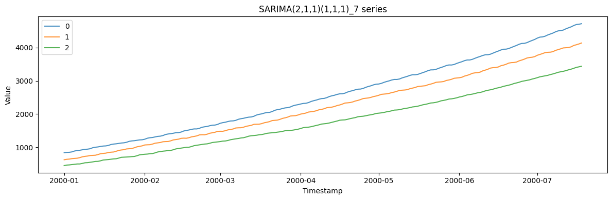
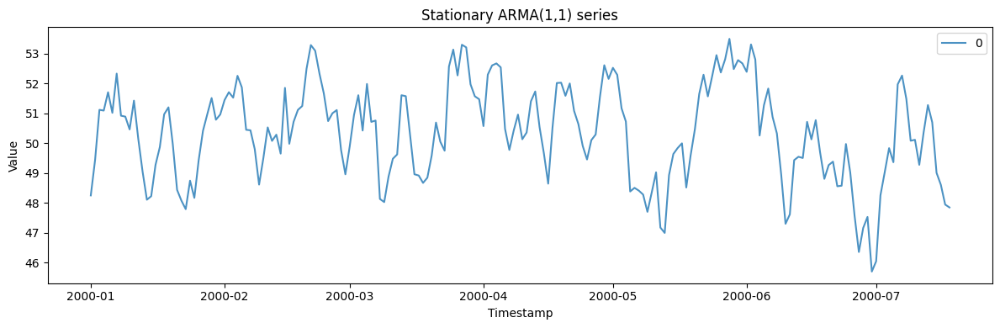
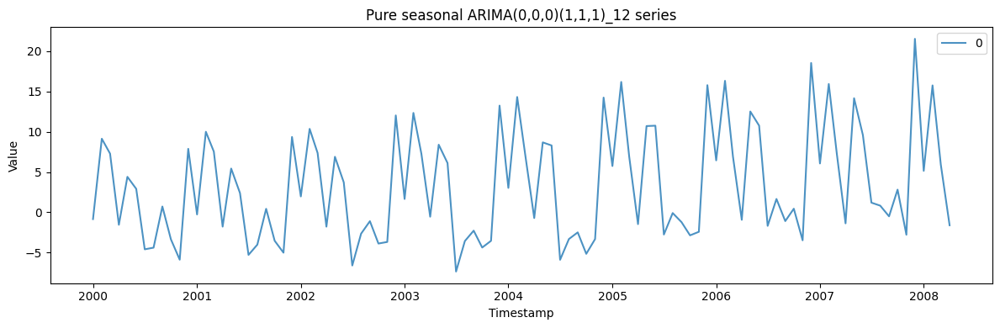

SARIMA — Seasonal AutoRegressive Integrated Moving Average — is the
workhorse linear model for series with autocorrelation, trend, and
seasonality. Generating from a *known* `(p, d, q)(P, D, Q)`
specification lets you confirm a model recovers the order you put in, or
build panels with a precise, well-understood dependence structure.

> **The model**
>
> $$\phi(B)\,\Phi(B^s)\,(1-B)^d (1-B^s)^D\, y_t = \theta(B)\,\Theta(B^s)\, \varepsilon_t$$
>
> An ARIMA(p, d, q) process combines `p` autoregressive lags, `d` orders
> of differencing (for trend / unit roots), and `q` moving-average lags;
> the seasonal part `(P, D, Q)` repeats that structure at the seasonal
> period. Set the orders and coefficients to dial in anything from white
> noise to a strongly seasonal, integrated series.

```python
import polars as pl
import matplotlib.pyplot as plt

from synforecast.generators import SARIMAGenerator
```

## 1. Basic SARIMA(2,1,1)(1,1,1)\_7

A SARIMA model with weekly seasonality, suitable for daily data.

```python
params = {
    "min_length": 200,
    "max_length": 200,
    "freq": "D",
    "p": 2,
    "d": 1,
    "q": 1,
    "P": 1,
    "D": 1,
    "Q": 1,
    "seasonal_period": 7,
    "noise_std": 2.0,
    "drift": 0.5,
    "seed": 42,
}

generator = SARIMAGenerator(engine="polars", **params)
```

### Model information

Inspect the auto-generated model parameters and polynomial structure.

```python
model_info = generator.get_model_info()
print(f"Model: {model_info['model']}")
print(f"AR parameters: {model_info['ar_params']}")
print(f"MA parameters: {model_info['ma_params']}")
print(f"Seasonal AR parameters: {model_info['seasonal_ar_params']}")
print(f"Seasonal MA parameters: {model_info['seasonal_ma_params']}")
print(f"Drift: {model_info['drift']}")
print(f"Burn-in: {model_info['burn_in']}")
print(f"\nExpanded AR polynomial lags: {model_info['full_ar_polynomial_lags']}")
print(f"Expanded AR polynomial coeffs: {model_info['full_ar_polynomial_coeffs']}")
```

``` text
Model: SARIMA(2,1,1)(1,1,1)[7]
AR parameters: [0.2298813963661166, -0.04889724819835817]
MA parameters: [0.35859791991138246]
Seasonal AR parameters: [0.15789442324749114]
Seasonal MA parameters: [-0.40582265211235047]
Drift: 0.5
Burn-in: 100

Expanded AR polynomial lags: [1, 2, 3, 4, 5, 6, 7, 8, 9]
Expanded AR polynomial coeffs: [0.2298813963661166, -0.04889724819835817, -0.0, -0.0, -0.0, -0.0, 0.15789442324749114, -0.036296990494555884, 0.007720602802669188]
```

### Generate and inspect data

```python
df = generator.generate(n_series=3)
print(f"Generated {df['unique_id'].n_unique()} time series")
print(f"Total observations: {len(df)}")
df.head(10)
```

``` text
Generated 3 time series
Total observations: 600
```

| unique_id | ds                  | y          |
|-----------|---------------------|------------|
| cat       | datetime\[ns\]      | f64        |
| "0"       | 2000-01-01 00:00:00 | 840.568595 |
| "0"       | 2000-01-02 00:00:00 | 849.409081 |
| "0"       | 2000-01-03 00:00:00 | 852.256521 |
| "0"       | 2000-01-04 00:00:00 | 864.365821 |
| "0"       | 2000-01-05 00:00:00 | 890.874551 |
| "0"       | 2000-01-06 00:00:00 | 904.417479 |
| "0"       | 2000-01-07 00:00:00 | 912.95809  |
| "0"       | 2000-01-08 00:00:00 | 927.189939 |
| "0"       | 2000-01-09 00:00:00 | 941.521277 |
| "0"       | 2000-01-10 00:00:00 | 946.445261 |

```python
fig, ax = plt.subplots(figsize=(12, 4))
for uid in df["unique_id"].unique().to_list():
    series = df.filter(pl.col("unique_id") == uid)
    ax.plot(series["ds"].to_list(), series["y"].to_list(), label=uid, alpha=0.8)
ax.set_xlabel("Timestamp")
ax.set_ylabel("Value")
ax.set_title("SARIMA(2,1,1)(1,1,1)_7 series")
ax.legend()
plt.tight_layout()
plt.show()
```



### Statistics by series

```python
df.group_by("unique_id").agg(
    [
        pl.col("y").count().alias("count"),
        pl.col("y").min().alias("min_value"),
        pl.col("y").max().alias("max_value"),
        pl.col("y").mean().alias("mean_value"),
        pl.col("y").std().alias("std_value"),
    ]
).sort("unique_id")
```

| unique_id | count | min_value  | max_value   | mean_value  | std_value   |
|-----------|-------|------------|-------------|-------------|-------------|
| cat       | u32   | f64        | f64         | f64         | f64         |
| "0"       | 200   | 840.568595 | 4716.719654 | 2557.619461 | 1132.631603 |
| "1"       | 200   | 628.393    | 4135.85017  | 2221.617457 | 1020.787936 |
| "2"       | 200   | 452.878919 | 3437.538082 | 1778.004889 | 857.699315  |

## 2. Stationary ARMA(1,1) with custom parameters

A stationary model with no differencing and explicit AR/MA coefficients.

```python
params_arma = {
    "min_length": 200,
    "max_length": 200,
    "freq": "D",
    "p": 1,
    "d": 0,
    "q": 1,
    "P": 0,
    "D": 0,
    "Q": 0,
    "ar_params": [0.7],
    "ma_params": [0.3],
    "mean": 50.0,
    "noise_std": 1.0,
    "seed": 123,
}

generator_arma = SARIMAGenerator(engine="polars", **params_arma)
df_arma = generator_arma.generate(n_series=1)

print(f"Model: {generator_arma.get_model_info()['model']}")
print(f"Mean: {generator_arma.get_model_info()['mean']}")
print(f"Series mean: {df_arma['y'].mean():.2f}")
print(f"Series std: {df_arma['y'].std():.2f}")
```

``` text
Model: ARIMA(1,0,1)
Mean: 50.0
Series mean: 50.35
Series std: 1.61
```

```python
fig, ax = plt.subplots(figsize=(12, 4))
for uid in df_arma["unique_id"].unique().to_list():
    series = df_arma.filter(pl.col("unique_id") == uid)
    ax.plot(series["ds"].to_list(), series["y"].to_list(), label=uid, alpha=0.8)
ax.set_xlabel("Timestamp")
ax.set_ylabel("Value")
ax.set_title("Stationary ARMA(1,1) series")
ax.legend()
plt.tight_layout()
plt.show()
```



## 3. Pure seasonal ARIMA(0,0,0)(1,1,1)\_12

A purely seasonal model with monthly frequency and 12-month seasonality.

```python
params_seasonal = {
    "min_length": 100,
    "max_length": 100,
    "freq": "MS",
    "p": 0,
    "d": 0,
    "q": 0,
    "P": 1,
    "D": 1,
    "Q": 1,
    "seasonal_period": 12,
    "seasonal_ar_params": [0.5],
    "seasonal_ma_params": [0.3],
    "noise_std": 1.0,
    "seed": 456,
}

generator_seasonal = SARIMAGenerator(engine="polars", **params_seasonal)
df_seasonal = generator_seasonal.generate(n_series=1)

print(f"Model: {generator_seasonal.get_model_info()['model']}")
print("\nFirst 24 months:")
df_seasonal.head(24)
```

``` text
Model: SARIMA(0,0,0)(1,1,1)[12]

First 24 months:
```

| unique_id | ds                  | y         |
|-----------|---------------------|-----------|
| cat       | datetime\[ns\]      | f64       |
| "0"       | 2000-01-01 00:00:00 | -0.846697 |
| "0"       | 2000-02-01 00:00:00 | 9.129227  |
| "0"       | 2000-03-01 00:00:00 | 7.281973  |
| "0"       | 2000-04-01 00:00:00 | -1.550024 |
| "0"       | 2000-05-01 00:00:00 | 4.399888  |
| …         | …                   | …         |
| "0"       | 2001-08-01 00:00:00 | -4.021058 |
| "0"       | 2001-09-01 00:00:00 | 0.429695  |
| "0"       | 2001-10-01 00:00:00 | -3.538732 |
| "0"       | 2001-11-01 00:00:00 | -5.016018 |
| "0"       | 2001-12-01 00:00:00 | 9.350066  |

```python
fig, ax = plt.subplots(figsize=(12, 4))
for uid in df_seasonal["unique_id"].unique().to_list():
    series = df_seasonal.filter(pl.col("unique_id") == uid)
    ax.plot(series["ds"].to_list(), series["y"].to_list(), label=uid, alpha=0.8)
ax.set_xlabel("Timestamp")
ax.set_ylabel("Value")
ax.set_title("Pure seasonal ARIMA(0,0,0)(1,1,1)_12 series")
ax.legend()
plt.tight_layout()
plt.show()
```



> **Related generators**
>
> -   [ETS](/synforecast/docs/generators/statistical/ets.html) — the exponential-smoothing counterpart for trend and
>     seasonality.
> -   [Seasonal](/synforecast/docs/generators/statistical/seasonal.html) — a simpler fixed seasonal wave without ARMA
>     dynamics.
> -   [Random walk](/synforecast/docs/generators/statistical/random_walk.html) — the special case ARIMA(0, 1, 0).
>
> All orders and coefficients are documented in the [generator
> reference](https://github.com/Nixtla/synforecast/blob/main/GENERATORS.md).

