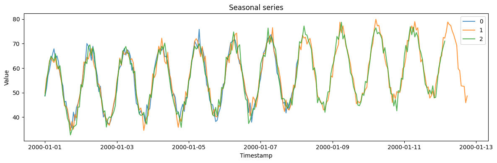

A seasonal series is a repeating cycle riding on a trend — daily
traffic, weekly sales, yearly demand. `SeasonalGenerator` builds one by
adding a periodic wave, a linear trend, and observation noise, which
makes it the natural test of whether a model captures periodicity and
extrapolates the level.

> **The model**
>
> $$y_t = \text{base} + \text{trend}\cdot t + \text{amplitude}\cdot s\!\left(2\pi t / \text{period}\right) + \varepsilon_t$$
>
> -   `seasonality_period` — length of one cycle in time steps (24 gives
>     a daily cycle on hourly data).
> -   `seasonality_amplitude` — height of the seasonal swing.
> -   `trend` — linear drift per step; `base_level` — the starting
>     level.
> -   `noise_level` — standard deviation of the additive noise.

```python
import polars as pl
import matplotlib.pyplot as plt

from synforecast.generators import SeasonalGenerator
```

## Define generator parameters

Configure a seasonal generator with daily seasonality (24-hour period),
a slight upward trend, and a base level of 50.

```python
params = {
    "min_length": 168,
    "max_length": 336,
    "freq": "h",
    "seasonality_period": 24,
    "seasonality_amplitude": 15.0,
    "trend": 0.05,
    "noise_level": 2.0,
    "base_level": 50.0,
    "seed": 123,
}

generator = SeasonalGenerator(engine="polars", **params)
df = generator.generate(n_series=3)
```


```python
fig, ax = plt.subplots(figsize=(12, 4))
for uid in df["unique_id"].unique().to_list():
    series = df.filter(pl.col("unique_id") == uid)
    ax.plot(series["ds"].to_list(), series["y"].to_list(), label=uid, alpha=0.8)
ax.set_xlabel("Timestamp")
ax.set_ylabel("Value")
ax.set_title("Seasonal series")
ax.legend()
plt.tight_layout()
plt.show()
```



Every series repeats on a 24-step cycle around a gently rising level.
The series have different lengths (`min_length` ≠ `max_length`) but
share the same daily shape and trend — the seasonal structure a
forecaster should learn.

## Inspect the generated data

```python
print(f"Generated {df['unique_id'].n_unique()} time series")
print(f"Total observations: {len(df)}")
df.head(10)
```

``` text
Generated 3 time series
Total observations: 721
```

| unique_id | ds                  | y         |
|-----------|---------------------|-----------|
| cat       | datetime\[ns\]      | f64       |
| "0"       | 2000-01-01 00:00:00 | 48.634355 |
| "0"       | 2000-01-01 01:00:00 | 51.658968 |
| "0"       | 2000-01-01 02:00:00 | 56.909722 |
| "0"       | 2000-01-01 03:00:00 | 59.2974   |
| "0"       | 2000-01-01 04:00:00 | 62.751023 |
| "0"       | 2000-01-01 05:00:00 | 65.499531 |
| "0"       | 2000-01-01 06:00:00 | 67.897628 |
| "0"       | 2000-01-01 07:00:00 | 63.845217 |
| "0"       | 2000-01-01 08:00:00 | 65.0017   |
| "0"       | 2000-01-01 09:00:00 | 62.627031 |

## Statistics by series

```python
df.group_by("unique_id").agg(
    [
        pl.col("y").count().alias("count"),
        pl.col("y").min().alias("min_value"),
        pl.col("y").max().alias("max_value"),
        pl.col("y").mean().alias("mean_value"),
        pl.col("y").std().alias("std_value"),
    ]
)
```

| unique_id | count | min_value | max_value | mean_value | std_value |
|-----------|-------|-----------|-----------|------------|-----------|
| cat       | u32   | f64       | f64       | f64        | f64       |
| "2"       | 268   | 32.718865 | 78.747915 | 56.740124  | 11.285512 |
| "0"       | 170   | 35.600282 | 75.837123 | 54.621329  | 10.619455 |
| "1"       | 283   | 34.431384 | 79.936749 | 57.388507  | 11.255673 |

## Sample of one series

View the first 24 hours of a single series to see the seasonal pattern.

```python
df.filter(pl.col("unique_id") == "0").head(24)
```

| unique_id | ds                  | y         |
|-----------|---------------------|-----------|
| cat       | datetime\[ns\]      | f64       |
| "0"       | 2000-01-01 00:00:00 | 48.634355 |
| "0"       | 2000-01-01 01:00:00 | 51.658968 |
| "0"       | 2000-01-01 02:00:00 | 56.909722 |
| "0"       | 2000-01-01 03:00:00 | 59.2974   |
| "0"       | 2000-01-01 04:00:00 | 62.751023 |
| …         | …                   | …         |
| "0"       | 2000-01-01 19:00:00 | 42.030839 |
| "0"       | 2000-01-01 20:00:00 | 38.652835 |
| "0"       | 2000-01-01 21:00:00 | 43.811501 |
| "0"       | 2000-01-01 22:00:00 | 45.388067 |
| "0"       | 2000-01-01 23:00:00 | 47.831552 |

> **Related generators**
>
> -   [SARIMA](/synforecast/docs/generators/statistical/sarima.html) — seasonality with autoregressive/moving-average
>     dynamics instead of a fixed wave.
> -   [ETS](/synforecast/docs/generators/statistical/ets.html) — seasonality through exponential-smoothing state-space
>     models.
> -   Layer on [anomalies](/synforecast/docs/capabilities/anomalies.html) or
>     [changepoints](/synforecast/docs/capabilities/changepoints.html) to stress-test a
>     seasonal model.

