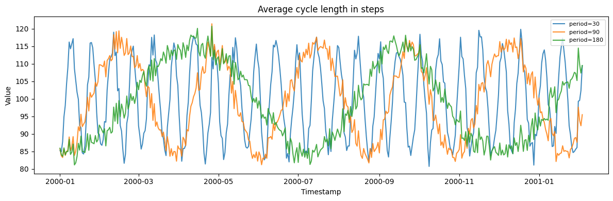
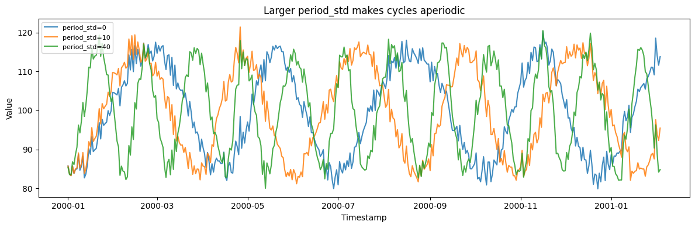
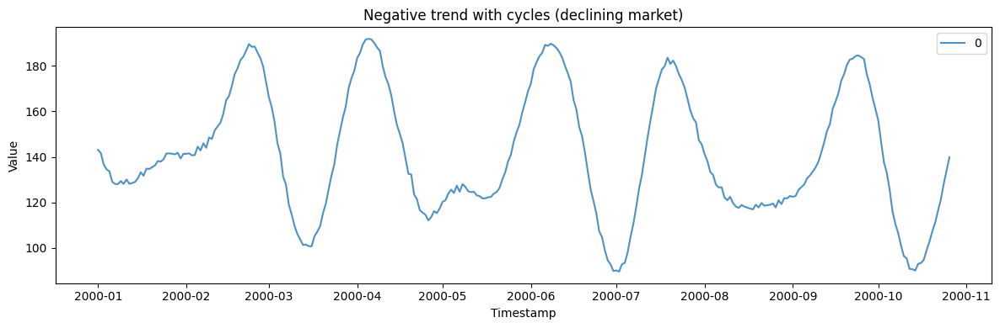
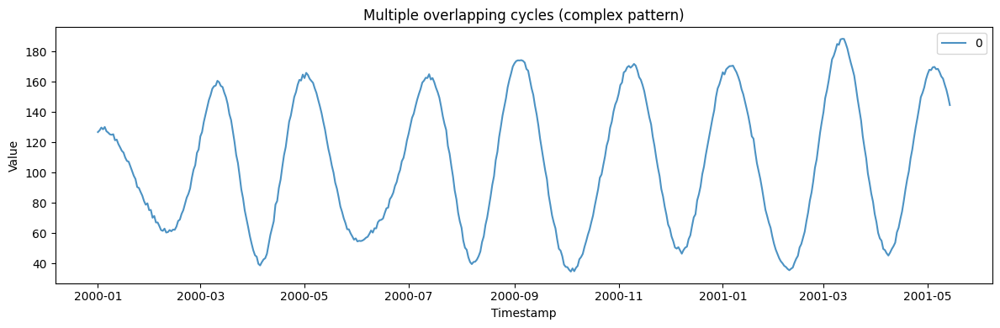
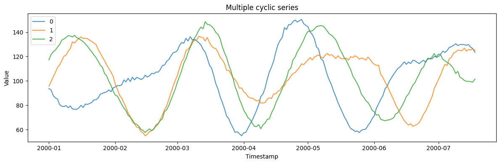

Cyclic series oscillate, but — unlike a clean seasonal wave — with
*irregular* periods and amplitudes: business cycles, ecological booms
and busts, quasi-periodic signals. The generator overlays one or more
noisy cycles so the period drifts rather than repeating exactly.

> **The model**
>
> $$y_t = \text{base} + \text{trend}\cdot t + \sum_{i=1}^{n} A_i \sin\!\big(\psi_i(t)\big) + \varepsilon_t$$
>
> Each series superimposes `num_cycles` oscillations whose periods vary
> from cycle to cycle (`cycle_period_std` controls how irregular). Small
> variance approaches a fixed seasonal wave; large variance produces
> genuinely aperiodic cycling.

```python
import polars as pl
import matplotlib.pyplot as plt

from synforecast.generators import CyclicGenerator
```

## 1. Cycle length

`cycle_period_mean` sets the average cycle length in steps. The period
still drifts within each series, which is what separates a cycle from a
fixed seasonal wave.

```python
base = {
    "min_length": 400,
    "max_length": 400,
    "freq": "D",
    "base_level": 100.0,
    "trend": 0.0,
    "cycle_amplitude_mean": 20.0,
    "num_cycles": 1,
    "noise_std": 2.0,
    "seed": 42,
}

fig, ax = plt.subplots(figsize=(12, 4))
for period in (30.0, 90.0, 180.0):
    df = CyclicGenerator(
        engine="polars", cycle_period_mean=period, **base
    ).generate(n_series=1)
    ax.plot(df["ds"].to_list(), df["y"].to_list(), label=f"period={period:.0f}", alpha=0.85)
ax.set(xlabel="Timestamp", ylabel="Value", title="Average cycle length in steps")
ax.legend(fontsize=8)
plt.tight_layout()
plt.show()

```



## 2. Cycle irregularity

`cycle_period_std` controls how much the period wanders. At zero the
series is close to a fixed seasonal wave; large values give genuinely
aperiodic cycling.

```python
fig, ax = plt.subplots(figsize=(12, 4))
for period_std in (0.0, 10.0, 40.0):
    df = CyclicGenerator(
        engine="polars",
        min_length=400,
        max_length=400,
        freq="D",
        base_level=100.0,
        trend=0.0,
        cycle_period_mean=90.0,
        cycle_period_std=period_std,
        cycle_amplitude_mean=20.0,
        num_cycles=1,
        noise_std=2.0,
        seed=42,
    ).generate(n_series=1)
    ax.plot(
        df["ds"].to_list(), df["y"].to_list(), label=f"period_std={period_std:.0f}", alpha=0.85
    )
ax.set(xlabel="Timestamp", ylabel="Value", title="Larger period_std makes cycles aperiodic")
ax.legend(fontsize=8)
plt.tight_layout()
plt.show()

```



## 3. Negative trend

A downward trend combined with cyclical fluctuations.

```python
declining_params = {
    "min_length": 300,
    "max_length": 300,
    "freq": "D",
    "base_level": 150.0,
    "trend": -0.05,
    "cycle_period_mean": 50.0,
    "cycle_amplitude_mean": 20.0,
    "num_cycles": 3,
    "seed": 42,
}

declining_gen = CyclicGenerator(engine="polars", **declining_params)
declining_df = declining_gen.generate(n_series=1)

print(f"Generated {len(declining_df)} observations with declining trend")
print(f"Statistics: Mean={declining_df['y'].mean():.4f}, Std={declining_df['y'].std():.4f}")
declining_df.head(10)
```

``` text
Generated 300 observations with declining trend
Statistics: Mean=140.8307, Std=27.3867
```

| unique_id | ds                  | y          |
|-----------|---------------------|------------|
| cat       | datetime\[ns\]      | f64        |
| "0"       | 2000-01-01 00:00:00 | 143.101924 |
| "0"       | 2000-01-02 00:00:00 | 141.627292 |
| "0"       | 2000-01-03 00:00:00 | 136.638082 |
| "0"       | 2000-01-04 00:00:00 | 134.529648 |
| "0"       | 2000-01-05 00:00:00 | 133.656044 |
| "0"       | 2000-01-06 00:00:00 | 129.039617 |
| "0"       | 2000-01-07 00:00:00 | 128.071289 |
| "0"       | 2000-01-08 00:00:00 | 128.080343 |
| "0"       | 2000-01-09 00:00:00 | 129.365766 |
| "0"       | 2000-01-10 00:00:00 | 128.117344 |

```python
fig, ax = plt.subplots(figsize=(12, 4))
for uid in declining_df["unique_id"].unique().to_list():
    series = declining_df.filter(pl.col("unique_id") == uid)
    ax.plot(series["ds"].to_list(), series["y"].to_list(), label=uid, alpha=0.8)
ax.set_xlabel("Timestamp")
ax.set_ylabel("Value")
ax.set_title("Negative trend with cycles (declining market)")
ax.legend()
plt.tight_layout()
plt.show()
```



## 4. Overlapping cycles

Five overlapping cycle components create a complex, realistic pattern.

```python
complex_params = {
    "min_length": 500,
    "max_length": 500,
    "freq": "D",
    "base_level": 100.0,
    "trend": 0.02,
    "cycle_period_mean": 60.0,
    "cycle_amplitude_mean": 15.0,
    "num_cycles": 5,
    "seed": 42,
}

complex_gen = CyclicGenerator(engine="polars", **complex_params)
complex_df = complex_gen.generate(n_series=1)

print(f"Generated {len(complex_df)} observations with multiple overlapping cycles")
print(f"Statistics: Mean={complex_df['y'].mean():.4f}, Std={complex_df['y'].std():.4f}")
complex_df.head(10)
```

``` text
Generated 500 observations with multiple overlapping cycles
Statistics: Mean=105.8392, Std=43.9463
```

| unique_id | ds                  | y          |
|-----------|---------------------|------------|
| cat       | datetime\[ns\]      | f64        |
| "0"       | 2000-01-01 00:00:00 | 126.751732 |
| "0"       | 2000-01-02 00:00:00 | 127.885824 |
| "0"       | 2000-01-03 00:00:00 | 129.749177 |
| "0"       | 2000-01-04 00:00:00 | 128.563635 |
| "0"       | 2000-01-05 00:00:00 | 130.119181 |
| "0"       | 2000-01-06 00:00:00 | 127.31363  |
| "0"       | 2000-01-07 00:00:00 | 126.418862 |
| "0"       | 2000-01-08 00:00:00 | 125.266044 |
| "0"       | 2000-01-09 00:00:00 | 124.954641 |
| "0"       | 2000-01-10 00:00:00 | 125.315938 |

```python
fig, ax = plt.subplots(figsize=(12, 4))
for uid in complex_df["unique_id"].unique().to_list():
    series = complex_df.filter(pl.col("unique_id") == uid)
    ax.plot(series["ds"].to_list(), series["y"].to_list(), label=uid, alpha=0.8)
ax.set_xlabel("Timestamp")
ax.set_ylabel("Value")
ax.set_title("Multiple overlapping cycles (complex pattern)")
ax.legend()
plt.tight_layout()
plt.show()
```



## 5. Multiple series

Generate multiple independent cyclic series in one call.

```python
multi_params = {
    "min_length": 200,
    "max_length": 200,
    "freq": "D",
    "base_level": 100.0,
    "trend": 0.03,
    "cycle_period_mean": 60.0,
    "cycle_amplitude_mean": 20.0,
    "num_cycles": 3,
    "seed": 42,
}

multi_gen = CyclicGenerator(engine="polars", **multi_params)
multi_df = multi_gen.generate(n_series=3)

print(f"Generated 3 series with {len(multi_df)} total observations")
print(f"Overall Statistics: Mean={multi_df['y'].mean():.4f}, Std={multi_df['y'].std():.4f}")
multi_df.filter(pl.col("unique_id") == "0").head(10)
```

``` text
Generated 3 series with 600 total observations
Overall Statistics: Mean=103.3095, Std=24.7829
```

| unique_id | ds                  | y         |
|-----------|---------------------|-----------|
| cat       | datetime\[ns\]      | f64       |
| "0"       | 2000-01-01 00:00:00 | 93.663885 |
| "0"       | 2000-01-02 00:00:00 | 92.67384  |
| "0"       | 2000-01-03 00:00:00 | 88.006548 |
| "0"       | 2000-01-04 00:00:00 | 86.059544 |
| "0"       | 2000-01-05 00:00:00 | 85.195164 |
| "0"       | 2000-01-06 00:00:00 | 80.448824 |
| "0"       | 2000-01-07 00:00:00 | 79.228091 |
| "0"       | 2000-01-08 00:00:00 | 78.881414 |
| "0"       | 2000-01-09 00:00:00 | 79.728552 |
| "0"       | 2000-01-10 00:00:00 | 77.980928 |

```python
fig, ax = plt.subplots(figsize=(12, 4))
for uid in multi_df["unique_id"].unique().to_list():
    series = multi_df.filter(pl.col("unique_id") == uid)
    ax.plot(series["ds"].to_list(), series["y"].to_list(), label=uid, alpha=0.8)
ax.set_xlabel("Timestamp")
ax.set_ylabel("Value")
ax.set_title("Multiple cyclic series")
ax.legend()
plt.tight_layout()
plt.show()
```



> **Related generators**
>
> -   [Seasonal](/synforecast/docs/generators/statistical/seasonal.html) — a fixed, exactly repeating
>     period.
> -   [Gaussian process](/synforecast/docs/generators/multivariate/gaussian_process.html) — periodic
>     kernels for smooth quasi-periodicity.
>
> Cycle-count and irregularity parameters are in the [generator
> reference](https://github.com/Nixtla/synforecast/blob/main/GENERATORS.md).

