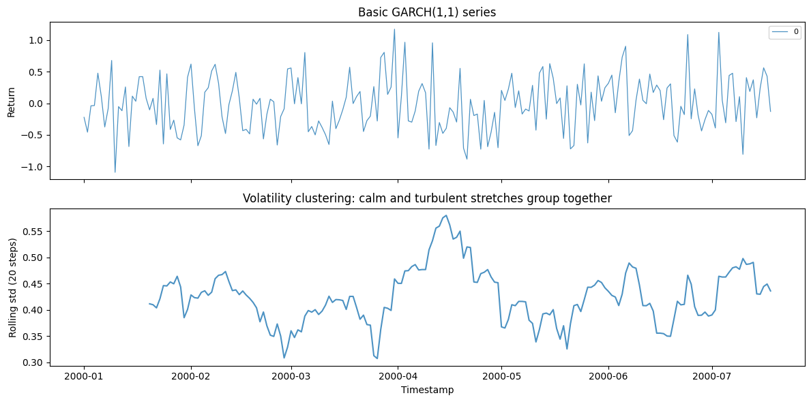
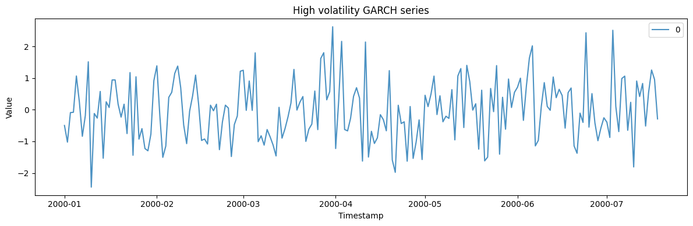
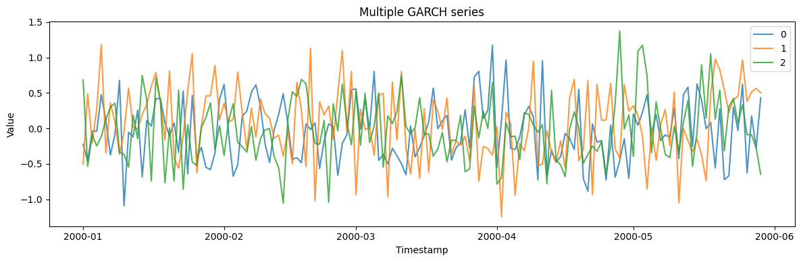

GARCH is the standard model for *volatility clustering* — calm stretches
and turbulent stretches that group together, as in financial returns.
The series itself is roughly uncorrelated, but its variance is
autocorrelated, which is exactly what fools models that assume constant
noise.

> **The model**
>
> The conditional variance follows
> $\sigma_t^2 = \omega + \sum\alpha_i\,\varepsilon_{t-i}^2 + \sum\beta_j\,\sigma_{t-j}^2$:
> today’s variance depends on recent squared shocks (`alpha`) and recent
> variance (`beta`). Higher `alpha + beta` means more persistent
> volatility bursts.

```python
import polars as pl
import matplotlib.pyplot as plt

from synforecast.generators import GARCHGenerator
```

## 1. Basic GARCH(1,1) model

A standard GARCH(1,1) with default alpha/beta and moderate base
volatility.

```python
basic_params = {
    "min_length": 200,
    "max_length": 200,
    "freq": "D",
    "p": 1,
    "q": 1,
    "omega": 0.1,
    "seed": 42,
}

basic_gen = GARCHGenerator(engine="polars", **basic_params)
basic_df = basic_gen.generate(n_series=1)

print(f"Generated {len(basic_df)} observations with GARCH(1,1)")
print(f"Statistics: Mean={basic_df['y'].mean():.4f}, Std={basic_df['y'].std():.4f}")
basic_df.head(10)
```

``` text
Generated 200 observations with GARCH(1,1)
Statistics: Mean=-0.0104, Std=0.4302
```

| unique_id | ds                  | y         |
|-----------|---------------------|-----------|
| cat       | datetime\[ns\]      | f64       |
| "0"       | 2000-01-01 00:00:00 | -0.222789 |
| "0"       | 2000-01-02 00:00:00 | -0.4579   |
| "0"       | 2000-01-03 00:00:00 | -0.040794 |
| "0"       | 2000-01-04 00:00:00 | -0.036292 |
| "0"       | 2000-01-05 00:00:00 | 0.476476  |
| "0"       | 2000-01-06 00:00:00 | 0.109476  |
| "0"       | 2000-01-07 00:00:00 | -0.37548  |
| "0"       | 2000-01-08 00:00:00 | -0.082258 |
| "0"       | 2000-01-09 00:00:00 | 0.677303  |
| "0"       | 2000-01-10 00:00:00 | -1.093879 |

```python
fig, (ax_returns, ax_vol) = plt.subplots(2, 1, figsize=(12, 6), sharex=True)
for uid in basic_df["unique_id"].unique().to_list():
    series = basic_df.filter(pl.col("unique_id") == uid)
    ax_returns.plot(
        series["ds"].to_list(), series["y"].to_list(), label=uid, alpha=0.8, linewidth=0.9
    )
    rolling = series.with_columns(pl.col("y").rolling_std(window_size=20).alias("sigma"))
    ax_vol.plot(rolling["ds"].to_list(), rolling["sigma"].to_list(), alpha=0.8)
ax_returns.set(ylabel="Return", title="Basic GARCH(1,1) series")
ax_returns.legend(fontsize=8)
ax_vol.set(
    xlabel="Timestamp",
    ylabel="Rolling std (20 steps)",
    title="Volatility clustering: calm and turbulent stretches group together",
)
plt.tight_layout()
plt.show()

```



## 2. High volatility GARCH

Increase the base volatility parameter `omega` to produce larger
fluctuations.

```python
high_vol_params = {
    "min_length": 200,
    "max_length": 200,
    "freq": "D",
    "p": 1,
    "q": 1,
    "omega": 0.5,
    "seed": 42,
}

high_vol_gen = GARCHGenerator(engine="polars", **high_vol_params)
high_vol_df = high_vol_gen.generate(n_series=1)

print(f"Generated {len(high_vol_df)} observations with high base volatility")
print(f"Statistics: Mean={high_vol_df['y'].mean():.4f}, Std={high_vol_df['y'].std():.4f}")
high_vol_df.head(10)
```

``` text
Generated 200 observations with high base volatility
Statistics: Mean=-0.0233, Std=0.9620
```

| unique_id | ds                  | y         |
|-----------|---------------------|-----------|
| cat       | datetime\[ns\]      | f64       |
| "0"       | 2000-01-01 00:00:00 | -0.498172 |
| "0"       | 2000-01-02 00:00:00 | -1.023896 |
| "0"       | 2000-01-03 00:00:00 | -0.091218 |
| "0"       | 2000-01-04 00:00:00 | -0.081152 |
| "0"       | 2000-01-05 00:00:00 | 1.065434  |
| "0"       | 2000-01-06 00:00:00 | 0.244796  |
| "0"       | 2000-01-07 00:00:00 | -0.839599 |
| "0"       | 2000-01-08 00:00:00 | -0.183934 |
| "0"       | 2000-01-09 00:00:00 | 1.514496  |
| "0"       | 2000-01-10 00:00:00 | -2.445987 |

```python
fig, ax = plt.subplots(figsize=(12, 4))
for uid in high_vol_df["unique_id"].unique().to_list():
    series = high_vol_df.filter(pl.col("unique_id") == uid)
    ax.plot(series["ds"].to_list(), series["y"].to_list(), label=uid, alpha=0.8)
ax.set_xlabel("Timestamp")
ax.set_ylabel("Value")
ax.set_title("High volatility GARCH series")
ax.legend()
plt.tight_layout()
plt.show()
```



## 3. Multiple GARCH series

Generate multiple independent GARCH series in one call.

```python
multi_params = {
    "min_length": 150,
    "max_length": 150,
    "freq": "D",
    "p": 1,
    "q": 1,
    "omega": 0.1,
    "seed": 42,
}

multi_gen = GARCHGenerator(engine="polars", **multi_params)
multi_df = multi_gen.generate(n_series=3)

print(f"Generated 3 series with {len(multi_df)} total observations")
print(f"Overall Statistics: Mean={multi_df['y'].mean():.4f}, Std={multi_df['y'].std():.4f}")
multi_df.filter(pl.col("unique_id") == "0").head(10)
```

``` text
Generated 3 series with 450 total observations
Overall Statistics: Mean=0.0004, Std=0.4641
```

| unique_id | ds                  | y         |
|-----------|---------------------|-----------|
| cat       | datetime\[ns\]      | f64       |
| "0"       | 2000-01-01 00:00:00 | -0.222789 |
| "0"       | 2000-01-02 00:00:00 | -0.4579   |
| "0"       | 2000-01-03 00:00:00 | -0.040794 |
| "0"       | 2000-01-04 00:00:00 | -0.036292 |
| "0"       | 2000-01-05 00:00:00 | 0.476476  |
| "0"       | 2000-01-06 00:00:00 | 0.109476  |
| "0"       | 2000-01-07 00:00:00 | -0.37548  |
| "0"       | 2000-01-08 00:00:00 | -0.082258 |
| "0"       | 2000-01-09 00:00:00 | 0.677303  |
| "0"       | 2000-01-10 00:00:00 | -1.093879 |

```python
fig, ax = plt.subplots(figsize=(12, 4))
for uid in multi_df["unique_id"].unique().to_list():
    series = multi_df.filter(pl.col("unique_id") == uid)
    ax.plot(series["ds"].to_list(), series["y"].to_list(), label=uid, alpha=0.8)
ax.set_xlabel("Timestamp")
ax.set_ylabel("Value")
ax.set_title("Multiple GARCH series")
ax.legend()
plt.tight_layout()
plt.show()
```



> **Related generators**
>
> -   [Stochastic volatility](/synforecast/docs/generators/stochastic/stochastic_volatility.html) — latent-process
>     volatility (Heston / SABR) rather than GARCH recursion.
> -   [Levy process](/synforecast/docs/generators/stochastic/levy_process.html) — heavy tails without the clustering.
>
> Coefficient parameters are in the [generator
> reference](https://github.com/Nixtla/synforecast/blob/main/GENERATORS.md).

