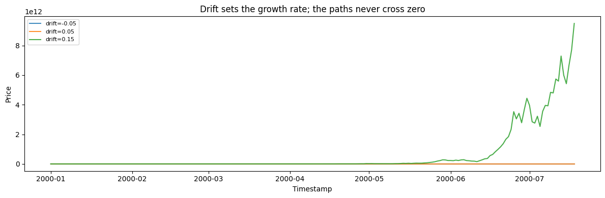
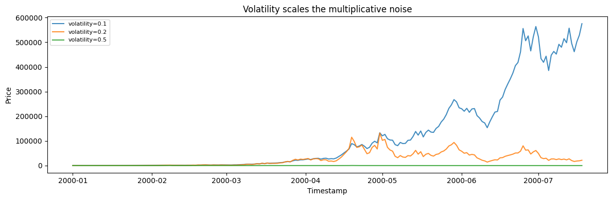
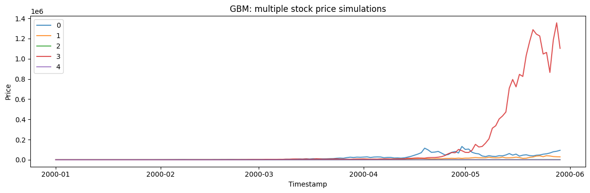

Geometric Brownian motion (GBM) is the standard model for strictly
positive, compounding quantities — asset prices, populations, anything
that grows *multiplicatively*. Its log grows as a drifting random walk,
so the level is log-normal and never goes negative.

> **The model**
>
> $$dS_t = \mu\,S_t\,dt + \sigma\,S_t\,dW_t$$
>
> Returns are proportional to the current level: `drift` (`mu`) sets the
> exponential growth rate and `volatility` (`sigma`) the multiplicative
> noise. This is the process behind Black-Scholes option pricing.

```python
import polars as pl
import matplotlib.pyplot as plt

from synforecast.generators import GeometricBrownianMotionGenerator
```

## 1. Drift

`drift` is the exponential growth rate. The seed is shared, so the three
paths have identical noise and differ only in trend direction.

```python
base = {
    "min_length": 200,
    "max_length": 200,
    "freq": "D",
    "sigma": 0.2,
    "initial_value": 100.0,
    "seed": 42,
}

fig, ax = plt.subplots(figsize=(12, 4))
for mu in (-0.05, 0.05, 0.15):
    df = GeometricBrownianMotionGenerator(
        engine="polars", mu=mu, **base
    ).generate(n_series=1)
    ax.plot(df["ds"].to_list(), df["y"].to_list(), label=f"drift={mu}", alpha=0.85)
ax.set(
    xlabel="Timestamp",
    ylabel="Price",
    title="Drift sets the growth rate; the paths never cross zero",
)
ax.legend(fontsize=8)
plt.tight_layout()
plt.show()

```



## 2. Volatility

`volatility` scales the multiplicative noise. Because the process is
multiplicative, the spread grows with the level rather than staying
constant.

```python
fig, ax = plt.subplots(figsize=(12, 4))
for sigma in (0.1, 0.2, 0.5):
    df = GeometricBrownianMotionGenerator(
        engine="polars",
        min_length=200,
        max_length=200,
        freq="D",
        mu=0.05,
        sigma=sigma,
        initial_value=100.0,
        seed=42,
    ).generate(n_series=1)
    ax.plot(df["ds"].to_list(), df["y"].to_list(), label=f"volatility={sigma}", alpha=0.85)
ax.set(
    xlabel="Timestamp",
    ylabel="Price",
    title="Volatility scales the multiplicative noise",
)
ax.legend(fontsize=8)
plt.tight_layout()
plt.show()

```



## 3. Multiple paths

Generate 5 independent GBM paths in one call.

```python
multi_params = {
    "min_length": 150,
    "max_length": 150,
    "freq": "D",
    "mu": 0.05,
    "sigma": 0.2,
    "initial_value": 100.0,
    "seed": 42,
}

multi_gen = GeometricBrownianMotionGenerator(engine="polars", **multi_params)
multi_df = multi_gen.generate(n_series=5)

print(f"Generated 5 stock price simulations with {len(multi_df)} total observations")
print(f"Overall Statistics: Mean={multi_df['y'].mean():.4f}, Min={multi_df['y'].min():.4f}, Max={multi_df['y'].max():.4f}")
multi_df.filter(pl.col("unique_id") == "0").head(10)
```

``` text
Generated 5 stock price simulations with 750 total observations
Overall Statistics: Mean=33529.5984, Min=39.7278, Max=1355600.3980
```

| unique_id | ds                  | y         |
|-----------|---------------------|-----------|
| cat       | datetime\[ns\]      | f64       |
| "0"       | 2000-01-01 00:00:00 | 100.0     |
| "0"       | 2000-01-02 00:00:00 | 77.855257 |
| "0"       | 2000-01-03 00:00:00 | 66.931005 |
| "0"       | 2000-01-04 00:00:00 | 83.485543 |
| "0"       | 2000-01-05 00:00:00 | 92.09352  |
| "0"       | 2000-01-06 00:00:00 | 85.875252 |
| "0"       | 2000-01-07 00:00:00 | 77.473016 |
| "0"       | 2000-01-08 00:00:00 | 90.038957 |
| "0"       | 2000-01-09 00:00:00 | 86.666449 |
| "0"       | 2000-01-10 00:00:00 | 92.367284 |

```python
fig, ax = plt.subplots(figsize=(12, 4))
for uid in multi_df["unique_id"].unique().to_list():
    series = multi_df.filter(pl.col("unique_id") == uid)
    ax.plot(series["ds"].to_list(), series["y"].to_list(), label=uid, alpha=0.8)
ax.set_xlabel("Timestamp")
ax.set_ylabel("Price")
ax.set_title("GBM: multiple stock price simulations")
ax.legend()
plt.tight_layout()
plt.show()
```



> **Related generators**
>
> -   [Random walk](../statistical/random_walk) — the *additive*
>     counterpart.
> -   [Jump diffusion](jump_diffusion) — GBM plus sudden jumps.
>
> Drift and volatility parameters are in the [generator
> reference](https://github.com/Nixtla/synforecast/blob/main/GENERATORS.md).

