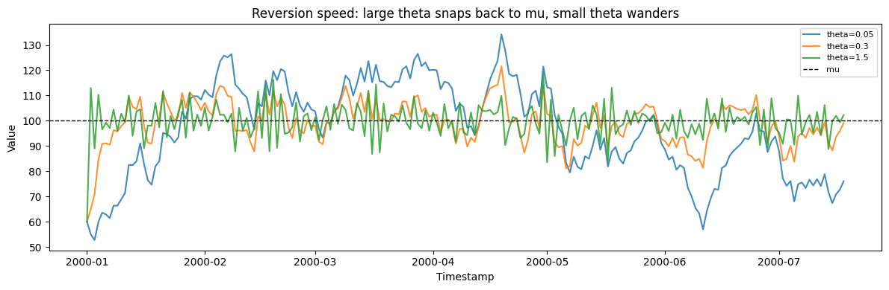
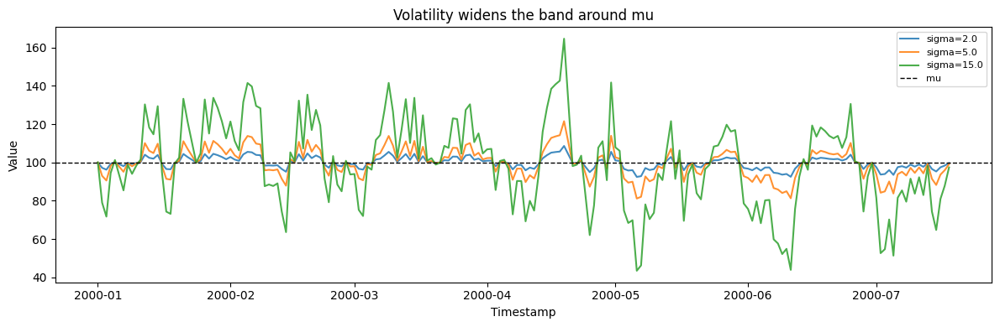
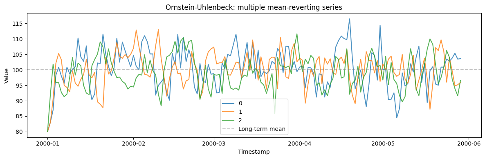

The Ornstein-Uhlenbeck process is the canonical *mean-reverting* series:
it wanders like a random walk but is continually pulled back toward a
long-run level. It models interest-rate spreads, temperatures, and any
quantity with an equilibrium it drifts around rather than away from.

> **The model**
>
> $$dx_t = \theta\,(\mu - x_t)\,dt + \sigma\,dW_t$$
>
> `theta` is the reversion speed (how hard it is pulled back), `mu` the
> long-run mean, and `sigma` the volatility. Large `theta` gives a tight
> band around `mu`; small `theta` approaches a random walk.

```python
import polars as pl
import matplotlib.pyplot as plt

from synforecast.generators import OrnsteinUhlenbeckGenerator
```

## 1. Reversion speed

`theta` sets how hard the process is pulled back to `mu`. Everything
else, including the seed, is held fixed, so the three paths differ only
in reversion speed.

```python
base = {
    "min_length": 200,
    "max_length": 200,
    "freq": "D",
    "mu": 100.0,
    "sigma": 5.0,
    "initial_value": 60.0,
    "seed": 42,
}

fig, ax = plt.subplots(figsize=(12, 4))
for theta in (0.05, 0.3, 1.5):
    df = OrnsteinUhlenbeckGenerator(engine="polars", theta=theta, **base).generate(
        n_series=1
    )
    ax.plot(df["ds"].to_list(), df["y"].to_list(), label=f"theta={theta}", alpha=0.85)
ax.axhline(base["mu"], color="black", linestyle="--", linewidth=1, label="mu")
ax.set(
    xlabel="Timestamp",
    ylabel="Value",
    title="Reversion speed: large theta snaps back to mu, small theta wanders",
)
ax.legend(fontsize=8)
plt.tight_layout()
plt.show()

```



## 2. Volatility

`sigma` sets the size of the random shocks. With `theta` fixed, a larger
`sigma` widens the band the process occupies around `mu` without
changing how fast it returns.

```python
fig, ax = plt.subplots(figsize=(12, 4))
for sigma in (2.0, 5.0, 15.0):
    df = OrnsteinUhlenbeckGenerator(
        engine="polars",
        min_length=200,
        max_length=200,
        freq="D",
        theta=0.3,
        mu=100.0,
        sigma=sigma,
        initial_value=100.0,
        seed=42,
    ).generate(n_series=1)
    ax.plot(df["ds"].to_list(), df["y"].to_list(), label=f"sigma={sigma}", alpha=0.85)
ax.axhline(100.0, color="black", linestyle="--", linewidth=1, label="mu")
ax.set(xlabel="Timestamp", ylabel="Value", title="Volatility widens the band around mu")
ax.legend(fontsize=8)
plt.tight_layout()
plt.show()

```



## 3. Multiple series

Generate multiple independent OU processes in one call.

```python
multi_params = {
    "min_length": 150,
    "max_length": 150,
    "freq": "D",
    "theta": 0.5,
    "mu": 100.0,
    "sigma": 5.0,
    "initial_value": 80.0,
    "seed": 42,
}

multi_gen = OrnsteinUhlenbeckGenerator(engine="polars", **multi_params)
multi_df = multi_gen.generate(n_series=3)

print(f"Generated 3 series with {len(multi_df)} total observations")
print(f"Overall Statistics: Mean={multi_df['y'].mean():.4f}, Std={multi_df['y'].std():.4f}")
multi_df.filter(pl.col("unique_id") == "0").head(10)
```

``` text
Generated 3 series with 450 total observations
Overall Statistics: Mean=99.8925, Std=5.8501
```

| unique_id | ds                  | y          |
|-----------|---------------------|------------|
| cat       | datetime\[ns\]      | f64        |
| "0"       | 2000-01-01 00:00:00 | 80.0       |
| "0"       | 2000-01-02 00:00:00 | 82.992031  |
| "0"       | 2000-01-03 00:00:00 | 86.966288  |
| "0"       | 2000-01-04 00:00:00 | 98.258423  |
| "0"       | 2000-01-05 00:00:00 | 100.832489 |
| "0"       | 2000-01-06 00:00:00 | 97.918522  |
| "0"       | 2000-01-07 00:00:00 | 95.635111  |
| "0"       | 2000-01-08 00:00:00 | 100.825374 |
| "0"       | 2000-01-09 00:00:00 | 98.708297  |
| "0"       | 2000-01-10 00:00:00 | 100.196799 |

```python
fig, ax = plt.subplots(figsize=(12, 4))
for uid in multi_df["unique_id"].unique().to_list():
    series = multi_df.filter(pl.col("unique_id") == uid)
    ax.plot(series["ds"].to_list(), series["y"].to_list(), label=uid, alpha=0.8)
ax.axhline(y=100.0, color="gray", linestyle="--", alpha=0.5, label="Long-term mean")
ax.set_xlabel("Timestamp")
ax.set_ylabel("Value")
ax.set_title("Ornstein-Uhlenbeck: multiple mean-reverting series")
ax.legend()
plt.tight_layout()
plt.show()
```



> **Related generators**
>
> -   [Random walk](../statistical/random_walk) — the no-reversion limit
>     (`theta` → 0).
> -   [Bounded process](bounded_process) — mean reversion constrained to
>     an interval.
>
> Reversion, mean, and volatility parameters are in the [generator
> reference](https://github.com/Nixtla/synforecast/blob/main/GENERATORS.md).

