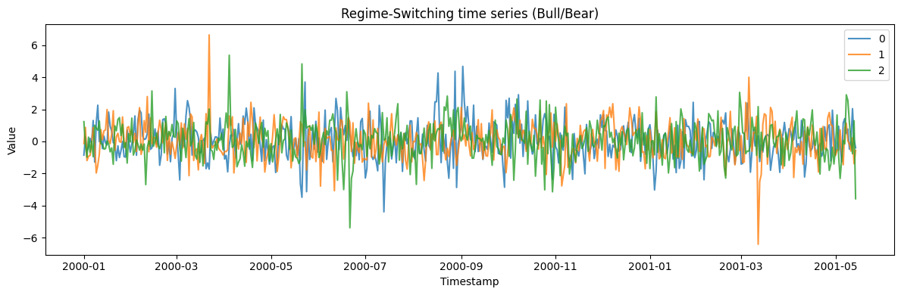
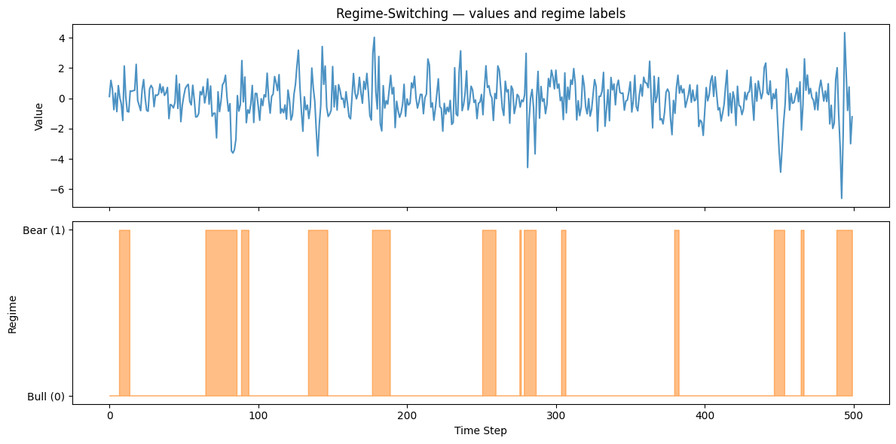

A regime-switching series alternates between distinct dynamic *regimes*
— bull/bear markets, expansion/recession — with switches governed by a
hidden Markov chain. Each regime has its own mean and volatility, so the
series changes character abruptly and persistently.

> **The model**
>
> $$y_t = \mu_{s_t} + \phi_{s_t}\,(y_{t-1} - \mu_{s_t}) + \sigma_{s_t}\,\varepsilon_t, \qquad s_t \sim \text{Markov}(P)$$
>
> A latent Markov chain over `n_regimes` states controls which dynamics
> generate each step; a transition matrix sets how sticky each regime
> is. The result is piecewise-stationary data with structural breaks
> that recur rather than happen once.

```python
import polars as pl
import matplotlib.pyplot as plt

from synforecast.generators import RegimeSwitchingGenerator
```

## Bull/Bear market model

Define a two-regime model where the bull regime has positive mean and
low variance, while the bear regime has negative mean and high variance.

```python
params = {
    "min_length": 500,
    "max_length": 500,
    "freq": "D",
    "n_regimes": 2,
    "regime_means": [0.05, -0.03],
    "regime_variances": [1.0, 4.0],
    "regime_ar_coeffs": [0.1, 0.2],
    "transition_matrix": [
        [0.98, 0.02],
        [0.10, 0.90],
    ],
    "seed": 42,
}

generator = RegimeSwitchingGenerator(engine="polars", **params)
df = generator.generate(n_series=3)

print(f"Generated {df['unique_id'].n_unique()} time series")
print(f"Total observations: {len(df)}")
df.head(10)
```

``` text
Generated 3 time series
Total observations: 1500
```

| unique_id | ds                  | y         |
|-----------|---------------------|-----------|
| cat       | datetime\[ns\]      | f64       |
| "0"       | 2000-01-01 00:00:00 | -0.855946 |
| "0"       | 2000-01-02 00:00:00 | 0.300061  |
| "0"       | 2000-01-03 00:00:00 | -0.589824 |
| "0"       | 2000-01-04 00:00:00 | -0.35486  |
| "0"       | 2000-01-05 00:00:00 | 0.190187  |
| "0"       | 2000-01-06 00:00:00 | -0.131834 |
| "0"       | 2000-01-07 00:00:00 | 1.305301  |
| "0"       | 2000-01-08 00:00:00 | -1.289682 |
| "0"       | 2000-01-09 00:00:00 | 1.136141  |
| "0"       | 2000-01-10 00:00:00 | 2.261838  |

```python
fig, ax = plt.subplots(figsize=(12, 4))
for uid in df["unique_id"].unique().to_list():
    series = df.filter(pl.col("unique_id") == uid)
    ax.plot(series["ds"].to_list(), series["y"].to_list(), label=uid, alpha=0.8)
ax.set_xlabel("Timestamp")
ax.set_ylabel("Value")
ax.set_title("Regime-Switching time series (Bull/Bear)")
ax.legend()
plt.tight_layout()
plt.show()
```



## Model information

Inspect model parameters including the stationary distribution of the
Markov chain.

```python
info = generator.get_model_info()
print(f"Number of regimes: {info['n_regimes']}")
print(f"Regime means: {info['regime_means']}")
print(f"Regime variances: {info['regime_variances']}")
print(f"Stationary distribution: {[f'{p:.3f}' for p in info['stationary_distribution']]}")
```

``` text
Number of regimes: 2
Regime means: [0.05, -0.03]
Regime variances: [1.0, 4.0]
Stationary distribution: ['0.833', '0.167']
```

## Regime labels

Generate data with regime labels to see how observations are distributed
across regimes.

```python
values, regimes, ids = generator.generate_with_regimes(n_series=1)
regime_counts = {0: (regimes == 0).sum(), 1: (regimes == 1).sum()}
print(f"Regime 0 (Bull) observations: {regime_counts[0]}")
print(f"Regime 1 (Bear) observations: {regime_counts[1]}")
```

``` text
Regime 0 (Bull) observations: 398
Regime 1 (Bear) observations: 102
```

```python
fig, axes = plt.subplots(2, 1, figsize=(12, 6), sharex=True)
axes[0].plot(values, alpha=0.8)
axes[0].set_ylabel("Value")
axes[0].set_title("Regime-Switching — values and regime labels")
axes[1].fill_between(range(len(regimes)), regimes, alpha=0.5, step="mid", color="tab:orange")
axes[1].set_xlabel("Time Step")
axes[1].set_ylabel("Regime")
axes[1].set_yticks([0, 1])
axes[1].set_yticklabels(["Bull (0)", "Bear (1)"])
plt.tight_layout()
plt.show()
```



## Statistics by series

Compare summary statistics across the generated series.

```python
stats = df.group_by("unique_id").agg(
    [
        pl.col("y").count().alias("count"),
        pl.col("y").min().alias("min_value"),
        pl.col("y").max().alias("max_value"),
        pl.col("y").mean().alias("mean_value"),
        pl.col("y").std().alias("std_value"),
    ]
)
stats
```

| unique_id | count | min_value | max_value | mean_value | std_value |
|-----------|-------|-----------|-----------|------------|-----------|
| cat       | u32   | f64       | f64       | f64        | f64       |
| "0"       | 500   | -4.397419 | 4.687607  | 0.085832   | 1.1675    |
| "1"       | 500   | -6.417219 | 6.649223  | 0.054715   | 1.114054  |
| "2"       | 500   | -5.390482 | 5.381689  | 0.083175   | 1.140473  |

> **Related generators**
>
> -   [Changepoints](../../capabilities/changepoints) — one-off
>     structural breaks rather than recurring regimes.
> -   [GARCH](garch) — smoothly varying volatility instead of discrete
>     states.
>
> Regime and transition parameters are in the [generator
> reference](https://github.com/Nixtla/synforecast/blob/main/GENERATORS.md).

