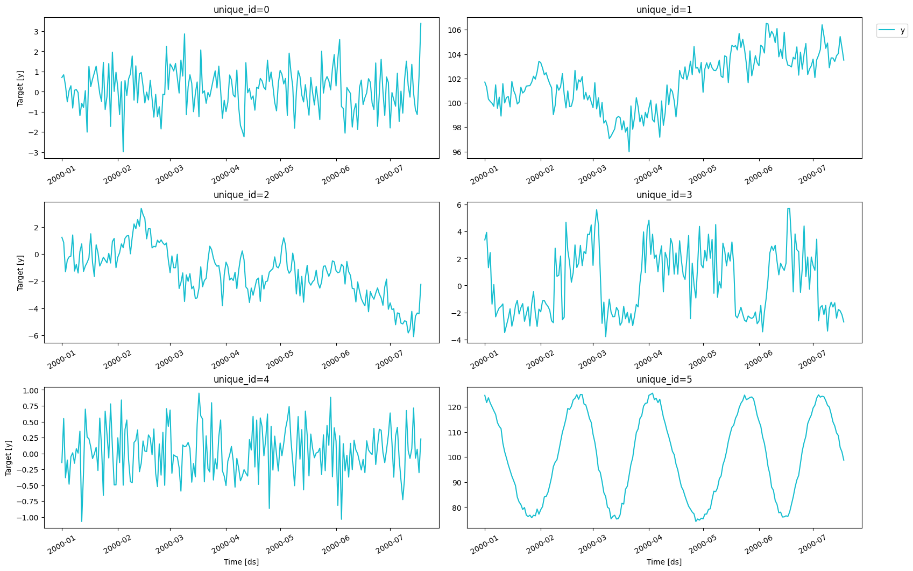
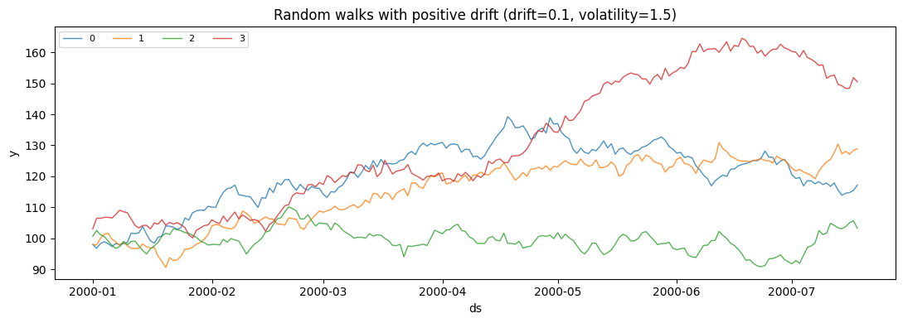
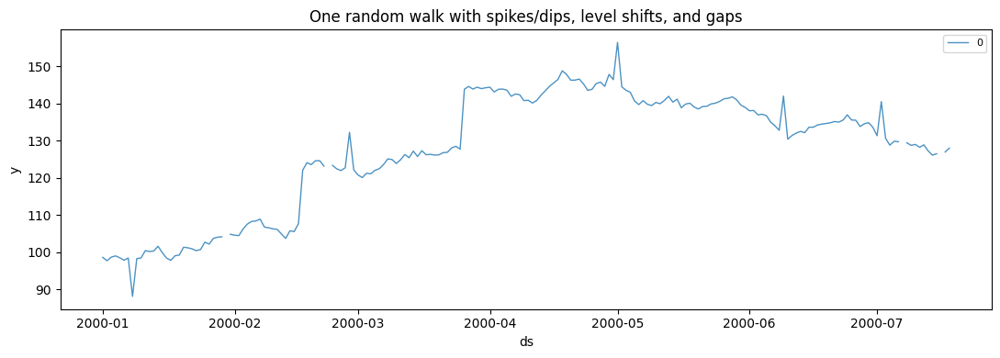
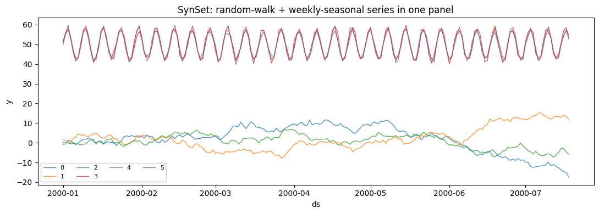

SynForecast generates synthetic time-series panels — validated,
reproducible, and in the same long format as the rest of the
Nixtlaverse. This guide goes from a one-line panel to explicitly
controlled generators, injected real-world patterns, and mixed datasets.

> **Common uses**
>
> -   **Testing** a forecasting pipeline on data whose true process you
>     know, before trusting it on real series.
> -   **Augmenting** a small panel so a global model has more to learn
>     from — see [SynAugment](../capabilities/augmentation).
> -   **Pretraining** foundation models on a diverse corpus no single
>     real dataset provides.
> -   **Sharing** a reproducible example without exposing proprietary
>     data.

## 1. Generate a panel in one line

`generate_series` draws from a balanced pool of generators spanning
trends, seasonality, volatility clustering, counts, and more, then
returns a panel you can hand straight to any Nixtla forecaster.

```python
from synforecast import generate_series

panel = generate_series(
    n_series=6,
    freq="D",
    min_length=200,
    max_length=200,
    engine="polars",
    seed=1,
)
panel.head()
```

| unique_id | ds                  | y         |
|-----------|---------------------|-----------|
| cat       | datetime\[ns\]      | f64       |
| "0"       | 2000-01-01 00:00:00 | 0.705375  |
| "0"       | 2000-01-02 00:00:00 | 0.838695  |
| "0"       | 2000-01-03 00:00:00 | 0.303755  |
| "0"       | 2000-01-04 00:00:00 | -0.502002 |
| "0"       | 2000-01-05 00:00:00 | 0.060002  |

> **The Nixtla long format**
>
> Every SynForecast output uses three columns — `unique_id` (series id),
> `ds` (timestamp), and `y` (value) — the schema `statsforecast`,
> `mlforecast`, and `neuralforecast` all expect, so no adapter is
> needed. The default `engine="pandas"` returns a pandas frame; pass
> `engine="polars"` (as here) for Polars.

```python
import matplotlib.pyplot as plt
import polars as pl
from utilsforecast.plotting import plot_series


def plot_panel(df, title, max_series=8):
    """Overlay a panel on one axis, for series that share a data-generating process."""
    fig, ax = plt.subplots(figsize=(11, 4))
    for uid in df["unique_id"].unique(maintain_order=True).to_list()[:max_series]:
        series = df.filter(pl.col("unique_id") == uid)
        ax.plot(series["ds"], series["y"], linewidth=1, alpha=0.8, label=str(uid))
    ax.set(title=title, xlabel="ds", ylabel="y")
    ax.legend(fontsize=8, ncol=4)
    plt.tight_layout()
    plt.show()


# These six series come from six different generators, so their scales differ by
# an order of magnitude. One panel per series keeps the small-amplitude
# processes readable; `plot_panel` above is for series that share a process.
plot_series(panel, max_ids=6, plot_random=False)

```



Each line is a different data-generating process. Together they cover
ARIMA dynamics, exponential smoothing, long memory, regime switching,
volatility clustering, and irregular cycles. That diversity is what
turns the panel into a stress test for a forecaster rather than one
shape repeated six times.

Don’t take that on trust — pass `with_generator_col=True` to record
which generator produced each series:

```python
provenance = generate_series(
    n_series=6,
    freq="D",
    min_length=200,
    max_length=200,
    engine="polars",
    seed=1,
    with_generator_col=True,
)
per_series = provenance.group_by("unique_id", "generator").len().sort("unique_id")
print(per_series)
assert per_series["generator"].n_unique() == 6, "panel should span 6 generators"
```

``` text
shape: (6, 3)
┌───────────┬─────────────────────────────────┬─────┐
│ unique_id ┆ generator                       ┆ len │
│ ---       ┆ ---                             ┆ --- │
│ cat       ┆ str                             ┆ u32 │
╞═══════════╪═════════════════════════════════╪═════╡
│ 0         ┆ SARIMAGenerator                 ┆ 200 │
│ 1         ┆ ETSGenerator                    ┆ 200 │
│ 2         ┆ FractionalBrownianMotionGenera… ┆ 200 │
│ 3         ┆ RegimeSwitchingGenerator        ┆ 200 │
│ 4         ┆ GARCHGenerator                  ┆ 200 │
│ 5         ┆ CyclicGenerator                 ┆ 200 │
└───────────┴─────────────────────────────────┴─────┘
```

## 2. Choose a generator when you need control

`generate_series` is the fast default. When you need a known process —
for example, to confirm your model recovers an upward trend —
instantiate a generator and set its parameters explicitly. Here, a
random walk with positive drift and moderate volatility.

```python
from synforecast.generators import RandomWalkGenerator

rw = RandomWalkGenerator(
    engine="polars",
    min_length=200,
    max_length=200,
    freq="D",
    drift=0.1,
    volatility=1.5,
    start_value=100.0,
    seed=42,
)
walks = rw.generate(n_series=4)
plot_panel(walks, "Random walks with positive drift (drift=0.1, volatility=1.5)")
```



All four series share the same process but a different noise draw: the
common upward pull is the `drift`, the jaggedness is the `volatility`.
Change `seed` for fresh draws, or the parameters to reshape the process.
Every generator’s full parameter set is listed in the [generator
reference](https://github.com/Nixtla/synforecast/blob/main/GENERATORS.md).

## 3. Inject real-world patterns

Real series are rarely clean. Any generator can add anomalies, level
shifts, and missing values, so you can measure how a model copes with
them — and because everything is seeded, the messy series is
reproducible.

```python
messy = RandomWalkGenerator(
    engine="polars",
    min_length=200,
    max_length=200,
    freq="D",
    start_value=100.0,
    seed=42,
    # spikes and dips
    anomalies=True,
    anomaly_fraction=0.03,
    anomaly_types=["spike", "dip"],
    # abrupt level shifts
    changepoints=True,
    num_changepoints=2,
    changepoint_type="level",
    # gaps
    missing_data=True,
    missing_rate=0.02,
)
plot_panel(
    messy.generate(n_series=1),
    "One random walk with spikes/dips, level shifts, and gaps",
)
```



> **Each pattern has its own guide**
>
> The knobs above are the quick version. Fine-grained control lives in
> the capability guides: [anomalies](../capabilities/anomalies),
> [changepoints](../capabilities/changepoints), and
> [missingness](../capabilities/missingness). To attach exogenous
> regressors, see [exogenous](../capabilities/exogenous).

## 4. Combine generators into one dataset

A realistic panel mixes behaviors. `SynSet` composes several generators
into a single long-format dataset, with each generator contributing a
batch of series under its own ids.

```python
from synforecast import SynSet
from synforecast.generators import SeasonalGenerator

dataset = SynSet(
    [
        RandomWalkGenerator(
            engine="polars", min_length=200, max_length=200, freq="D", seed=1
        ),
        SeasonalGenerator(
            engine="polars",
            min_length=200,
            max_length=200,
            freq="D",
            seasonality_period=7,
            seasonality_amplitude=8.0,
            seed=2,
        ),
    ]
)
mixed = dataset.generate(n_series_per_generator=3)
plot_panel(mixed, "SynSet: random-walk + weekly-seasonal series in one panel")
```



> **Reproducibility and the alpha API**
>
> Generation is fully seeded: the same inputs produce the same panel
> across runs and regardless of `n_jobs`. SynForecast is in alpha, so
> seed-identical outputs may change between releases — pin a version if
> you depend on exact values.

## Where to go next

-   **Generators** — 31 generator classes from SARIMA, ETS, and GARCH to
    Gaussian processes and the
    [KernelSynth](../generators/pretraining/kernel_synth) pretraining
    recipe. Start with [random
    walk](../generators/statistical/random_walk) or
    [seasonal](../generators/statistical/seasonal).
-   **[Augmentation](../capabilities/augmentation)** — expand a small
    real panel with `SynAugment` or TSMixup.
-   **[Balanced pool](../capabilities/balanced_pool)** — what
    `generate_series` draws from by default, and how to tailor it.
-   **Integrations** — end-to-end workflows with
    [statsforecast](../integrations/statsforecast),
    [mlforecast](../integrations/mlforecast), and
    [neuralforecast](../integrations/neuralforecast).

