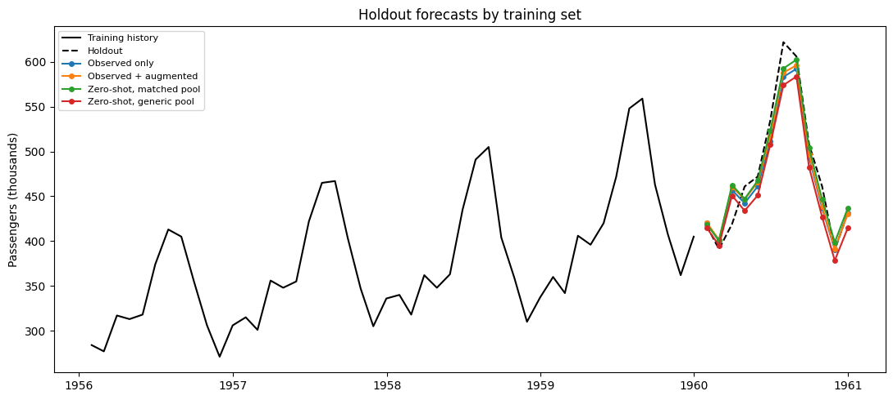

This guide compares an observed-data baseline, global training with
observed and augmented series, and models trained only on independent
synthetic series and transferred zero-shot to the observed series.

MLForecast trains a single global model over lagged and derived features
pooled across every series in the panel. Because that fitted estimator
is shared, two things follow. Adding synthetic series changes the model
the observed series is scored by — unlike a local model fitted
independently per series, where extra series leave the target fit
untouched. And a model trained only on synthetic series can be applied
to a previously unseen panel through `predict(new_df=...)`, which is
zero-shot transfer rather than a per-series refit. Both workflows below
rely on that shared-weight behavior.

> **Scale the target before pooling series**
>
> A global model sees every series through one set of coefficients, so
> series on different levels have to be made comparable first. The
> forecaster below applies `Differences([12])` to remove the annual
> seasonal trend and `LocalStandardScaler()` to put each series on its
> own scale.
>
> Without those transforms every synthetic workflow on this page
> degrades by a factor of four to six: the estimator fits whatever level
> the synthetic panel happens to occupy and predicts a nearly flat line
> for the airline series. That failure is a symptom of the model
> configuration, not of the synthetic data.

We use the classic [Box–Jenkins airline passenger
series](https://search.r-project.org/R/refmans/datasets/html/AirPassengers.html),
holding out its final 12 months before generating any augmented data.

```python
from pathlib import Path

import matplotlib.pyplot as plt
import numpy as np
import pandas as pd
from mlforecast import MLForecast
from mlforecast.target_transforms import Differences, LocalStandardScaler
from sklearn.linear_model import Ridge

from utilsforecast.evaluation import evaluate
from utilsforecast.losses import mae

from synforecast import SynAugment, SynSet, generate_series
from synforecast.generators import ETSGenerator, SARIMAGenerator, SeasonalGenerator

```


```python
HORIZON = 12
TARGET_ID = "AirPassengers"
data_path = Path("nbs/data/air_passengers.csv")
if not data_path.exists():
    data_path = Path("../../data/air_passengers.csv")

observed_df = pd.read_csv(data_path, parse_dates=["ds"])
train_df = observed_df.iloc[:-HORIZON].copy()
test_df = observed_df.iloc[-HORIZON:].copy()
train_df.tail()
```

|     | unique_id     | ds         | y     |
|-----|---------------|------------|-------|
| 127 | AirPassengers | 1959-08-31 | 559.0 |
| 128 | AirPassengers | 1959-09-30 | 463.0 |
| 129 | AirPassengers | 1959-10-31 | 407.0 |
| 130 | AirPassengers | 1959-11-30 | 362.0 |
| 131 | AirPassengers | 1959-12-31 | 405.0 |

The next cell builds the four training sets. The observed baseline is
the single airline series. The augmented panel adds eight counterparts
of that series, drawn with `SynAugment` under a SARIMA override so the
generated histories match its seasonal structure; the 12-month holdout
is removed first, so no future value reaches the augmenter.

The two pretraining panels are both independent of the airline data, and
differ only in how they were composed:

-   **matched monthly pool** — SARIMA, ETS, and seasonal generators
    configured for monthly data with a 12-step seasonal period, an
    upward trend, and a comparable level.
-   **generic balanced pool** — `generate_series` with its defaults,
    which spans random walks, volatility clustering, chaos, and counts
    at whatever scale each process produces.

Non-finite synthetic series are dropped from both so the estimator
trains on clean histories.

```python
augmented_train_df = SynAugment(seed=42).augment(
    train_df,
    n_augment=8,
    generator_override={TARGET_ID: "SARIMAGenerator"},
)

n_obs = len(train_df)
monthly_generators = [
    SARIMAGenerator(
        min_length=n_obs, max_length=n_obs, freq="ME", engine="polars",
        seasonal_period=12, d=1, D=1, noise_std=2.0, seed=seed,
    )
    for seed in range(4)
] + [
    ETSGenerator(
        min_length=n_obs, max_length=n_obs, freq="ME", engine="polars",
        seasonal_period=12, trend_type="add", seasonal_type="add",
        level=300.0, trend=1.5, seed=10 + seed,
    )
    for seed in range(4)
] + [
    SeasonalGenerator(
        min_length=n_obs, max_length=n_obs, freq="ME", engine="polars",
        seasonality_period=12, base_level=300.0, trend=1.5,
        seasonality_amplitude=50.0, noise_level=10.0, seed=20 + seed,
    )
    for seed in range(4)
]


def drop_non_finite(df: pd.DataFrame) -> pd.DataFrame:
    """Keep only series whose values are all finite."""
    finite = df.groupby("unique_id", observed=True)["y"].apply(
        lambda values: np.isfinite(values).all()
    )
    return df.loc[df["unique_id"].isin(finite[finite].index)].copy()


# The generators emit Polars; the rest of this guide stays on pandas.
matched_pretrain_df = drop_non_finite(
    SynSet(monthly_generators).generate(n_series_per_generator=3).to_pandas()
)
generic_pretrain_df = drop_non_finite(
    generate_series(
        n_series=32, freq="ME", min_length=n_obs, max_length=n_obs, seed=42
    )
)

pd.DataFrame(
    {
        "training set": [
            "observed only",
            "observed + augmented",
            "matched monthly pool",
            "generic balanced pool",
        ],
        "series": [
            1,
            augmented_train_df["unique_id"].nunique(),
            matched_pretrain_df["unique_id"].nunique(),
            generic_pretrain_df["unique_id"].nunique(),
        ],
    }
)

```

|     | training set          | series |
|-----|-----------------------|--------|
| 0   | observed only         | 1      |
| 1   | observed + augmented  | 9      |
| 2   | matched monthly pool  | 36     |
| 3   | generic balanced pool | 32     |

```python
def make_forecaster() -> MLForecast:
    return MLForecast(
        models=Ridge(alpha=1.0),
        freq="ME",
        lags=[1, 2, 3, 6, 12],
        target_transforms=[Differences([12]), LocalStandardScaler()],
    )


def target_forecast(forecast_df: pd.DataFrame) -> pd.DataFrame:
    return forecast_df.loc[
        forecast_df["unique_id"].astype(str) == TARGET_ID,
        ["unique_id", "ds", "Ridge"],
    ].copy()

```


```python
real_only = make_forecaster()
real_only.fit(train_df)
real_only_forecast = target_forecast(real_only.predict(h=HORIZON))
```


```python
with_augmentation = make_forecaster()
with_augmentation.fit(augmented_train_df)
augmented_forecast = target_forecast(with_augmentation.predict(h=HORIZON))
```

MLForecast can apply a fitted global estimator to unseen series through
`predict(new_df=...)`. The estimators below are fitted only on
independent SynForecast series; the observed history is supplied only
when producing its recursive lag features and forecasts. This is
zero-shot transfer, not fine-tuning.

Fitting both pools separately is what makes the comparison useful: the
pretraining corpus is a modeling choice, and choosing it badly costs
more accuracy here than skipping pretraining altogether.

```python
matched_pretrained = make_forecaster()
matched_pretrained.fit(matched_pretrain_df)
matched_zero_shot_forecast = target_forecast(
    matched_pretrained.predict(h=HORIZON, new_df=train_df)
)

generic_pretrained = make_forecaster()
generic_pretrained.fit(generic_pretrain_df)
generic_zero_shot_forecast = target_forecast(
    generic_pretrained.predict(h=HORIZON, new_df=train_df)
)

```

We score each workflow by mean absolute error over the 12-month holdout
for the airline series.

```python
forecast_sets = {
    "Observed only": real_only_forecast,
    "Observed + augmented": augmented_forecast,
    "Zero-shot, matched pool": matched_zero_shot_forecast,
    "Zero-shot, generic pool": generic_zero_shot_forecast,
}
comparison = test_df[["unique_id", "ds", "y"]].copy()
for label, forecast_df in forecast_sets.items():
    comparison = comparison.merge(
        forecast_df.rename(columns={"Ridge": label}),
        on=["unique_id", "ds"],
        how="left",
    )

scores = evaluate(comparison, metrics=[mae], models=list(forecast_sets))
metrics = (
    scores.melt(id_vars=["unique_id", "metric"], var_name="workflow", value_name="MAE")
    .loc[:, ["workflow", "MAE"]]
    .sort_values("MAE", ignore_index=True)
)
metrics
```

|     | workflow                | MAE       |
|-----|-------------------------|-----------|
| 0   | Zero-shot, matched pool | 12.507531 |
| 1   | Observed + augmented    | 14.613678 |
| 2   | Observed only           | 16.302282 |
| 3   | Zero-shot, generic pool | 22.675395 |

```python
fig, ax = plt.subplots(figsize=(11, 5))
history = train_df.tail(48)
ax.plot(history["ds"], history["y"], color="black", label="Training history")
ax.plot(test_df["ds"], test_df["y"], color="black", linestyle="--", label="Holdout")
for label in forecast_sets:
    ax.plot(comparison["ds"], comparison[label], marker="o", markersize=4, label=label)
ax.set(title="Holdout forecasts by training set", ylabel="Passengers (thousands)")
ax.legend(fontsize=8)
fig.tight_layout()

```



Two things stand out, and both match the paired benchmarks in [When does
synthetic data help?](/synforecast/docs/capabilities/when_synthetic_helps.html).

**Augmentation is roughly neutral.** Across ten augmentation seeds the
augmented panel beat the observed-only baseline six times out of ten
(median MAE 15.8 against 16.3). Treat the single row in the table as a
workflow demonstration, not as evidence that augmentation improves
accuracy.

**A matched pretraining pool wins here; a generic one loses.** The
matched-pool zero-shot model beat observed-only training in all ten pool
seeds (median MAE 12.2), while the generic pool lost in all ten (median
22.2). One 132-point series is very little data for a global model,
which is the data-scarce regime where synthetic pretraining pays off —
but only when the corpus resembles the target domain in frequency,
seasonal period, and scale.

For a production decision, evaluate multiple temporal folds, generator
configurations, estimators, and random seeds. Choose augmentation ratios
and pool composition on validation data, never on the final holdout.

