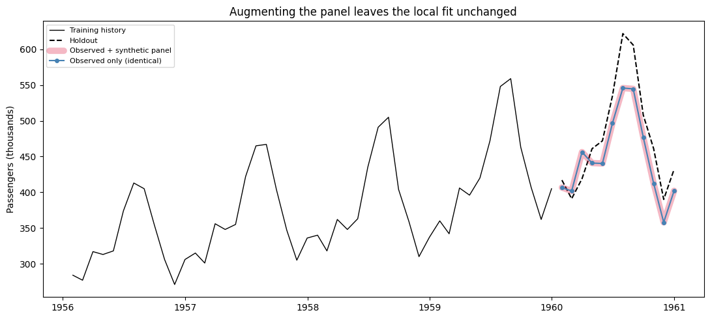
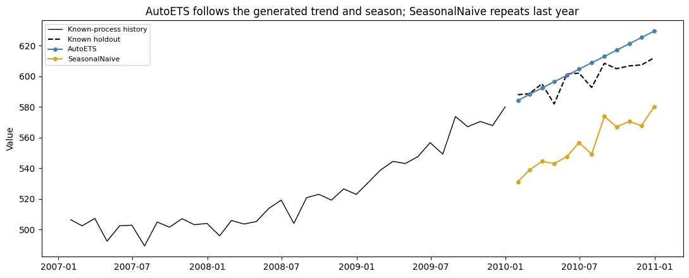

StatsForecast fits each series independently, so synthetic data plays a
different role here than it does for global models. This guide
establishes three things in order: augmenting a panel cannot change a
local fit, there is no local-model equivalent of pretraining, and a
generated series with a known process makes a good pipeline check.

`AutoETS` and its siblings share no parameters across series. Everything
below follows from that.

We use the classic [Box–Jenkins airline passenger
series](https://search.r-project.org/R/refmans/datasets/html/AirPassengers.html).
Its final 12 months are held out before `SynAugment` analyzes the
training history.

```python
from pathlib import Path

import matplotlib.pyplot as plt
import numpy as np
import pandas as pd
from statsforecast import StatsForecast
from statsforecast.models import AutoETS, SeasonalNaive

from utilsforecast.evaluation import evaluate
from utilsforecast.losses import mae

from synforecast import SynAugment
from synforecast.generators import ETSGenerator

```


```python
HORIZON = 12
TARGET_ID = "AirPassengers"
data_path = Path("nbs/data/air_passengers.csv")
if not data_path.exists():
    data_path = Path("../../data/air_passengers.csv")

observed_df = pd.read_csv(data_path, parse_dates=["ds"])
train_df = observed_df.iloc[:-HORIZON].copy()
test_df = observed_df.iloc[-HORIZON:].copy()
train_df.tail()
```

|     | unique_id     | ds         | y     |
|-----|---------------|------------|-------|
| 127 | AirPassengers | 1959-08-31 | 559.0 |
| 128 | AirPassengers | 1959-09-30 | 463.0 |
| 129 | AirPassengers | 1959-10-31 | 407.0 |
| 130 | AirPassengers | 1959-11-30 | 362.0 |
| 131 | AirPassengers | 1959-12-31 | 405.0 |

## 1. Augmentation cannot change a local fit

Adding synthetic series gives `AutoETS` more series to fit, but no
pooled parameter for them to influence, so the model fitted to the
airline series is untouched. Sixteen `SynAugment` counterparts are added
under a SARIMA override; the 12-month holdout is removed first, so no
future value reaches the augmenter.

```python
augmented_train_df = SynAugment(seed=42).augment(
    train_df,
    n_augment=16,
    generator_override={TARGET_ID: "SARIMAGenerator"},
)

pd.DataFrame(
    {
        "training set": ["observed only", "observed + augmented"],
        "series": [1, augmented_train_df["unique_id"].nunique()],
    }
)

```

|     | training set         | series |
|-----|----------------------|--------|
| 0   | observed only        | 1      |
| 1   | observed + augmented | 17     |

```python
def make_forecaster() -> StatsForecast:
    return StatsForecast(
        models=[AutoETS(season_length=12)],
        freq="ME",
        n_jobs=1,
    )


def target_forecast(forecast_df: pd.DataFrame) -> pd.DataFrame:
    return forecast_df.loc[
        forecast_df["unique_id"].astype(str) == TARGET_ID,
        ["unique_id", "ds", "AutoETS"],
    ].copy()
```


```python
real_only = make_forecaster()
real_only.fit(train_df)
real_only_forecast = target_forecast(real_only.predict(h=HORIZON))
```


```python
with_augmentation = make_forecaster()
with_augmentation.fit(augmented_train_df)
augmented_forecast = target_forecast(with_augmentation.predict(h=HORIZON))

identical = np.allclose(
    real_only_forecast["AutoETS"], augmented_forecast["AutoETS"]
)
print(f"the two forecasts are identical: {identical}")

```

``` text
the two forecasts are identical: True
```

```python
forecast_sets = {
    "Observed only": real_only_forecast,
    "Observed + synthetic panel": augmented_forecast,
}
comparison = test_df[["unique_id", "ds", "y"]].copy()
for label, forecast_df in forecast_sets.items():
    comparison = comparison.merge(
        forecast_df.rename(columns={"AutoETS": label}),
        on=["unique_id", "ds"],
        how="left",
    )

scores = evaluate(comparison, metrics=[mae], models=list(forecast_sets))
metrics = scores.melt(
    id_vars=["unique_id", "metric"], var_name="workflow", value_name="MAE"
).loc[:, ["workflow", "MAE"]]
metrics

```

|     | workflow                   | MAE       |
|-----|----------------------------|-----------|
| 0   | Observed only              | 35.612471 |
| 1   | Observed + synthetic panel | 35.612471 |

Both workflows score the same because they *are* the same fit. In the
chart the augmented forecast is drawn as a thick translucent band with
the observed-only line on top of it — one visible line means the two
coincide exactly.

```python
fig, ax = plt.subplots(figsize=(11, 5))
history = train_df.tail(48)
ax.plot(history["ds"], history["y"], color="black", linewidth=1, label="Training history")
ax.plot(test_df["ds"], test_df["y"], color="black", linestyle="--", label="Holdout")
# The two forecasts are identical, so the augmented one is drawn wide and
# translucent with the observed-only line on top of it.
ax.plot(comparison["ds"], comparison["Observed + synthetic panel"],
        color="crimson", linewidth=7, alpha=0.3, solid_capstyle="round",
        label="Observed + synthetic panel")
ax.plot(comparison["ds"], comparison["Observed only"],
        color="steelblue", linewidth=1.5, marker="o", markersize=4,
        label="Observed only (identical)")
ax.set(title="Augmenting the panel leaves the local fit unchanged",
       ylabel="Passengers (thousands)")
ax.legend(fontsize=8)
fig.tight_layout()

```



## 2. There is no local-model pretraining

Because nothing is shared, fitting `AutoETS` to synthetic histories
produces forecasts *for those histories*, not for the airline series.
Averaging them is not a shortcut either, and the table below shows why:
`SynAugment` matches each draw to the **mean of the training window**,
which leaves the final level free. On a strongly trending series the two
are far apart, so the draws end scattered around the observed endpoint.

```python
synthetic_history_df = augmented_train_df.loc[
    augmented_train_df["unique_id"].astype(str) != TARGET_ID
].copy()

levels = synthetic_history_df.groupby("unique_id", observed=True)["y"].agg(
    window_mean="mean",
    final_year_mean=lambda values: values.tail(12).mean(),
)

pd.DataFrame(
    {
        "series": ["observed", "synthetic (16 draws)"],
        "window mean": [
            round(train_df["y"].mean(), 1),
            f"{levels['window_mean'].min():.0f} - {levels['window_mean'].max():.0f}",
        ],
        "final-year mean": [
            round(train_df["y"].tail(12).mean(), 1),
            f"{levels['final_year_mean'].min():.0f} - {levels['final_year_mean'].max():.0f}",
        ],
    }
)

```

|     | series               | window mean | final-year mean |
|-----|----------------------|-------------|-----------------|
| 0   | observed             | 262.5       | 428.3           |
| 1   | synthetic (16 draws) | 262 - 263   | 191 - 506       |

## 3. Validate the pipeline on a known process

The two sections above used the airline series, whose true process
nobody knows. A generated series is different: you chose the process,
the seasonal period, and the noise scale, so you know in advance what a
correctly configured pipeline should be able to do.

That makes it a check with a known answer. The twelve series below come
from an additive ETS process with a 12-period season, and the last 12
points of each are held out. `AutoETS` should beat `SeasonalNaive` by a
wide margin, because the data really does contain the smooth
trend-plus-season structure `AutoETS` fits and `SeasonalNaive` ignores.
If it does not, the pipeline is misconfigured — and you have learned
that without touching real data.

```python
NOISE_STD = 6.0
known_process = ETSGenerator(
    min_length=132,
    max_length=132,
    freq="ME",
    engine="polars",
    seasonal_period=12,
    error_type="add",
    trend_type="add",
    seasonal_type="add",
    level=300.0,
    trend=1.5,
    noise_std=NOISE_STD,
    seed=7,
)
known_panel = known_process.generate(n_series=12).to_pandas()

is_holdout = (
    known_panel.groupby("unique_id", observed=True).cumcount() >= 132 - HORIZON
)
known_train_df = known_panel.loc[~is_holdout]
known_test_df = known_panel.loc[is_holdout]

known_models = StatsForecast(
    models=[AutoETS(season_length=12), SeasonalNaive(season_length=12)],
    freq="ME",
    n_jobs=1,
)
known_models.fit(known_train_df)
known_forecast = known_models.predict(h=HORIZON).merge(
    known_test_df[["unique_id", "ds", "y"]], on=["unique_id", "ds"]
)

known_scores = evaluate(
    known_forecast,
    metrics=[mae],
    models=["AutoETS", "SeasonalNaive"],
    agg_fn="mean",
)

known_scores.melt(id_vars="metric", var_name="model", value_name="MAE").loc[
    :, ["model", "MAE"]
].round(2)

```

|     | model         | MAE   |
|-----|---------------|-------|
| 0   | AutoETS       | 11.52 |
| 1   | SeasonalNaive | 49.54 |

`AutoETS` comes in around four times more accurate than `SeasonalNaive`,
which is the outcome the generated structure predicts. That is the whole
check: a known-answer test that fails loudly when the frequency, the
season length, or the model family is set up wrongly.

For a sense of how much of the remaining error is irreducible, the noise
is Gaussian with standard deviation `NOISE_STD`, so the best any
forecaster could do one step ahead is a mean absolute error of
`NOISE_STD * sqrt(2 / pi)`. Forecasting twelve steps ahead must do worse
than that, since an additive-error ETS accumulates innovations into its
state as the horizon grows — so treat the number below as a lower bound
to sit above, not a target to reach.

```python
best_one_step_mae = NOISE_STD * np.sqrt(2 / np.pi)
print(f"generator noise standard deviation: {NOISE_STD:.2f}")
print(f"best possible one-step MAE:         {best_one_step_mae:.2f}")

```

``` text
generator noise standard deviation: 6.00
best possible one-step MAE:         4.79
```

```python
example_id = known_panel["unique_id"].iloc[0]
example_history = known_train_df.loc[known_train_df["unique_id"] == example_id].tail(36)
example_holdout = known_test_df.loc[known_test_df["unique_id"] == example_id]
example_forecast = known_forecast.loc[known_forecast["unique_id"] == example_id]

fig, ax = plt.subplots(figsize=(11, 4.5))
ax.plot(example_history["ds"], example_history["y"], color="black", linewidth=1,
        label="Known-process history")
ax.plot(example_holdout["ds"], example_holdout["y"], color="black", linestyle="--",
        label="Known holdout")
ax.plot(example_forecast["ds"], example_forecast["AutoETS"], color="steelblue",
        marker="o", markersize=4, label="AutoETS")
ax.plot(example_forecast["ds"], example_forecast["SeasonalNaive"], color="goldenrod",
        marker="o", markersize=4, label="SeasonalNaive")
ax.set(
    title="AutoETS follows the generated trend and season; SeasonalNaive repeats last year",
    ylabel="Value",
)
ax.legend(fontsize=8)
fig.tight_layout()

```



For local models, synthetic data is a test instrument rather than extra
training signal. Augmentation is inert, aggregating synthetic fits is
not a substitute for pretraining, and generating from a process you
configured yourself gives you a check whose answer you already know.

Panel augmentation does help model families that pool parameters across
series — see the [MLForecast](mlforecast) and
[NeuralForecast](neuralforecast) guides. Synthetic panels are also
useful here for stress testing: inject
[anomalies](/synforecast/docs/capabilities/anomalies.html) or
[changepoints](/synforecast/docs/capabilities/changepoints.html) with known positions and
measure how far the fitted model moves.

