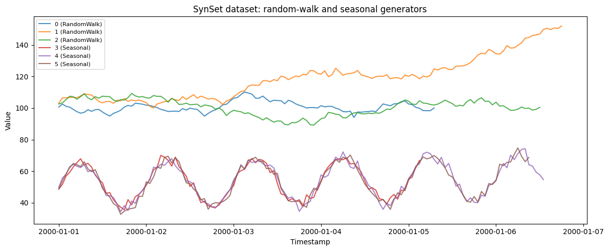

`SynSet` combines several generators into one long-format panel — the
way to build a dataset that *mixes* behaviors (say, trending random
walks alongside daily-seasonal demand) instead of repeating one shape.
Each generator contributes a batch of series, and their ids are numbered
sequentially so the result stays a single, model-ready frame.

> **SynSet vs. balanced_pool vs. generate_series**
>
> `SynSet` is the low-level composer you control directly.
> [`balanced_pool`](../../synforecast/docs/capabilities/balanced_pool.html)
> is a ready-made list of 42 generators you can drop into a `SynSet`,
> and
> [`generate_series`](../../synforecast/docs/getting-started/quickstart.html)
> wraps that pool in a one-liner. Use `SynSet` when you want an
> explicit, curated mix of generators.

```python
import matplotlib.pyplot as plt
import polars as pl

from synforecast import SynSet
from synforecast.generators import RandomWalkGenerator, SeasonalGenerator
```

## Define generators

Create a random walk generator and a seasonal generator with different
parameter configurations.

```python
rw_params = {
    "min_length": 100,
    "max_length": 150,
    "freq": "h",
    "drift": 0.1,
    "volatility": 1.5,
    "start_value": 100.0,
    "seed": 42,
}

seasonal_params = {
    "min_length": 100,
    "max_length": 150,
    "freq": "h",
    "seasonality_period": 24,
    "seasonality_amplitude": 15.0,
    "trend": 0.05,
    "noise_level": 2.0,
    "base_level": 50.0,
    "seed": 123,
}

rw_gen = RandomWalkGenerator(engine="polars", **rw_params)
seasonal_gen = SeasonalGenerator(engine="polars", **seasonal_params)
```

## Generate the dataset

`generate(n_series_per_generator=3)` draws 3 series from each generator
— 6 in total. Ids are assigned in generator order: `0-2` are the random
walks, `3-5` the seasonal series. Pass `start_id` to offset the
numbering when stitching several datasets together.

```python
dataset = SynSet([rw_gen, seasonal_gen])
df = dataset.generate(n_series_per_generator=3)

print(f"Generated {df['unique_id'].n_unique()} time series")
print(f"Total observations: {len(df)}")
df.head(10)
```

``` text
Generated 6 time series
Total observations: 740
```

| unique_id | ds                  | y          |
|-----------|---------------------|------------|
| cat       | datetime\[ns\]      | f64        |
| "0"       | 2000-01-01 00:00:00 | 100.620958 |
| "0"       | 2000-01-01 01:00:00 | 102.500707 |
| "0"       | 2000-01-01 02:00:00 | 101.104897 |
| "0"       | 2000-01-01 03:00:00 | 100.564106 |
| "0"       | 2000-01-01 04:00:00 | 99.076724  |
| "0"       | 2000-01-01 05:00:00 | 97.674284  |
| "0"       | 2000-01-01 06:00:00 | 96.714608  |
| "0"       | 2000-01-01 07:00:00 | 97.294935  |
| "0"       | 2000-01-01 08:00:00 | 98.929896  |
| "0"       | 2000-01-01 09:00:00 | 97.918173  |

```python
fig, ax = plt.subplots(figsize=(12, 5))
unique_ids = df["unique_id"].unique().to_list()

for uid in unique_ids:
    series = df.filter(pl.col("unique_id") == uid)
    # IDs 0, 1, 2 are RandomWalk; IDs 3, 4, 5 are Seasonal.
    gen_type = "RandomWalk" if int(uid) < 3 else "Seasonal"
    ax.plot(series["ds"].to_list(), series["y"].to_list(), label=f"{uid} ({gen_type})", alpha=0.8)
ax.set_title("SynSet dataset: random-walk and seasonal generators")
ax.set_xlabel("Timestamp")
ax.set_ylabel("Value")
ax.legend(fontsize=8)
plt.tight_layout()
plt.show()
```



## Statistics by series

Compare summary statistics across all generated series.

```python
stats = (
    df.group_by("unique_id")
    .agg(
        [
            pl.col("y").count().alias("count"),
            pl.col("y").min().alias("min_value"),
            pl.col("y").max().alias("max_value"),
            pl.col("y").mean().alias("mean_value"),
            pl.col("y").std().alias("std_value"),
        ]
    )
    .sort("unique_id")
)
stats
```

| unique_id | count | min_value  | max_value  | mean_value | std_value |
|-----------|-------|------------|------------|------------|-----------|
| cat       | u32   | f64        | f64        | f64        | f64       |
| "0"       | 104   | 94.028521  | 110.129544 | 100.735208 | 3.266454  |
| "1"       | 139   | 100.090121 | 151.940789 | 118.881905 | 13.27846  |
| "2"       | 133   | 89.176748  | 109.298167 | 100.537712 | 5.13869   |
| "3"       | 100   | 35.600282  | 70.029241  | 53.290106  | 10.264408 |
| "4"       | 134   | 34.431384  | 74.281368  | 54.466225  | 10.722442 |
| "5"       | 130   | 32.718865  | 74.773261  | 54.063785  | 11.005692 |

## Sample data

Compare the first few rows from a random walk series and a seasonal
series.

```python
print("Sample of series 0 (Random Walk - first 10 rows):")
df.filter(pl.col("unique_id") == "0").head(10)
```

``` text
Sample of series 0 (Random Walk - first 10 rows):
```

| unique_id | ds                  | y          |
|-----------|---------------------|------------|
| cat       | datetime\[ns\]      | f64        |
| "0"       | 2000-01-01 00:00:00 | 100.620958 |
| "0"       | 2000-01-01 01:00:00 | 102.500707 |
| "0"       | 2000-01-01 02:00:00 | 101.104897 |
| "0"       | 2000-01-01 03:00:00 | 100.564106 |
| "0"       | 2000-01-01 04:00:00 | 99.076724  |
| "0"       | 2000-01-01 05:00:00 | 97.674284  |
| "0"       | 2000-01-01 06:00:00 | 96.714608  |
| "0"       | 2000-01-01 07:00:00 | 97.294935  |
| "0"       | 2000-01-01 08:00:00 | 98.929896  |
| "0"       | 2000-01-01 09:00:00 | 97.918173  |

```python
print("Sample of series 3 (Seasonal - first 10 rows):")
df.filter(pl.col("unique_id") == "3").head(10)
```

``` text
Sample of series 3 (Seasonal - first 10 rows):
```

| unique_id | ds                  | y         |
|-----------|---------------------|-----------|
| cat       | datetime\[ns\]      | f64       |
| "3"       | 2000-01-01 00:00:00 | 48.634355 |
| "3"       | 2000-01-01 01:00:00 | 51.658968 |
| "3"       | 2000-01-01 02:00:00 | 56.909722 |
| "3"       | 2000-01-01 03:00:00 | 59.2974   |
| "3"       | 2000-01-01 04:00:00 | 62.751023 |
| "3"       | 2000-01-01 05:00:00 | 65.499531 |
| "3"       | 2000-01-01 06:00:00 | 67.897628 |
| "3"       | 2000-01-01 07:00:00 | 63.845217 |
| "3"       | 2000-01-01 08:00:00 | 65.0017   |
| "3"       | 2000-01-01 09:00:00 | 62.627031 |

