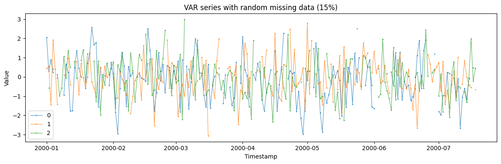
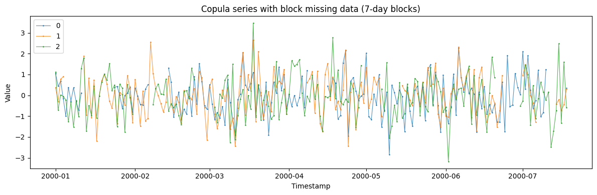
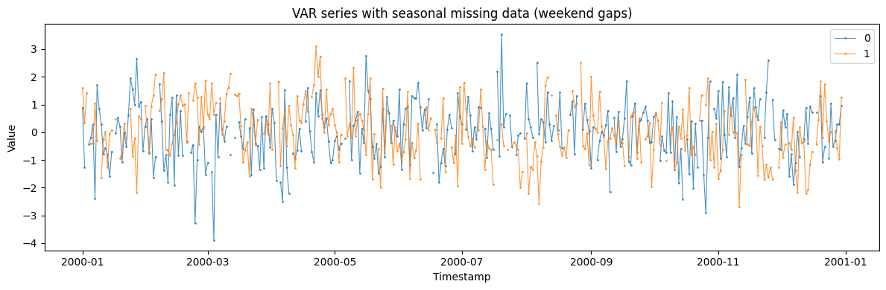
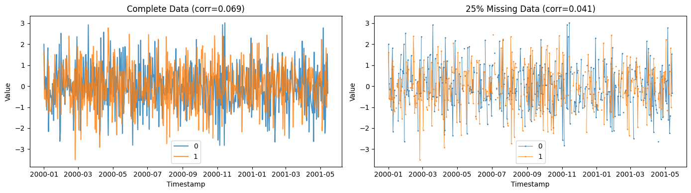

Multivariate feeds lose data too — a sensor drops out, a market halts, a
region stops reporting. SynForecast applies the same
[missingness](../../synforecast/docs/capabilities/missingness.html)
patterns to multivariate generators (`VAR`, `CopulaGenerator`), so you
can test multivariate imputation and check that a model still recovers
the cross-series structure through the gaps.

> **Independent gaps, shared structure**
>
> Each channel receives its *own* missing pattern — the series don’t
> drop out in lockstep — while the correlation between them is left
> intact, because missingness is applied after the correlated values are
> generated. The final section confirms the cross-series correlation
> survives.

```python
import matplotlib.pyplot as plt
import numpy as np
import polars as pl

from synforecast.generators import CopulaGenerator, VARGenerator
```

## VAR generator with random missing data

Generate 3 correlated series from a VAR(1) model with 15% random missing
data.

```python
var_params = {
    "min_length": 200,
    "max_length": 200,
    "freq": "D",
    "lag_order": 1,
    "missing_data": True,
    "missing_pattern": "random",
    "missing_rate": 0.15,
    "seed": 42,
}

var_gen = VARGenerator(engine="polars", **var_params)
df_var = var_gen.generate(n_series=3)

print(
    f"Generated {df_var['unique_id'].n_unique()} correlated series with VAR(1) model"
)
print(f"Total observations: {len(df_var)}")
df_var.head(30)
```

``` text
Generated 3 correlated series with VAR(1) model
Total observations: 600
```

| unique_id | ds                  | y         |
|-----------|---------------------|-----------|
| cat       | datetime\[ns\]      | f64       |
| "0"       | 2000-01-01 00:00:00 | 2.057667  |
| "0"       | 2000-01-02 00:00:00 | 0.295293  |
| "0"       | 2000-01-03 00:00:00 | 0.893053  |
| "0"       | 2000-01-04 00:00:00 | 0.235888  |
| "0"       | 2000-01-05 00:00:00 | NaN       |
| …         | …                   | …         |
| "0"       | 2000-01-26 00:00:00 | 0.474074  |
| "0"       | 2000-01-27 00:00:00 | NaN       |
| "0"       | 2000-01-28 00:00:00 | 0.068059  |
| "0"       | 2000-01-29 00:00:00 | NaN       |
| "0"       | 2000-01-30 00:00:00 | -0.438549 |

```python
print("Missing data statistics by series:")
for series_id in df_var["unique_id"].unique().sort():
    series_df = df_var.filter(pl.col("unique_id") == series_id)
    values = series_df["y"].to_numpy()
    nan_count = np.sum(np.isnan(values))
    nan_rate = nan_count / len(values)
    print(f"  {series_id}: {nan_count} missing ({nan_rate:.1%})")
```

``` text
Missing data statistics by series:
  0: 30 missing (15.0%)
  1: 30 missing (15.0%)
  2: 30 missing (15.0%)
```

```python
fig, ax = plt.subplots(figsize=(12, 4))
for uid in df_var["unique_id"].unique().to_list():
    series = df_var.filter(pl.col("unique_id") == uid)
    ax.plot(series["ds"].to_list(), series["y"].to_list(), label=uid, alpha=0.8, marker=".", markersize=2, linewidth=0.8)
ax.set_title("VAR series with random missing data (15%)")
ax.set_xlabel("Timestamp")
ax.set_ylabel("Value")
ax.legend()
plt.tight_layout()
plt.show()
```



## Copula generator with block missing data

Generate correlated series using a Gaussian copula with week-long
missing blocks, simulating synchronized outages.

```python
correlation_matrix = np.array([[1.0, 0.7, 0.3], [0.7, 1.0, 0.5], [0.3, 0.5, 1.0]])

copula_params = {
    "min_length": 200,
    "max_length": 200,
    "freq": "D",
    "copula_type": "gaussian",
    "correlation_matrix": correlation_matrix,
    "missing_data": True,
    "missing_pattern": "block",
    "missing_rate": 0.2,
    "missing_block_size": 7,
    "seed": 123,
}

copula_gen = CopulaGenerator(engine="polars", **copula_params)
df_copula = copula_gen.generate(n_series=3)

print(
    f"Generated {df_copula['unique_id'].n_unique()} correlated series with Gaussian copula"
)
print(f"Missing blocks of size: {copula_params['missing_block_size']} days")
df_copula.head(40)
```

``` text
Generated 3 correlated series with Gaussian copula
Missing blocks of size: 7 days
```

| unique_id | ds                  | y         |
|-----------|---------------------|-----------|
| cat       | datetime\[ns\]      | f64       |
| "0"       | 2000-01-01 00:00:00 | 1.05608   |
| "0"       | 2000-01-02 00:00:00 | 0.436385  |
| "0"       | 2000-01-03 00:00:00 | 0.680307  |
| "0"       | 2000-01-04 00:00:00 | -0.158773 |
| "0"       | 2000-01-05 00:00:00 | -0.99138  |
| …         | …                   | …         |
| "0"       | 2000-02-05 00:00:00 | 0.293606  |
| "0"       | 2000-02-06 00:00:00 | 0.504607  |
| "0"       | 2000-02-07 00:00:00 | NaN       |
| "0"       | 2000-02-08 00:00:00 | NaN       |
| "0"       | 2000-02-09 00:00:00 | NaN       |

```python
print("Block missing statistics by series:")
for series_id in df_copula["unique_id"].unique().sort():
    series_df = df_copula.filter(pl.col("unique_id") == series_id)
    values = series_df["y"].to_numpy()
    nan_count = np.sum(np.isnan(values))
    nan_rate = nan_count / len(values)

    max_consecutive = 0
    current_consecutive = 0
    for val in values:
        if np.isnan(val):
            current_consecutive += 1
            max_consecutive = max(max_consecutive, current_consecutive)
        else:
            current_consecutive = 0

    print(
        f"  {series_id}: {nan_count} missing ({nan_rate:.1%}), "
        f"max block: {max_consecutive} days"
    )
```

``` text
Block missing statistics by series:
  0: 33 missing (16.5%), max block: 12 days
  1: 35 missing (17.5%), max block: 7 days
  2: 30 missing (15.0%), max block: 9 days
```

```python
fig, ax = plt.subplots(figsize=(12, 4))
for uid in df_copula["unique_id"].unique().to_list():
    series = df_copula.filter(pl.col("unique_id") == uid)
    ax.plot(series["ds"].to_list(), series["y"].to_list(), label=uid, alpha=0.8, marker=".", markersize=2, linewidth=0.8)
ax.set_title("Copula series with block missing data (7-day blocks)")
ax.set_xlabel("Timestamp")
ax.set_ylabel("Value")
ax.legend()
plt.tight_layout()
plt.show()
```



## VAR with seasonal missing data (weekend gaps)

Simulate a year of VAR(2) data with weekly seasonal missing patterns,
representing weekend reporting gaps.

```python
var_seasonal_params = {
    "min_length": 365,
    "max_length": 365,
    "freq": "D",
    "lag_order": 2,
    "missing_data": True,
    "missing_pattern": "seasonal",
    "missing_rate": 0.12,
    "missing_seasonal_period": 7,
    "seed": 456,
}

var_seasonal_gen = VARGenerator(engine="polars", **var_seasonal_params)
df_var_seasonal = var_seasonal_gen.generate(n_series=2)

print(
    f"Generated {df_var_seasonal['unique_id'].n_unique()} correlated series (1 year)"
)
print(
    f"Seasonal period: {var_seasonal_params['missing_seasonal_period']} days (weekly)"
)

print("\nSeasonal missing statistics:")
for series_id in df_var_seasonal["unique_id"].unique().sort():
    series_df = df_var_seasonal.filter(pl.col("unique_id") == series_id)
    values = series_df["y"].to_numpy()
    nan_count = np.sum(np.isnan(values))
    nan_rate = nan_count / len(values)
    print(f"  {series_id}: {nan_count} missing ({nan_rate:.1%})")

df_var_seasonal.head(30)
```

``` text
Generated 2 correlated series (1 year)
Seasonal period: 7 days (weekly)

Seasonal missing statistics:
  0: 44 missing (12.1%)
  1: 46 missing (12.6%)
```

| unique_id | ds                  | y         |
|-----------|---------------------|-----------|
| cat       | datetime\[ns\]      | f64       |
| "0"       | 2000-01-01 00:00:00 | 0.891458  |
| "0"       | 2000-01-02 00:00:00 | -1.258571 |
| "0"       | 2000-01-03 00:00:00 | NaN       |
| "0"       | 2000-01-04 00:00:00 | -0.421688 |
| "0"       | 2000-01-05 00:00:00 | -0.204434 |
| …         | …                   | …         |
| "0"       | 2000-01-26 00:00:00 | 0.997592  |
| "0"       | 2000-01-27 00:00:00 | 2.656017  |
| "0"       | 2000-01-28 00:00:00 | 0.936677  |
| "0"       | 2000-01-29 00:00:00 | 1.093172  |
| "0"       | 2000-01-30 00:00:00 | -0.687454 |

```python
fig, ax = plt.subplots(figsize=(12, 4))
for uid in df_var_seasonal["unique_id"].unique().to_list():
    series = df_var_seasonal.filter(pl.col("unique_id") == uid)
    ax.plot(series["ds"].to_list(), series["y"].to_list(), label=uid, alpha=0.8, marker=".", markersize=2, linewidth=0.8)
ax.set_title("VAR series with seasonal missing data (weekend gaps)")
ax.set_xlabel("Timestamp")
ax.set_ylabel("Value")
ax.legend()
plt.tight_layout()
plt.show()
```



## Correlation across the gaps

Estimate the cross-series correlation with and without missing data
(dropping only the timestamps missing in either series). The estimate
stays close, confirming the gaps are missing-at-random with respect to
the dependence structure rather than distorting it.

```python
params_complete = {
    "min_length": 500,
    "max_length": 500,
    "freq": "D",
    "lag_order": 1,
    "missing_data": False,
    "seed": 789,
}

params_missing = {
    "min_length": 500,
    "max_length": 500,
    "freq": "D",
    "lag_order": 1,
    "missing_data": True,
    "missing_pattern": "random",
    "missing_rate": 0.25,
    "seed": 789,
}

gen_complete = VARGenerator(engine="polars", **params_complete)
df_complete = gen_complete.generate(n_series=2)

gen_missing = VARGenerator(engine="polars", **params_missing)
df_missing = gen_missing.generate(n_series=2)

# Calculate correlations
series_0_complete = df_complete.filter(pl.col("unique_id") == "0")[
    "y"
].to_numpy()
series_1_complete = df_complete.filter(pl.col("unique_id") == "1")[
    "y"
].to_numpy()
corr_complete = np.corrcoef(series_0_complete, series_1_complete)[0, 1]

series_0_missing = df_missing.filter(pl.col("unique_id") == "0")[
    "y"
].to_numpy()
series_1_missing = df_missing.filter(pl.col("unique_id") == "1")[
    "y"
].to_numpy()
mask = ~(np.isnan(series_0_missing) | np.isnan(series_1_missing))
corr_missing = np.corrcoef(series_0_missing[mask], series_1_missing[mask])[0, 1]

print(f"Correlation (complete data): {corr_complete:.3f}")
print(f"Correlation (25% missing):   {corr_missing:.3f}")
print(f"Correlation preserved:       {abs(corr_complete - corr_missing) < 0.1}")
```

``` text
Correlation (complete data): 0.069
Correlation (25% missing):   0.041
Correlation preserved:       True
```

```python
fig, axes = plt.subplots(1, 2, figsize=(14, 4))

for uid in df_complete["unique_id"].unique().to_list():
    series = df_complete.filter(pl.col("unique_id") == uid)
    axes[0].plot(series["ds"].to_list(), series["y"].to_list(), label=uid, alpha=0.8)
axes[0].set_title(f"Complete Data (corr={corr_complete:.3f})")
axes[0].set_xlabel("Timestamp")
axes[0].set_ylabel("Value")
axes[0].legend()

for uid in df_missing["unique_id"].unique().to_list():
    series = df_missing.filter(pl.col("unique_id") == uid)
    axes[1].plot(series["ds"].to_list(), series["y"].to_list(), label=uid, alpha=0.8, marker=".", markersize=2, linewidth=0.8)
axes[1].set_title(f"25% Missing Data (corr={corr_missing:.3f})")
axes[1].set_xlabel("Timestamp")
axes[1].set_ylabel("Value")
axes[1].legend()

plt.tight_layout()
plt.show()
```



