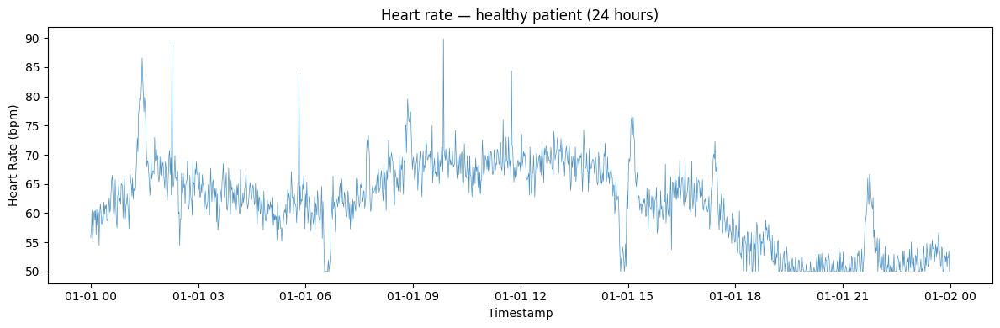
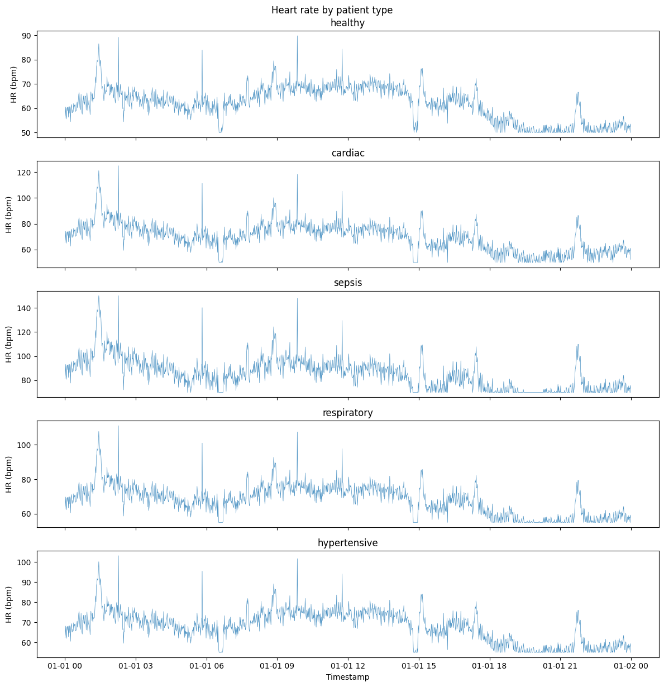
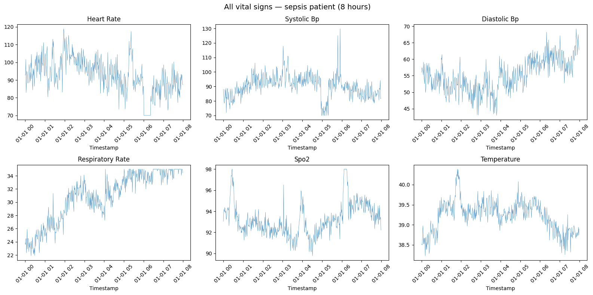

Physiological signals — heart rate, respiration, and the like — have
characteristic rhythms that shift with a patient’s condition.
`VitalSignsGenerator` produces these for testing clinical monitoring and
early-warning models without touching protected health data.

> **The model**
>
> Each series is a per-series baseline plus a slow random-walk drift, a
> circadian rhythm, heart-rate variability (for heart rate and blood
> pressure), random physiological events (activity bursts, rest periods,
> spikes), and measurement noise. The non-heart-rate signals also carry
> a correlation with heart rate. `vital_sign` chooses which of the six
> signals to emit, and `patient_type` — `healthy`, `cardiac`, `sepsis`,
> `respiratory`, or `hypertensive` — sets the baselines and the
> physiological bounds that values are clipped to.
>
> The circadian and HRV components assume one step is one minute
> (`freq='min'`); other frequencies distort those cycle periods.

```python
import matplotlib.pyplot as plt

from synforecast.generators import VitalSignsGenerator
```

## Heart rate - healthy patient

Generate 24 hours of per-minute heart rate data for a healthy patient
with circadian rhythm, HRV, and clinical events enabled.

```python
params = {
    "min_length": 1440,
    "max_length": 1440,
    "freq": "min",
    "patient_type": "healthy",
    "vital_sign": "heart_rate",
    "include_circadian": True,
    "include_hrv": True,
    "include_events": True,
    "seed": 42,
}

generator = VitalSignsGenerator(engine="polars", **params)
df = generator.generate(n_series=1)

values = df["y"].to_numpy()
print(f"Heart rate range: [{values.min():.1f}, {values.max():.1f}] bpm")
print(f"Mean heart rate: {values.mean():.1f} bpm")
print(f"Std deviation: {values.std():.1f} bpm")
```

``` text
Heart rate range: [50.0, 89.9] bpm
Mean heart rate: 61.8 bpm
Std deviation: 7.1 bpm
```

```python
fig, ax = plt.subplots(figsize=(12, 4))
ax.plot(df["ds"].to_list(), df["y"].to_list(), alpha=0.8, linewidth=0.5)
ax.set_xlabel("Timestamp")
ax.set_ylabel("Heart Rate (bpm)")
ax.set_title("Heart rate — healthy patient (24 hours)")
plt.tight_layout()
plt.show()
```



## Comparing patient types

Compare heart rate distributions across different patient conditions.

```python
patient_types = ["healthy", "cardiac", "sepsis", "respiratory", "hypertensive"]

for ptype in patient_types:
    gen = VitalSignsGenerator(engine="polars", 
        **{
            "min_length": 1440,
            "max_length": 1440,
            "freq": "min",
            "patient_type": ptype,
            "vital_sign": "heart_rate",
            "seed": 42,
        }
    )
    df_patient = gen.generate(n_series=1)
    hr = df_patient["y"].to_numpy()
    print(
        f"{ptype:15s}: mean={hr.mean():.1f}, std={hr.std():.1f}, range=[{hr.min():.0f}, {hr.max():.0f}]"
    )
```

``` text
healthy        : mean=61.8, std=7.1, range=[50, 90]
cardiac        : mean=69.5, std=11.0, range=[50, 125]
sepsis         : mean=85.3, std=12.8, range=[70, 150]
respiratory    : mean=67.9, std=8.8, range=[55, 111]
hypertensive   : mean=67.8, std=8.0, range=[55, 103]
```

```python
fig, axes = plt.subplots(len(patient_types), 1, figsize=(12, 2.5 * len(patient_types)), sharex=True)
for ax, ptype in zip(axes, patient_types):
    gen = VitalSignsGenerator(engine="polars", **{"min_length": 1440, "max_length": 1440, "freq": "min", "patient_type": ptype, "vital_sign": "heart_rate", "seed": 42})
    df_p = gen.generate(n_series=1)
    ax.plot(df_p["ds"].to_list(), df_p["y"].to_list(), alpha=0.8, linewidth=0.5)
    ax.set_ylabel("HR (bpm)")
    ax.set_title(ptype)
plt.xlabel("Timestamp")
plt.suptitle("Heart rate by patient type")
plt.tight_layout()
plt.show()
```



## All vital signs - sepsis patient

Generate all six vital signs simultaneously for a sepsis patient over 8
hours.

```python
sepsis_gen = VitalSignsGenerator(engine="polars", 
    **{
        "min_length": 480,
        "max_length": 480,
        "freq": "min",
        "patient_type": "sepsis",
        "seed": 42,
    }
)
all_vitals_df = sepsis_gen.generate_all_vitals(n_series=1)

print("Vital sign statistics for sepsis patient:")
vital_cols = [
    "heart_rate",
    "systolic_bp",
    "diastolic_bp",
    "respiratory_rate",
    "spo2",
    "temperature",
]

for col in vital_cols:
    vals = all_vitals_df[col].to_numpy()
    print(
        f"  {col:18s}: mean={vals.mean():.1f}, range=[{vals.min():.1f}, {vals.max():.1f}]"
    )
```

``` text
Vital sign statistics for sepsis patient:
  heart_rate        : mean=92.9, range=[70.0, 118.9]
  systolic_bp       : mean=90.3, range=[70.0, 129.8]
  diastolic_bp      : mean=55.0, range=[42.9, 69.2]
  respiratory_rate  : mean=30.8, range=[21.9, 35.0]
  spo2              : mean=93.2, range=[89.8, 98.0]
  temperature       : mean=39.2, range=[38.2, 40.4]
```

```python
vital_cols = ["heart_rate", "systolic_bp", "diastolic_bp", "respiratory_rate", "spo2", "temperature"]
fig, axes = plt.subplots(2, 3, figsize=(16, 8))
for ax, col in zip(axes.flat, vital_cols):
    ax.plot(all_vitals_df["ds"].to_list(), all_vitals_df[col].to_list(), alpha=0.8, linewidth=0.5)
    ax.set_title(col.replace("_", " ").title())
    ax.set_xlabel("Timestamp")
    ax.tick_params(axis="x", rotation=45)
plt.suptitle("All vital signs — sepsis patient (8 hours)", fontsize=14)
plt.tight_layout()
plt.show()
```



## Oxygen saturation (SpO2) comparison

Compare SpO2 levels across healthy, respiratory, and sepsis patients.
Lower SpO2 and more time below 95% indicates worse oxygenation.

```python
for ptype in ["healthy", "respiratory", "sepsis"]:
    gen = VitalSignsGenerator(engine="polars", 
        **{
            "min_length": 1440,
            "max_length": 1440,
            "freq": "min",
            "patient_type": ptype,
            "vital_sign": "spo2",
            "seed": 42,
        }
    )
    df_spo2 = gen.generate(n_series=1)
    spo2 = df_spo2["y"].to_numpy()
    below_95 = (spo2 < 95).sum() / len(spo2) * 100
    print(
        f"{ptype:12s}: mean={spo2.mean():.1f}%, min={spo2.min():.1f}%, time <95%: {below_95:.1f}%"
    )
```

``` text
healthy     : mean=97.0%, min=95.2%, time <95%: 0.0%
respiratory : mean=89.2%, min=85.0%, time <95%: 99.7%
sepsis      : mean=90.2%, min=85.0%, time <95%: 98.5%
```

## Model information

Inspect the generator configuration and baseline values for each vital
sign.

```python
info = generator.get_model_info()
print(f"Patient type: {info['patient_type']}")
print(f"Current vital sign: {info['vital_sign']}")
print(f"Circadian rhythm: {info['include_circadian']}")
print(f"HRV included: {info['include_hrv']}")

print("\nBaseline values for healthy patient:")
for vital, params in info["baselines"].items():
    print(
        f"  {vital}: mean={params['mean']}, range=[{params['min']}, {params['max']}]"
    )
```

``` text
Patient type: healthy
Current vital sign: heart_rate
Circadian rhythm: True
HRV included: True

Baseline values for healthy patient:
  heart_rate: mean=70, range=[50, 100]
  systolic_bp: mean=120, range=[90, 140]
  diastolic_bp: mean=80, range=[60, 90]
  respiratory_rate: mean=14, range=[10, 20]
  spo2: mean=98, range=[95, 100]
  temperature: mean=36.8, range=[36.0, 37.5]
```

> **Related generators**
>
> -   [Anomalies](../../../synforecast/docs/capabilities/anomalies.html)
>     — inject labelled events for detector benchmarks.
> -   [IoT
>     sensor](../../../synforecast/docs/generators/domain/iot_sensor.html)
>     — another instrument-style signal with artifacts.
>
> Full parameters are in the [generator
> reference](https://github.com/Nixtla/synforecast/blob/main/GENERATORS.md).

