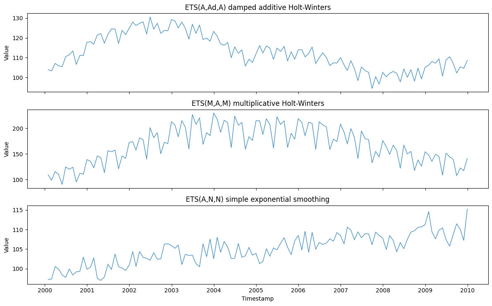
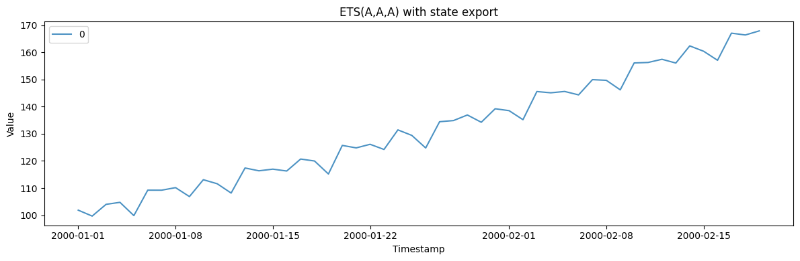
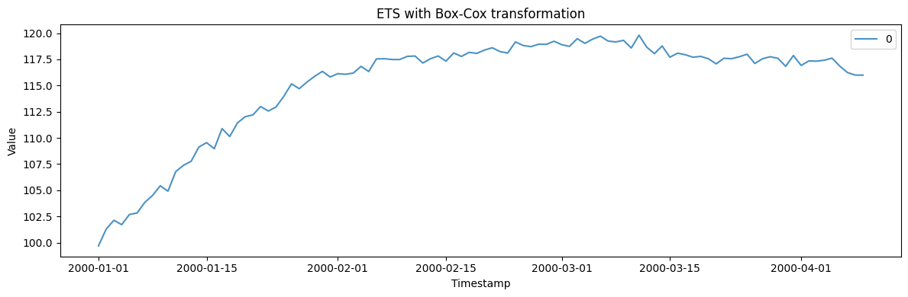

ETS models describe a series through slowly evolving *states* — level,
optional trend, optional seasonality — updated by exponential smoothing.
The error/trend/season taxonomy spans 30 variants (additive or
multiplicative, damped or not), so a single generator covers a broad
family of realistic trend-plus-seasonality shapes.

> **The model**
>
> $$y_t = \mu_t + \varepsilon_t, \qquad \mu_t = \ell_{t-1} + \phi\, b_{t-1} + s_{t-m} \quad \text{(ETS(A,A,A))}$$
>
> Each series is built from a level state plus optional trend and
> seasonal states, combined additively or multiplicatively via
> `error_type`, `trend_type`, `seasonal_type`, and `damped`. This is the
> state-space form behind Holt and Holt-Winters smoothing.

```python
import polars as pl
import matplotlib.pyplot as plt

from synforecast.generators import ETSGenerator
```

## 1. Taxonomy variants

The error/trend/season triple selects the model. All three draws share a
seed, a starting level, and a seasonal period, so the shapes differ only
by taxonomy: a damped additive trend flattens out, a multiplicative
season grows with the level, and no trend or season leaves pure level
smoothing.

```python
damped_df = ETSGenerator(
    engine="polars", min_length=120, max_length=120, freq="ME",
    error_type="add", trend_type="add", seasonal_type="add", damped=True, phi=0.9,
    seasonal_period=12, level=100.0, trend=1.0, noise_std=2.0, seed=42,
).generate(n_series=1)

multiplicative_df = ETSGenerator(
    engine="polars", min_length=120, max_length=120, freq="ME",
    error_type="mul", trend_type="add", seasonal_type="mul",
    seasonal_period=12, level=100.0, trend=1.0, noise_std=0.02, seed=42,
).generate(n_series=1)

level_only_df = ETSGenerator(
    engine="polars", min_length=120, max_length=120, freq="ME",
    error_type="add", trend_type=None, seasonal_type=None,
    level=100.0, noise_std=2.0, seed=42,
).generate(n_series=1)

panels = [
    ("ETS(A,Ad,A) damped additive Holt-Winters", damped_df),
    ("ETS(M,A,M) multiplicative Holt-Winters", multiplicative_df),
    ("ETS(A,N,N) simple exponential smoothing", level_only_df),
]
fig, axes = plt.subplots(3, 1, figsize=(12, 7.5), sharex=True)
for ax, (label, df) in zip(axes, panels):
    ax.plot(df["ds"].to_list(), df["y"].to_list(), alpha=0.85, linewidth=1)
    ax.set(ylabel="Value", title=label)
axes[-1].set_xlabel("Timestamp")
plt.tight_layout()
plt.show()

```



## 2. State export

Generate data and extract the underlying level, trend, and seasonal
state components.

```python
params_states = {
    "min_length": 50,
    "max_length": 50,
    "freq": "D",
    "error_type": "add",
    "trend_type": "add",
    "seasonal_type": "add",
    "seasonal_period": 7,
    "level": 100.0,
    "trend": 1.0,
    "alpha": 0.3,
    "beta": 0.1,
    "gamma": 0.1,
    "noise_std": 1.0,
    "seed": 42,
}

generator_states = ETSGenerator(engine="polars", **params_states)
obs_df, states_df = generator_states.generate_with_states(n_series=1)
```


```python
fig, ax = plt.subplots(figsize=(12, 4))
for uid in obs_df["unique_id"].unique().to_list():
    series = obs_df.filter(pl.col("unique_id") == uid)
    ax.plot(series["ds"].to_list(), series["y"].to_list(), label=uid, alpha=0.8)
ax.set_xlabel("Timestamp")
ax.set_ylabel("Value")
ax.set_title("ETS(A,A,A) with state export")
ax.legend()
plt.tight_layout()
plt.show()
```



```python
print("Observations DataFrame:")
obs_df.head(10)
```

``` text
Observations DataFrame:
```

| unique_id | ds                  | y          |
|-----------|---------------------|------------|
| cat       | datetime\[ns\]      | f64        |
| "0"       | 2000-01-01 00:00:00 | 101.852261 |
| "0"       | 2000-01-02 00:00:00 | 99.674429  |
| "0"       | 2000-01-03 00:00:00 | 103.997037 |
| "0"       | 2000-01-04 00:00:00 | 104.742658 |
| "0"       | 2000-01-05 00:00:00 | 99.842295  |
| "0"       | 2000-01-06 00:00:00 | 109.225432 |
| "0"       | 2000-01-07 00:00:00 | 109.215338 |
| "0"       | 2000-01-08 00:00:00 | 110.156755 |
| "0"       | 2000-01-09 00:00:00 | 106.862563 |
| "0"       | 2000-01-10 00:00:00 | 113.073648 |

```python
print("States DataFrame (level, trend, seasonal components):")
states_df.head(10)
```

``` text
States DataFrame (level, trend, seasonal components):
```

| unique_id | ds                  | level      | trend    | seasonal_0 | seasonal_1 | seasonal_2 | seasonal_3 | seasonal_4 | seasonal_5 | seasonal_6 |
|-----------|---------------------|------------|----------|------------|------------|------------|------------|------------|------------|------------|
| cat       | datetime\[ns\]      | f64        | f64      | f64        | f64        | f64        | f64        | f64        | f64        | f64        |
| "0"       | 2000-01-01 00:00:00 | 100.0      | 1.0      | 1.168504   | -2.182273  | 2.014922   | 0.402623   | -5.629283  | 3.185167   | 1.04034    |
| "0"       | 2000-01-02 00:00:00 | 100.905127 | 0.968376 | 1.136879   | -2.182273  | 2.014922   | 0.402623   | -5.629283  | 3.185167   | 1.04034    |
| "0"       | 2000-01-03 00:00:00 | 101.868463 | 0.966696 | 1.136879   | -2.183953  | 2.014922   | 0.402623   | -5.629283  | 3.185167   | 1.04034    |
| "0"       | 2000-01-04 00:00:00 | 102.579245 | 0.881391 | 1.136879   | -2.183953  | 1.929618   | 0.402623   | -5.629283  | 3.185167   | 1.04034    |
| "0"       | 2000-01-05 00:00:00 | 103.724456 | 0.969331 | 1.136879   | -2.183953  | 1.929618   | 0.490563   | -5.629283  | 3.185167   | 1.04034    |
| "0"       | 2000-01-06 00:00:00 | 104.927124 | 1.04711  | 1.136879   | -2.183953  | 1.929618   | 0.490563   | -5.551504  | 3.185167   | 1.04034    |
| "0"       | 2000-01-07 00:00:00 | 105.994044 | 1.053713 | 1.136879   | -2.183953  | 1.929618   | 0.490563   | -5.551504  | 3.19177    | 1.04034    |
| "0"       | 2000-01-08 00:00:00 | 107.385929 | 1.166437 | 1.136879   | -2.183953  | 1.929618   | 0.490563   | -5.551504  | 3.19177    | 1.153064   |
| "0"       | 2000-01-09 00:00:00 | 108.69262  | 1.213188 | 1.18363    | -2.183953  | 1.929618   | 0.490563   | -5.551504  | 3.19177    | 1.153064   |
| "0"       | 2000-01-10 00:00:00 | 109.64802  | 1.127259 | 1.18363    | -2.269882  | 1.929618   | 0.490563   | -5.551504  | 3.19177    | 1.153064   |

## 3. Box-Cox transformation

Apply a Box-Cox transformation (lambda=0.5, square root) to the
generated series.

```python
params_boxcox = {
    "min_length": 100,
    "max_length": 100,
    "freq": "D",
    "error_type": "add",
    "trend_type": "add",
    "seasonal_type": None,
    "level": 100.0,
    "trend": 0.5,
    "alpha": 0.3,
    "beta": 0.1,
    "noise_std": 0.5,
    "box_cox_lambda": 0.5,
    "seed": 111,
}

generator_boxcox = ETSGenerator(engine="polars", **params_boxcox)
df_boxcox = generator_boxcox.generate(n_series=1)

print(f"Model: {generator_boxcox.get_model_info()['model']}")
print(f"Box-Cox lambda: {generator_boxcox.get_model_info()['box_cox_lambda']}")
print(f"Mean: {df_boxcox['y'].mean():.2f}")
print(f"Std: {df_boxcox['y'].std():.2f}")
```

``` text
Model: ETS(A,A,N)
Box-Cox lambda: 0.5
Mean: 115.15
Std: 5.02
```

```python
fig, ax = plt.subplots(figsize=(12, 4))
for uid in df_boxcox["unique_id"].unique().to_list():
    series = df_boxcox.filter(pl.col("unique_id") == uid)
    ax.plot(series["ds"].to_list(), series["y"].to_list(), label=uid, alpha=0.8)
ax.set_xlabel("Timestamp")
ax.set_ylabel("Value")
ax.set_title("ETS with Box-Cox transformation")
ax.legend()
plt.tight_layout()
plt.show()
```



> **Related generators**
>
> -   [SARIMA](../../../synforecast/docs/generators/statistical/sarima.html)
>     — the ARIMA view of the same trend/seasonal structure.
> -   [Seasonal](../../../synforecast/docs/generators/statistical/seasonal.html)
>     — a fixed seasonal wave when you don’t need evolving states.
>
> The full error/trend/season taxonomy is in the [generator
> reference](https://github.com/Nixtla/synforecast/blob/main/GENERATORS.md).

