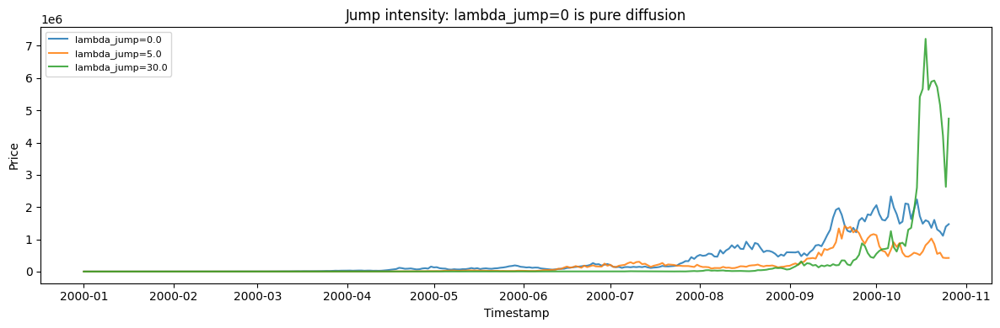
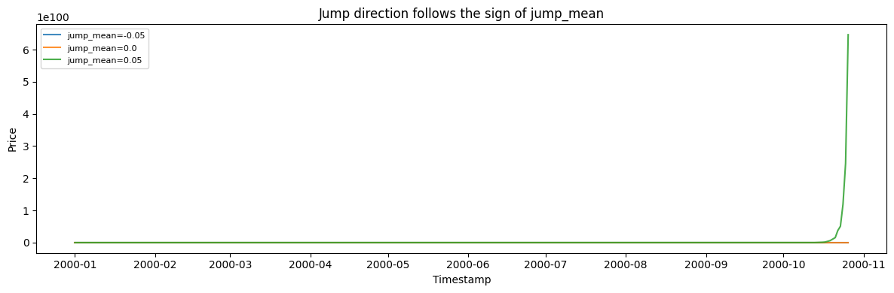
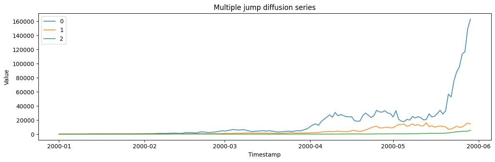

A jump-diffusion process is a smooth diffusion (like GBM) punctuated by
sudden *jumps* — the model for prices that mostly drift but occasionally
gap on news. It is a realistic test for methods that must distinguish
ordinary volatility from discrete shocks.

> **The model**
>
> $$dS_t = \mu S_t\, dt + \sigma S_t\, dW_t + S_{t^-}\, dJ_t, \qquad N_t \sim \mathrm{Poisson}(\lambda\, dt)$$
>
> A continuous diffusion accumulates small changes while a Poisson jump
> process adds occasional discrete moves. The jump intensity sets how
> often jumps occur; the jump-size distribution sets how large they are.
> Between jumps the series behaves like its underlying diffusion.

```python
import polars as pl
import matplotlib.pyplot as plt

from synforecast.generators import JumpDiffusionGenerator
```

## 1. Jump intensity

`lambda_jump` is the expected number of jumps per unit time. Between
jumps the path is an ordinary diffusion, so raising it adds
discontinuities without changing the underlying drift.

```python
base = {
    "min_length": 300,
    "max_length": 300,
    "freq": "D",
    "mu": 0.05,
    "sigma": 0.15,
    "jump_mean": 0.0,
    "jump_std": 0.05,
    "initial_value": 100.0,
    "seed": 42,
}

fig, ax = plt.subplots(figsize=(12, 4))
for lambda_jump in (0.0, 5.0, 30.0):
    df = JumpDiffusionGenerator(
        engine="polars", lambda_jump=lambda_jump, **base
    ).generate(n_series=1)
    ax.plot(
        df["ds"].to_list(), df["y"].to_list(), label=f"lambda_jump={lambda_jump}", alpha=0.85
    )
ax.set(
    xlabel="Timestamp",
    ylabel="Price",
    title="Jump intensity: lambda_jump=0 is pure diffusion",
)
ax.legend(fontsize=8)
plt.tight_layout()
plt.show()

```



## 2. Jump direction

`jump_mean` is the average log jump size, so its sign decides whether
shocks push the price up or down. The drift is not compensated for
jumps, which is why a negative mean drags the whole path down.

```python
fig, ax = plt.subplots(figsize=(12, 4))
for jump_mean in (-0.05, 0.0, 0.05):
    df = JumpDiffusionGenerator(
        engine="polars",
        min_length=300,
        max_length=300,
        freq="D",
        mu=0.05,
        sigma=0.15,
        lambda_jump=15.0,
        jump_mean=jump_mean,
        jump_std=0.02,
        initial_value=100.0,
        seed=42,
    ).generate(n_series=1)
    ax.plot(
        df["ds"].to_list(), df["y"].to_list(), label=f"jump_mean={jump_mean}", alpha=0.85
    )
ax.set(xlabel="Timestamp", ylabel="Price", title="Jump direction follows the sign of jump_mean")
ax.legend(fontsize=8)
plt.tight_layout()
plt.show()

```



## 3. Multiple series

Generate multiple independent jump diffusion paths.

```python
multi_params = {
    "min_length": 150,
    "max_length": 150,
    "freq": "D",
    "mu": 0.05,
    "sigma": 0.15,
    "lambda_jump": 0.2,
    "jump_mean": 0.0,
    "jump_std": 0.1,
    "initial_value": 100.0,
    "seed": 42,
}

multi_gen = JumpDiffusionGenerator(engine="polars", **multi_params)
multi_df = multi_gen.generate(n_series=3)

print(f"Generated 3 series with {len(multi_df)} total observations")
print(f"Overall Statistics: Mean={multi_df['y'].mean():.4f}, Std={multi_df['y'].std():.4f}")
multi_df.filter(pl.col("unique_id") == "0").head(10)
```

``` text
Generated 3 series with 450 total observations
Overall Statistics: Mean=6662.1054, Std=16489.8470
```

| unique_id | ds                  | y          |
|-----------|---------------------|------------|
| cat       | datetime\[ns\]      | f64        |
| "0"       | 2000-01-01 00:00:00 | 100.0      |
| "0"       | 2000-01-02 00:00:00 | 84.240947  |
| "0"       | 2000-01-03 00:00:00 | 94.557346  |
| "0"       | 2000-01-04 00:00:00 | 107.575297 |
| "0"       | 2000-01-05 00:00:00 | 114.688591 |
| "0"       | 2000-01-06 00:00:00 | 159.7268   |
| "0"       | 2000-01-07 00:00:00 | 146.174789 |
| "0"       | 2000-01-08 00:00:00 | 171.596255 |
| "0"       | 2000-01-09 00:00:00 | 174.553944 |
| "0"       | 2000-01-10 00:00:00 | 168.409026 |

```python
fig, ax = plt.subplots(figsize=(12, 4))
for uid in multi_df["unique_id"].unique().to_list():
    series = multi_df.filter(pl.col("unique_id") == uid)
    ax.plot(series["ds"].to_list(), series["y"].to_list(), label=uid, alpha=0.8)
ax.set_xlabel("Timestamp")
ax.set_ylabel("Value")
ax.set_title("Multiple jump diffusion series")
ax.legend()
plt.tight_layout()
plt.show()
```



> **Related generators**
>
> -   [Geometric Brownian
>     motion](../../../synforecast/docs/generators/stochastic/geometric_brownian_motion.html)
>     — the jump-free diffusion.
> -   [Hawkes
>     process](../../../synforecast/docs/generators/stochastic/hawkes_process.html)
>     — when the jumps cluster and self-excite.
>
> Jump intensity and size parameters are in the [generator
> reference](https://github.com/Nixtla/synforecast/blob/main/GENERATORS.md).

