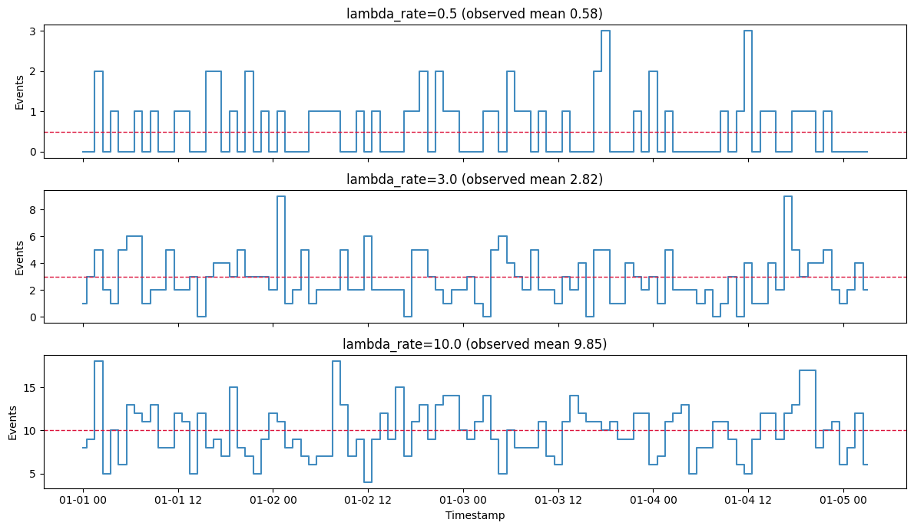
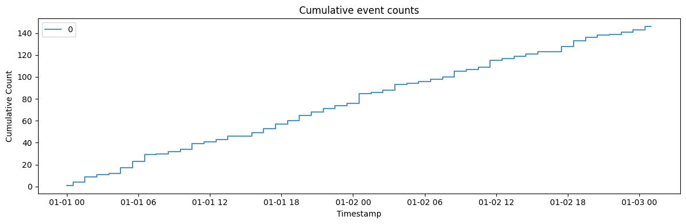
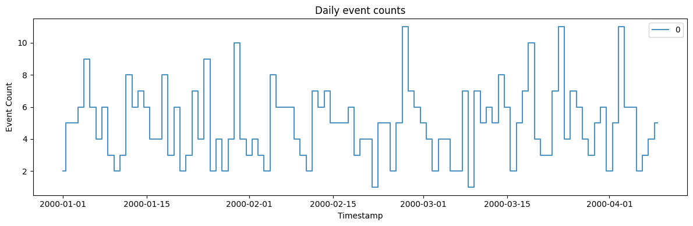
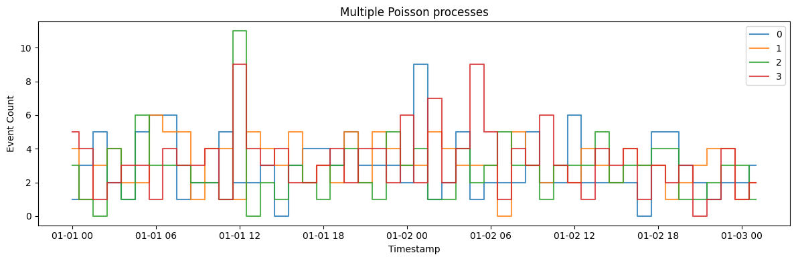

A Poisson process models *event counts over time* — arrivals at a queue,
clicks, failures — where events occur independently at a constant
average rate. It is the baseline against which bursty or self-exciting
arrival patterns are compared.

> **The model**
>
> $$y_t \sim \mathrm{Poisson}(\lambda), \qquad \mathbb{E}[y_t] = \mathrm{Var}(y_t) = \lambda$$
>
> Events arrive independently at rate `lambda` per unit time, so counts
> in disjoint windows are independent and Poisson-distributed. The
> result is the memoryless benchmark: no clustering, no correlation
> between successive intervals.

```python
import polars as pl
import matplotlib.pyplot as plt

from synforecast.generators import PoissonProcessGenerator
```

## 1. Arrival rate

`lambda_rate` is the expected number of events per time step, and it
sets both the mean and the variance. Each panel shares an axis so the
change in level and in spread is directly comparable.

```python
fig, axes = plt.subplots(3, 1, figsize=(12, 7), sharex=True)
for ax, lambda_rate in zip(axes, (0.5, 3.0, 10.0)):
    df = PoissonProcessGenerator(
        engine="polars",
        min_length=100,
        max_length=100,
        freq="h",
        lambda_rate=lambda_rate,
        cumulative=False,
        seed=42,
    ).generate(n_series=1)
    counts = df["y"].to_list()
    ax.step(df["ds"].to_list(), counts, where="mid", alpha=0.85)
    ax.axhline(lambda_rate, color="crimson", linestyle="--", linewidth=1)
    ax.set(
        ylabel="Events",
        title=f"lambda_rate={lambda_rate} (observed mean {sum(counts) / len(counts):.2f})",
    )
axes[-1].set_xlabel("Timestamp")
plt.tight_layout()
plt.show()

```



## 2. Cumulative counts

The same process but with cumulative counting — useful for modeling
total arrivals over time.

```python
cumulative_params = {
    "min_length": 50,
    "max_length": 50,
    "freq": "h",
    "lambda_rate": 3.0,
    "cumulative": True,
    "seed": 42,
}

cumulative_gen = PoissonProcessGenerator(engine="polars", **cumulative_params)
cumulative_df = cumulative_gen.generate(n_series=1)

print(f"Generated {len(cumulative_df)} hourly cumulative counts")
print(f"Final cumulative count: {cumulative_df['y'].tail(1).item():.0f}")
cumulative_df.head(10)
```

``` text
Generated 50 hourly cumulative counts
Final cumulative count: 146
```

| unique_id | ds                  | y    |
|-----------|---------------------|------|
| cat       | datetime\[ns\]      | f64  |
| "0"       | 2000-01-01 00:00:00 | 1.0  |
| "0"       | 2000-01-01 01:00:00 | 4.0  |
| "0"       | 2000-01-01 02:00:00 | 9.0  |
| "0"       | 2000-01-01 03:00:00 | 11.0 |
| "0"       | 2000-01-01 04:00:00 | 12.0 |
| "0"       | 2000-01-01 05:00:00 | 17.0 |
| "0"       | 2000-01-01 06:00:00 | 23.0 |
| "0"       | 2000-01-01 07:00:00 | 29.0 |
| "0"       | 2000-01-01 08:00:00 | 30.0 |
| "0"       | 2000-01-01 09:00:00 | 32.0 |

```python
fig, ax = plt.subplots(figsize=(12, 4))
for uid in cumulative_df["unique_id"].unique().to_list():
    series = cumulative_df.filter(pl.col("unique_id") == uid)
    ax.step(
        series["ds"].to_list(), series["y"].to_list(), where="mid", label=uid, alpha=0.8
    )
ax.set_xlabel("Timestamp")
ax.set_ylabel("Cumulative Count")
ax.set_title("Cumulative event counts")
ax.legend()
plt.tight_layout()
plt.show()
```



## 3. Daily event counts

Change the frequency to daily with 5 events per day on average.

```python
daily_params = {
    "min_length": 100,
    "max_length": 100,
    "freq": "D",
    "lambda_rate": 5.0,
    "cumulative": False,
    "seed": 42,
}

daily_gen = PoissonProcessGenerator(engine="polars", **daily_params)
daily_df = daily_gen.generate(n_series=1)

print(f"Generated {len(daily_df)} daily event counts")
print(f"Statistics: Mean={daily_df['y'].mean():.4f}, Total Events={daily_df['y'].sum():.0f}")
daily_df.head(10)
```

``` text
Generated 100 daily event counts
Statistics: Mean=4.9400, Total Events=494
```

| unique_id | ds                  | y   |
|-----------|---------------------|-----|
| cat       | datetime\[ns\]      | f64 |
| "0"       | 2000-01-01 00:00:00 | 2.0 |
| "0"       | 2000-01-02 00:00:00 | 5.0 |
| "0"       | 2000-01-03 00:00:00 | 5.0 |
| "0"       | 2000-01-04 00:00:00 | 6.0 |
| "0"       | 2000-01-05 00:00:00 | 9.0 |
| "0"       | 2000-01-06 00:00:00 | 6.0 |
| "0"       | 2000-01-07 00:00:00 | 4.0 |
| "0"       | 2000-01-08 00:00:00 | 6.0 |
| "0"       | 2000-01-09 00:00:00 | 3.0 |
| "0"       | 2000-01-10 00:00:00 | 2.0 |

```python
fig, ax = plt.subplots(figsize=(12, 4))
for uid in daily_df["unique_id"].unique().to_list():
    series = daily_df.filter(pl.col("unique_id") == uid)
    ax.step(
        series["ds"].to_list(), series["y"].to_list(), where="mid", label=uid, alpha=0.8
    )
ax.set_xlabel("Timestamp")
ax.set_ylabel("Event Count")
ax.set_title("Daily event counts")
ax.legend()
plt.tight_layout()
plt.show()
```



## 4. Multiple processes

Generate multiple independent processes in one call.

```python
multi_params = {
    "min_length": 50,
    "max_length": 50,
    "freq": "h",
    "lambda_rate": 3.0,
    "cumulative": False,
    "seed": 42,
}

multi_gen = PoissonProcessGenerator(engine="polars", **multi_params)
multi_df = multi_gen.generate(n_series=4)

print(f"Generated 4 different Poisson processes with {len(multi_df)} total observations")
print(f"Overall Statistics: Mean={multi_df['y'].mean():.4f}, Total Events={multi_df['y'].sum():.0f}")
multi_df.filter(pl.col("unique_id") == "0").head(10)
```

``` text
Generated 4 different Poisson processes with 200 total observations
Overall Statistics: Mean=2.9900, Total Events=598
```

| unique_id | ds                  | y   |
|-----------|---------------------|-----|
| cat       | datetime\[ns\]      | f64 |
| "0"       | 2000-01-01 00:00:00 | 1.0 |
| "0"       | 2000-01-01 01:00:00 | 3.0 |
| "0"       | 2000-01-01 02:00:00 | 5.0 |
| "0"       | 2000-01-01 03:00:00 | 2.0 |
| "0"       | 2000-01-01 04:00:00 | 1.0 |
| "0"       | 2000-01-01 05:00:00 | 5.0 |
| "0"       | 2000-01-01 06:00:00 | 6.0 |
| "0"       | 2000-01-01 07:00:00 | 6.0 |
| "0"       | 2000-01-01 08:00:00 | 1.0 |
| "0"       | 2000-01-01 09:00:00 | 2.0 |

```python
fig, ax = plt.subplots(figsize=(12, 4))
for uid in multi_df["unique_id"].unique().to_list():
    series = multi_df.filter(pl.col("unique_id") == uid)
    ax.step(
        series["ds"].to_list(), series["y"].to_list(), where="mid", label=uid, alpha=0.8
    )
ax.set_xlabel("Timestamp")
ax.set_ylabel("Event Count")
ax.set_title("Multiple Poisson processes")
ax.legend()
plt.tight_layout()
plt.show()
```



> **Related generators**
>
> -   [Hawkes
>     process](../../../synforecast/docs/generators/stochastic/hawkes_process.html)
>     — arrivals that cluster because each event raises the rate.
> -   [INAR](../../../synforecast/docs/generators/statistical/inar.html)
>     — autocorrelated integer counts.
>
> Rate parameters are in the [generator
> reference](https://github.com/Nixtla/synforecast/blob/main/GENERATORS.md).

